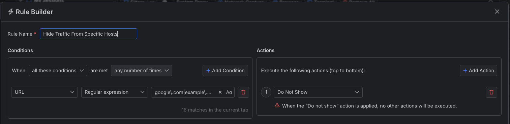

# Hiding Traffic from Specific Hosts

In some occasions, you would like to temporary hide traffic from specific hosts. With Fiddler Everywhere, you can easily create rules that limit the captured traffic so that you can see and concentrate only on the sessions that matter.


## Creating a "Hide Traffic From Specific Hosts" Rule

In this example, we will create a rule named "Hide Traffic From Specific Hosts" that hides all captured traffic except for traffic generated from the specified host.

Create a "SHide Traffic From Specific Hosts" rule that sets the following matching conditions and actions through the [Rules Builder]().

- Create a matching condition that uses the "When **all these conditions** are met **any number of times**". 

- Match by a **URL** that uses a regular expression to match addresses that contain **google.com** and  **example.com.**

    ```regex
    google\.com|example\.com
    ```

- Create a **Do Not Show** action.

    >important Note that the **Do Not Show** action is final, which means that no other action or active rule wplaced lower in the rules queue will be executed.

This example rule hides all sessions containing **google.com** or **example.com** in their URLs.



Once the rule is created, enable the **Rules** tab, toggle the rule switch, and start capturing traffic.


The link below provides a ready-to-use rule for download as a FARX file, which you can import through the Rules toolbar.

[A "Hide Traffic From Specific Hosts" rule as FARX file](https://github.com/telerik/fiddler-everywhere/rules/filters/hide-specific-hosts)
 
 