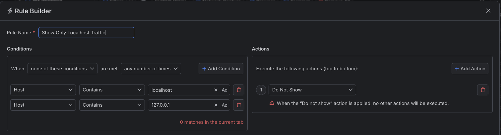
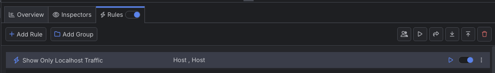

# Showing Only Localhost Traffic

A typical scenario for many software engineers is to work and test in a local environment. Web applications are often using localhost deployment before testing in production. With Fiddler Everywhere, you can easily create rules that allow you to limit the captured traffic so that you can see and concentrate only on the sessions that matter.

## Creating a "Show Only Localhost Traffic" Rule

In this example, we will create a rule named "Show Only Localhost Traffic" that hides all captured traffic except for traffic generated from the `localhost` host or the local loopback address `127.0.0.1`.

Create a "Show Only Localhost Traffic" rule that sets the following matching conditions and actions through the [Rules Builder]().

- Create a matching condition that uses the "When **none of these conditions** are met **any number of times**". Note that in this rule, we will use the negative statements to match and apply actions on anything but our targets.

- Match by a `Host` that contains `localhost` and by a `Host` that contains `127.0.0.1`.

- Create a `Do Not Show` action. 

    >important Note that the`Do Not Show` action is final, which means that no other action or active rule wplaced lower in the rules queue will be executed.

This is an example rule that hides all sessions except those containing `localhost` and `127.0.0.1` in their hosts.

Once the rule is created, enable the **Rules** tab, toggle the rule switch, and start capturing traffic.

The link below provides a ready-to-use rule for download as a FARX file, which you can import through the Rules toolbar.

[A "Show Only Localhost Traffic" rule as FARX file](https://github.com/telerik/fiddler-everywhere/rules/filters/show-only-localhost)
 
 