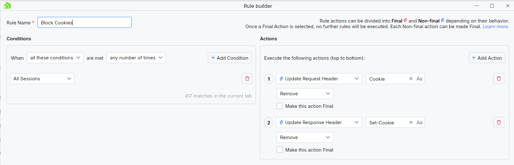
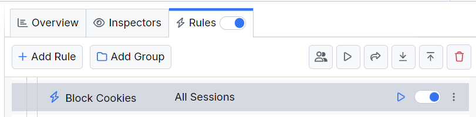

# Blocking Cookies

An HTTP cookie is a piece of information that the client and the server exchange to store specific data like authorization details, user preferences, analytics, and others. As a developer, you might need to test your client or server application as if the receiving cookies is explicitly blocked. 

With Fiddler Everywhere, you can create a rule that automatically blocks sending and receiving cookies.

## Creating a "Block Cookies" Rule

Create a "Block Cookies" rule, by setting the following actions through the [Rules Builder]().

- Create a **Update Request Header** action, and remove the all pre-set values for the **Cookie** header.
- Create a **Update Response Header** action, and remove the all pre-set values for the **Set-Cookie** header.

An example rule that matches all sessions and explicitly blocks all cookies.

Once the rule is created, enable the **Rules** tab, toggle the rule switch, and start capturing traffic.

The link below provides a ready-to-use rule for download as a FARX file, which you can import through the Rules toolbar.

[A "Block Cookies" rule as FARX file](https://github.com/telerik/fiddler-everywhere/rules/tooling/block-cookies)
 
 