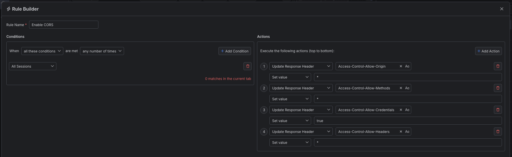
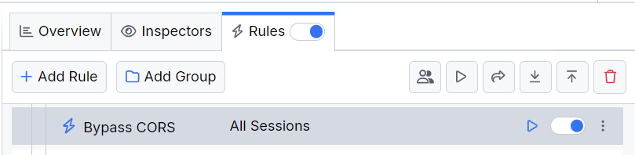

## CORS and the Same-Origin Policy

Cross-Origin Resource Sharing (CORS) is a technique based on HTTP headers that limits the origins (outside the target domain) allowed to load resources on the client's side. Setting specific domains, schemes, or ports permitted to serve resources guarantees that clients can't be tricked into sharing sensitive data with third-party actors. Most modern-day applications strictly set a list of external origins that are allowed to bypass CORS.

With Fiddler Everywhere, you can easily create a rule that bypasses the pre-set CORS policies by overwriting the sent/received values with wildcards (or other specific values).

## Creating a "Bypass CORS" Rule

In this example, we will create a rule named "Bypass CORS" that effectively sets the CORS policy not to a same-origin or specific domain but to all domains (while using a wildcard). It is important to note that this effectively bypasses the same-origin policy, which might allow third-party actors to execute a cross-site request forgery (CSRF). The rule should only be used for testing purposes and where/when needed, not for real-life scenarios.

To create a "Bypass CORS" rule, set the following actions through the [Rules Builder]().

- The HTTP Response header `Access-Control-Allow-Origin` must be set with a wildcard value `*`.
- The HTTP Response header `Access-Control-Allow-Methods` must be set with a wildcard value `*`.
- The HTTP Response header `Access-Control-Allow-Credentials` must be set with a wildcard value `*`.
- The HTTP Response header `Access-Control-Allow-Headers` must be set with a wildcard value `*`.

An example rule that matches all sessions and explicitly blocks all cookies.

Once the rule is created, enable the **Rules** tab, toggle the rule switch, and start capturing traffic.

The link below provides a ready-to-use rule for download as a FARX file, which you can import through the Rules toolbar.

[A "Bypass CORS" rule as FARX file](https://github.com/telerik/fiddler-everywhere/rules/tooling/bypass-cors)
 
 