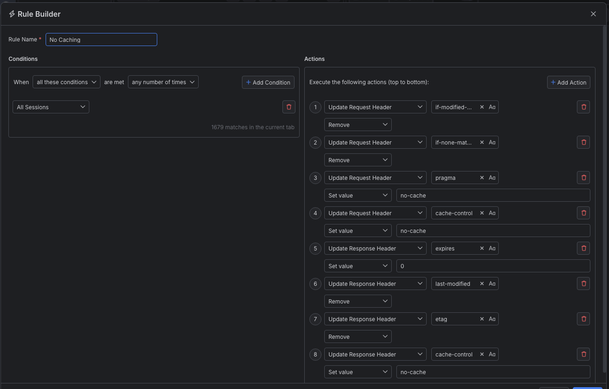

# Disabling Caching

Many client and server applications cache resources to optimize sequential connections. Caching works through specific HTTP Headers that instruct the client or the server to use a local copy of the response. This way, the applications can load their content significantly faster than having to download the actual resources each time they are requested.

 Whether you are a tester, quality engineer, or developer, you might often need to clear the cache using the built-in tools (for example, through the "Empty Cache and Hard Reload" feature in Chromium-based browsers) to ensure that you see the latest version of the requested resources. 
 
 With Fiddler Everywhere, you can create a rule that automatically disables data caching. This allows you to test always against the latest version of your client/server API.

## Creating a "No Caching" Rule

Create a "No Caching" rule, by setting the following actions through the [Rules Builder]().

- Create a **Update Request Header** action, and remove the all pre-set values for the **If-Modified-Since** header.
- Create a **Update Request Header** action, and remove the all pre-set values for the**If-None-Match** header.
- Create a **Update Request Header** action, and update the **Pragma** header with value **no-cache**.
- Create a **Update Request Header** action, and update the **Cache-control** header with value **no-cache**.
- Create a **Update Response Header** action, and update the **Expires** header with value **0**.
- Create a **Update Response Header** action, and remove the all pre-set values for the **Last-Modified** header.
- Create a **Update Response Header** action, and remove the all pre-set values for the **eTag** header.
- Create a **Update Response Header** action, and update the **Cache-Control** header with value **no-cache**.

An example rule that matches all sessions and explicitly turns off the caching through.

> Tip: The matching criteria in the above screenshot demonstrate how to apply the rule for all sessions. However, Fiddler Everywhere provides robust matching conditions that you can use to further optimize your web debugging process.

Once the rule is created, enable the **Rules** tab, toggle the rule switch, and start capturing traffic.

The link below provides a ready-to-use rule for download as a FARX file which you can then import through the Rules toolbar.

[A "No Caching" rule as FARX file](https://github.com/telerik/fiddler-everywhere/rules/tooling/no-caching)
 
 