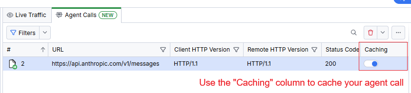
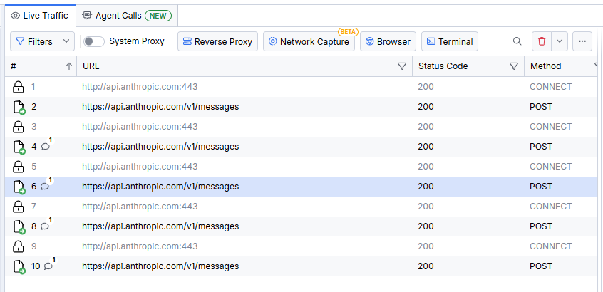
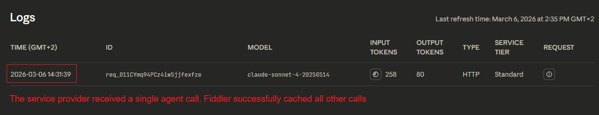

# Agent Cache

Reuse prior agent responses during development and testing to shorten the feedback loop and speed up iterations—while keeping execution costs under control. This is **Agent Cache**.

When building and testing automated agents that communicate with model-provider endpoints over HTTPS, every test run sends a live request and consumes tokens. Agent Cache breaks that cycle by letting you cache a captured endpoint response and have Fiddler Everywhere replay it for matching calls—so your testing no longer incurs token costs after the first capture, and repeated runs against the same cached response stay fast and deterministic.

## Overview

Fiddler Everywhere adds an **Agent Calls** tab in the **Traffic** pane, alongside tabs such as **Live Traffic** and **Compare Sessions**.

The **Agent Calls** tab is a focused view over sessions already captured in **Live Traffic**. It automatically filters and displays HTTPS sessions that target supported model-provider endpoints.

>important The **Agent Calls** tab reflects sessions that have already been captured. You must have active traffic capture running, or previously captured sessions present in **Live Traffic**, before any sessions appear in **Agent Calls**.

## The Agent Calls Tab

The **Agent Calls** grid includes the same key columns as **Live Traffic**—for example, **#**, **Host**, **URL**, **Method**, **Status**, **Body**, and **Duration**—giving you full visibility into each captured endpoint call.

Additional behaviors to keep in mind:

- Sessions appear in **Agent Calls** automatically when Fiddler detects traffic to supported agentic endpoints.
- If two or more identical endpoints are cached, Fiddler returns the response from the first cached session.
- Fiddler rules apply only to non-cached sessions. Cached responses are returned as-is without rule evaluation.
- After a session is cached, subsequent requests to that endpoint appear only in **Live Traffic**. **Agent Calls** shows the original non-cached requests.

The grid adds one dedicated sticky column:

| Column | Description |
|:-------|:------------|
| **Caching** | A toggle switch per session. Enable it to cache the session's recorded response. Disable it to stop intercepting and resume live calls to that endpoint. 

When the **Caching** switch is enabled for a session, Fiddler Everywhere intercepts matching outbound calls and returns the cached response instead of forwarding the request to the remote endpoint. When the switch is disabled, requests pass through normally.

## Get Started

The following scenario demonstrates how Agent Cache eliminates redundant token usage during the development of an agent that calls a model-provider endpoint.

**Scenario:** You are building an agent that sends a structured HTTPS request to a completion endpoint (for example, `api.openai.com`). During development you repeatedly trigger the same call to verify your agent's parsing and response-handling logic. Without caching, each run consumes tokens.

1. Start capturing traffic in Fiddler Everywhere—click **Start Capture** in the toolbar.
1. Run your agent to trigger an HTTPS call to the model-provider endpoint.
1. Open **Traffic > Agent Calls**.
1. Locate the captured session in the grid (use the **Host** or **URL** columns to identify it).
1. Enable the **Caching** switch for that session in the sticky **Caching** column.
       
1. Run your agent again with the same request.
1. Verify in the **Live Traffic** grid that Fiddler Everywhere served the cached response for all subsequent requests.
       

A quick check in the agent provider confirms that no new live calls were made and no tokens were consumed.



You can disable the **Caching** switch at any time to resume live calls to the endpoint.

## Supported Endpoints

The **Agent Calls** tab automatically detects and displays sessions targeting a broad range of model-provider and inference-gateway endpoints—including major providers, cloud-hosted inference services, and local runners—without any manual configuration.

### Adding Endpoints Manually

If a session does not appear in **Agent Calls** automatically—for example, when working with a locally hosted API, an internal gateway, or a newer provider not yet in the built-in detection list—you can promote it manually:

1. In **Live Traffic**, right-click the session.
2. Select **Add to Agent Calls** from the context menu.

The session then appears in the **Agent Calls** tab and can be cached like any automatically detected session.

## How It Works

The following diagram shows the request flow when Agent Cache is active.

```txt
┌─────────────────────┐
│    Your Agent       │
└──────────┬──────────┘
           │ HTTPS request (proxied)
           ▼
┌─────────────────────┐
│ Fiddler Everywhere  │
│  (Agent Calls tab)  │
└──────────┬──────────┘
           │
      Cache ON?
           │
    ┌──────┴──────┐
    │             │
   YES           NO
    │             │
    ▼             ▼
┌─────────┐  ┌─────────┐
│ Return  │  │ Forward │
│ cached  │  │ request │
│response │  └────┬────┘
└────┬────┘       │ HTTPS
     │            ▼
     │    ┌──────────────┐
     │    │   Provider   │
     │    └──────┬───────┘
     │           │ response
     │           │
     └───────────┤
                 ▼
          ┌─────────────┐
          │ Your Agent  │
          │  (response) │
          └─────────────┘
```

1. Your agent routes HTTPS traffic through Fiddler Everywhere, either by configuring a proxy in code, by using system proxy settings, or by launching the agent from the Fiddler built-in terminal.
2. Fiddler captures the call and displays it in the **Agent Calls** tab.
3. When the **Caching** switch is enabled for that session, Fiddler replays the stored response for any matching subsequent call.
4. The provider endpoint never receives the duplicate request—no tokens are charged.

## Notes

- Agent Cache is available on Trial, Pro, and Enterprise plans. It is not available on Lite licenses.
- Agent Cache is intended for development and verification workflows where deterministic responses are required.
- Matching is based on the captured request details. If your agent changes the request payload, headers, or target path, capture and cache the updated variant separately.
- Review cached sessions periodically to keep the stored responses aligned with your current workflow expectations.
- Cached sessions are stored within the current Fiddler Everywhere session. Closing and reopening the application clears the cache state.

## Feedback

We welcome your feedback on Agent Cache and any other features you would like to see. You can reach the team by:

- Email [fiddler-support@progress.com](mailto:fiddler-support@progress.com)
- Opening a GitHub issue at [https://github.com/telerik/fiddler-everywhere/issues](https://github.com/telerik/fiddler-everywhere/issues)

## See Also

* [the Fiddler MCP Server - Overview](slug://fiddler-mcp-server)
* [the Fiddler MCP Server - Prompt Ideas](slug://fiddler_ai_prompt_library)
* [the Fiddler Debugging Assistant](slug://fiddler-assistant)