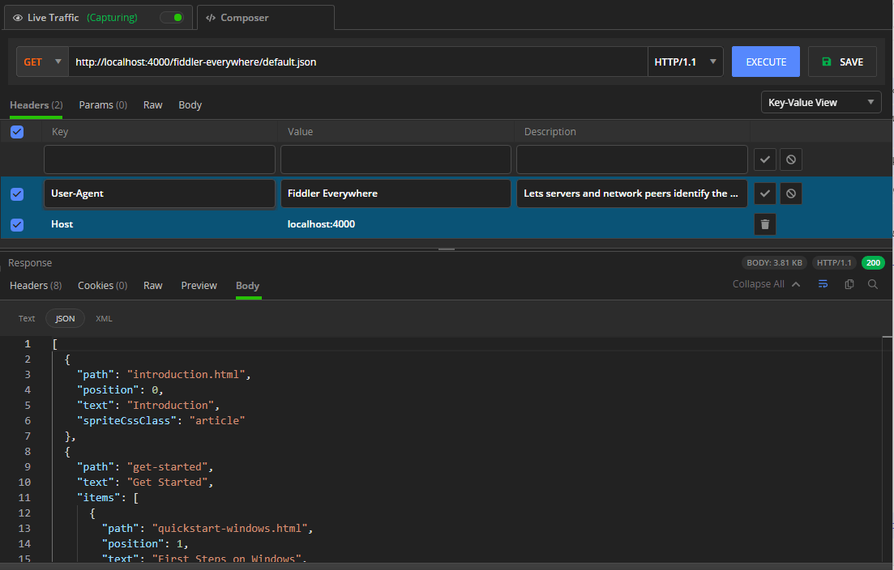

# Creating API Requests

The **Composer** inside Fiddler Everywhere allows you to create requests to APIs.

Requests that are made to local and online APIs enable you to check and debug various endpoints, inspect and analyze requests and responses, and retrieve and receive data quickly.

To create an API request:

1. Select an appropriate **HTTP method** and enter the endpoint URL. The Composer supports the **GET**, **POST**, **PUT**, **DELETE**, **TRACE**, **SEARCH**, and **PROPFIND** methods and also allows you to change the version of the HTTP protocol with the drop-down menu to the left of the **Execute** button.

1. (Optional) If required, enter additional headers, parameters, and body. For example, common scenarios are to enter an authorization header, a **Content-type** header, or custom body data.

    >important By default, the Fiddler Everywhere client will add a **User-Agent** header with the __Fiddler Everywhere__ value. This header lets servers and network peers identify the application, the operating system, the vendor, and/or the version of the requesting user agent.

    >tip To inspect the request that will be sent to the server in detail, use the read-only **Raw** view.

1. To send the composed API request, click **Execute**.

1. Inspect the result in the **Response inspector** tab of the Composer. Like the inspectors for the **Live Traffic** tab, the **Response** inspector provides multiple views such as **Headers**, **Raw**, **JSON**, and so on.

1. (Optional) You can save the request by clicking the **Save** button located to the right of **Execute**. Saved requests are loaded as a collection in the **Requests list** and can be reused or shared with collaborators.

## Additional Resources

- [Grouping Requests in Collections]()
- [Mocking Server Responses]()
- [Inspecting Captured Traffic]().
- [Modifying Traffic]()
- [Sharing Captured Traffic with Collaborators]().
