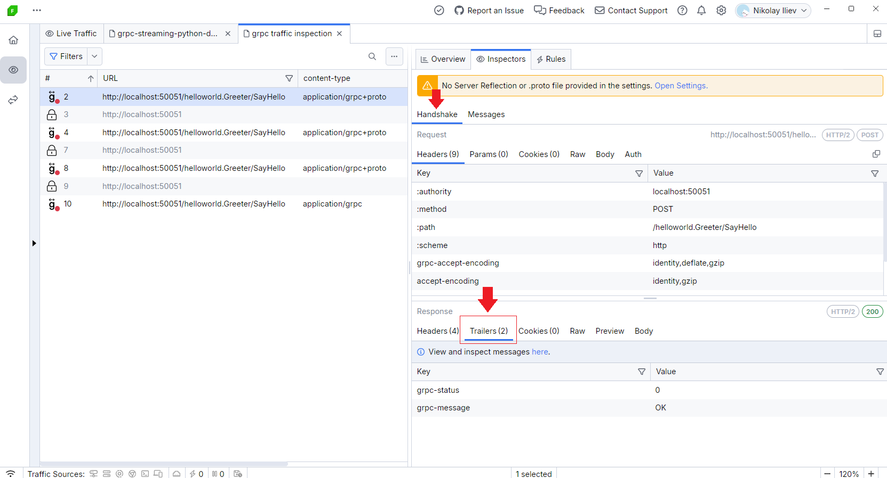
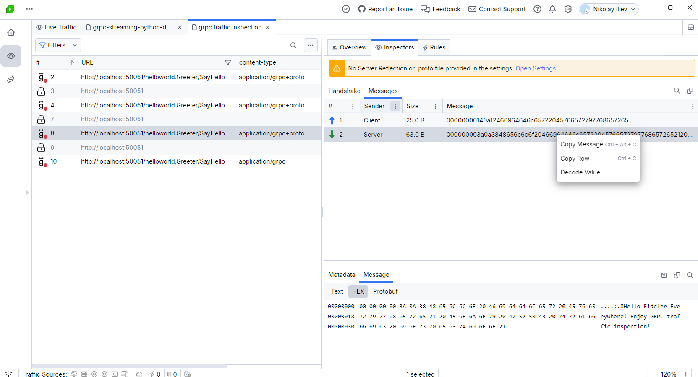
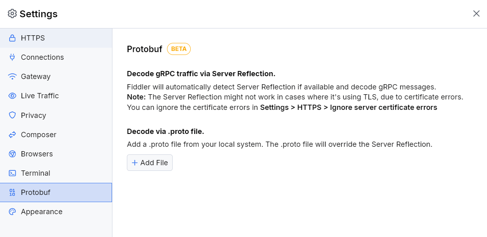

# Capturing and Inspecting gRPC Traffic

My client application utilizes the gRPC framework. What exactly is gRPC? Can I capture and inspect gRPC traffic with Fiddler Everywhere?

## Capturing gRPC in Fiddler Everywhere

[gRPC](https://grpc.io/) is an open-source, cross-platform Remote- Procedure Call (RPC) framework. One of its common usages is to connect services in and across servers with pluggable support for tracing, load balancing, and authentication. 

Fiddler Everywhere captures gRPC traffic automatically through [all capturing modes](slug://capture-traffic-get-started) with the clarification that as gRPC uses HTTP/2, you need to ensure that HTTP/2 capturing is enabled in Fiddler Everywhere. With the Fiddler proxy, you can capture gRPC traffic with all supported streaming modes - unary RPC (no streaming), server-streaming RPC, client-streaming RPC, and bi-directional streaming RPC. [Learn more about the streaming modes in gRPC here...](https://grpc.io/docs/what-is-grpc/core-concepts/#unary-rpc)

To capture gRPC traffic with Fiddler Everywhere, the following conditions must be satisfied:

1. Enable HTTP/2 capturing in Fiddler Everywhere through **Settings** > **Connections** > **Enable HTTP/2 support**.
1. Configure the client using the gRPC framework to go through the Fiddler proxy. The execution of this step differs depending on the client's application. Here are some setup guidelines for different clients:
    - **Terminals and shell applications**&mdash;A terminal and shells can be configured explicitly through the Fiddler proxy. [Learn how to capture traffic from a terminal here...](slug://capture-terminal-traffic)
    - **Bash**&mdash;A bash application can be configured to go through the Fiddler proxy. [Learn how to capture traffic from Bash here...](slug://capture-terminal-traffic)
    - **Node.js**&mdash;A Node.js application can be configured to go through the Fiddler proxy. [Learn how to capture traffic from Node.js here...](slug://fiddler-nodejs-traffic)
    - **Python applications**&mdash;Python applications can be configured to go through the Fiddler proxy. [Learn how to capture traffic from Python applications here...](slug://fiddler-python-traffic)
    - **Java applications**&mdash;A Java application can be configured explicitly through the Fiddler proxy. [Learn how to capture traffic from Java applications here...](slug://configure-java-fiddler-everywhere)
    - **Other gRPC clients**&mdash; If your gRPC client utilizes a different technology stack, you must find the proper method for configuring its proxy settings and set the Fiddler address (by default, http://127.0.0.1:8866) as an HTTP and HTTPS proxy.
1. Start capturing! That is it! Fiddler Everywhere will start capturing gRPC immediately.

## Inspecting gRPC Traffic

Fiddler Everywhere introduces a specific user interface to ease the inspection of gRPC traffic. [The gRPC inspectors](slug://inspector-types#websocket-grpc-sse-and-socketio-inspectors) are pretty similar to the inspectors used for capturing WebSocket traffic with one exception - the new gRPC Response inspector called **Trailer** (part of the **Handshake** tab). 

You can use the **Trailer** inspector to examine the specific trailers the server sends or mock particular gRPC behavior. For example, you can modify (through a rule) the `grpc_status` trailer header and test how your application behaves in unexpected scenarios like unexpected errors in the stream.



The captured gRPC session will have a green badge until the gRPC channel is open and a red badge when the gRPC channel is closed.

Double-click a gRPC session to automatically open [the **Messages** tab](slug://inspector-types#messages-tab) and [the **Message** inspector](slug://inspector-types#message-inspector) that allows you to inspect each gRPC message as originally received (the context menu provides decoding option) or through [the **HEX inspector**](slug://inspector-types#hex-body-inspector).



The **Messages** tab lists the outgoing (Sender: Client) and incoming (Sender: Server) gRPC messages. Fiddler Everywhere shows the size and the original content of each message. You can use the context menu to copy the whole row message quickly.

It is important to note that the gRPC uses [Protobuf format](https://protobuf.dev/overview/), which is in unreadable form. That means that the **Decode value** context menu option cannot be used for proper decoding of any gRPC channel message. The only way to decode a Protobuf message is to own the **.proto** file, which cannot be extracted over the gRPC session. Only the scheme creators are aware of the **.proto** format. Fiddler can help developers (that have access to the **.proto** scheme) by allowing them to extract a specific message and then decode it through the owner **.proto** file and the following command:

```js
// [message_object_name] is the name of the message object in the .proto file.
// If the message is inside a package, use package_name.message_object_name.
// [.proto_file_path] is the path to the .proto file where the message is defined.
// [binary_message_file_path] is the path to the file you want to decode.
protoc --decode [message_object_name] [.proto_file_path] < [binary_message_file_path]
```

Selecting a specific message allows you to inspect the message in detail through the **Message** inspector. You can examine the context as text or use the HEX inspector, which consists of an offset column, a hex view column, and a text view column.

## Decoding gRPC traffic

Often, the content in the received gRPC messages will be encoded. Meanwhile, Fiddler Everywhere will try to present the content automatically in a readable form, which is often impossible. To further improve the decoding potions, Fiddler Everywhere also supports decoding through the following options:

- Decoding through gRPC server reflection.

- Decoding through Protobuf schema files (files with extension `.proto`).

### Server Reflection

Fiddler Everywhere will automatically detect if the gRPC server supports and uses server reflection. The server reflection might not work when it uses TLS due to certificate errors. You can ignore the errors through the **Settings** > **HTTPS** > **Ignore Server Certificate Errors** option.

The received gRPC messages will be automatically decoded if server reflection is available.

### Protobuf Files

If you own the Protobuf schema files, you can provide them in Fiddler Everywhere through the **Settings** > **Protobuf** > **Decode via .proto file** option. Fiddler Everywhere will try to use the available `.proto` files to decode all received gRPC messages.



As a result, the gRPC message will have a tooltip indicating that Fiddler used a Protobuf file for its decoding.

## Capturing gRPC Traffic via Reverse Proxy

Fiddler Everywhere supports two proxy approaches for capturing gRPC traffic. Understanding which one to use depends on whether your gRPC server uses **TLS (h2 — HTTP/2 over TLS)** or **cleartext (h2c — HTTP/2 without TLS)**.

| Transport | Recommended Capture Method |
|---|---|
| h2c (insecure, `add_insecure_port`) | Forward proxy |
| h2 (TLS, `add_secure_port`) | Reverse proxy |

> gRPC Python uses a bundled BoringSSL stack and does **not** use the operating system's certificate store. This affects how trust is established for both proxy modes described below.

### Capturing h2 (TLS) gRPC Traffic via Reverse Proxy

When the gRPC server is configured with TLS (`add_secure_port` / `ssl_server_credentials`), the reverse proxy is the recommended capture method. Fiddler Everywhere accepts the TLS connection from the client on one port and forwards it to the server on a different port.

**Step 1 — Configure the server to listen on a custom port.**

Change your server to listen on a port that differs from the one your client connects to (for example, move the server to `8877` and keep the client pointing to `8843`):

```python
# greeter_server.py (TLS example)
port = server.add_secure_port('localhost:8877', server_credentials)
```

**Step 2 — Add a reverse proxy rule in Fiddler Everywhere.**

1. Open the **Reverse Proxy** panel in Fiddler Everywhere.
2. Set **Client Port** to `8843` (the port your client connects to).
3. Set **Remote Host** to `localhost:8877` (the port your server listens on).
4. Set both **Client Protocol** and **Remote Protocol** to **HTTPS**.
5. Save and enable the reverse proxy.

**Step 3 — Trust Fiddler's root CA in your gRPC client.**

Because gRPC Python uses its own TLS stack (BoringSSL) independent of the OS certificate store, you must explicitly provide Fiddler's root CA certificate when constructing the channel credentials. Export Fiddler's root certificate (available in **Settings > HTTPS > Export root certificate**) and concatenate it with your server's CA before passing it to `ssl_channel_credentials`:

```python
# Load your server's CA and Fiddler's root CA
with open('path/to/server_root.crt', 'rb') as f:
    server_ca = f.read()
with open('path/to/fiddler_root.pem', 'rb') as f:
    fiddler_ca = f.read()

# Combine both CAs so gRPC trusts the server cert and Fiddler's MITM cert
combined_roots = server_ca + fiddler_ca
channel_credential = grpc.ssl_channel_credentials(combined_roots)

channel = grpc.secure_channel('localhost:8843', channel_credential)
```

> Passing `None` to `grpc.ssl_channel_credentials()` does **not** fall back to the OS trust store in gRPC Python. You must always pass the explicit PEM bytes for any CA you want gRPC to trust.

**Traffic flow:**

```
gRPC Client → Fiddler reverse proxy (8843, HTTPS) → gRPC Server (8877, HTTPS)
```

### Capturing h2c (Cleartext) gRPC Traffic via Forward Proxy

When the gRPC server uses cleartext transport (`add_insecure_port` / `insecure_channel`), the **reverse proxy cannot be used** for gRPC. Fiddler Everywhere's reverse proxy does not support the h2c upgrade handshake (the `PRI * HTTP/2.0` connection preface sent over plain TCP). Connections will be accepted but immediately dropped, resulting in a `StatusCode.UNAVAILABLE: End of TCP stream` error.

Use the **forward proxy** approach instead. The `grpc.http_proxy` channel option instructs the gRPC library to tunnel the connection through Fiddler using an HTTP `CONNECT` tunnel, which passes h2c traffic transparently.

**Step 1 — Keep the server on its original port** (no port changes needed):

```python
# greeter_server.py
server.add_insecure_port('[::]:50051')
```

**Step 2 — Configure the client to route through Fiddler's forward proxy:**

```python
# greeter_client.py
channel = grpc.insecure_channel(
    'localhost:50051',
    options=[('grpc.http_proxy', 'http://localhost:8866')]
)
```

Replace `8866` with the port Fiddler Everywhere listens on (configured in **Settings > Connections > Fiddler listens on port**).

**Step 3 — Ensure HTTP/2 is enabled in Fiddler Everywhere.**

Go to **Settings > Connections** and enable **HTTP/2 support**.

**Traffic flow:**

```
gRPC Client → Fiddler forward proxy (8866, CONNECT tunnel) → gRPC Server (50051, h2c)
```

> No port changes are required on either the client or the server when using the forward proxy approach. The proxy address is provided entirely through the `grpc.http_proxy` channel option.
