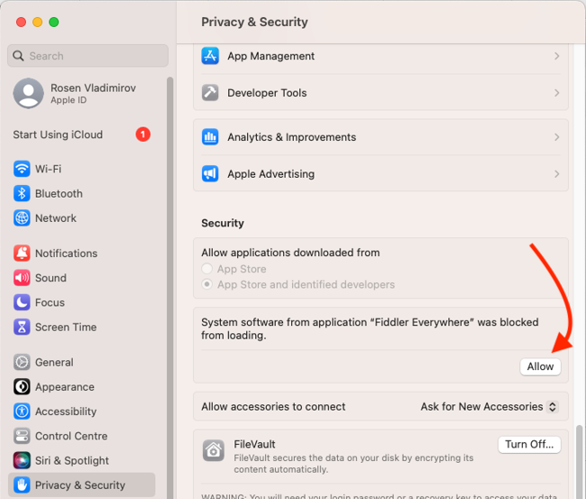
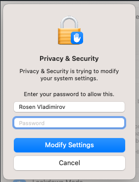
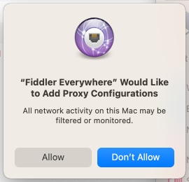
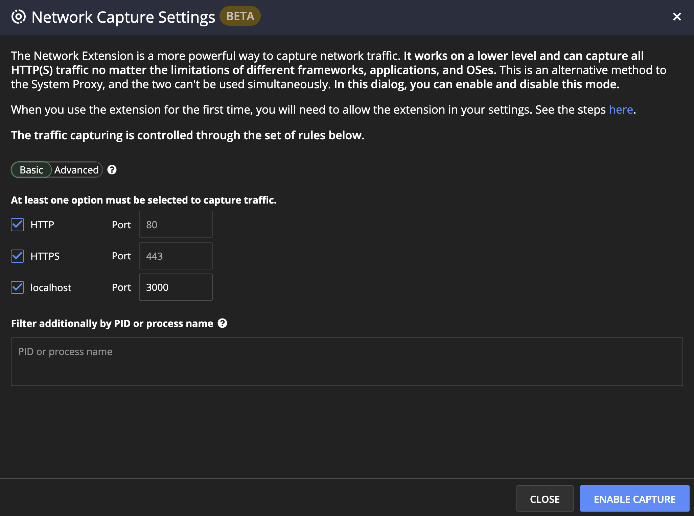
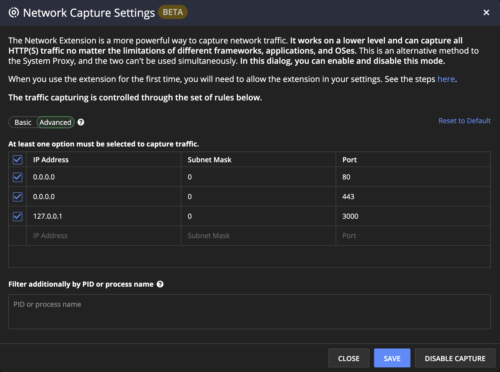

# Network Capture

>important The **Network Capture** feature is a BETA version and is subject to change in the future. Currently, the functionality is available only for the **macOS** version of Fiddler Everywhere.

This article describes using Fiddler's network capturing mode, where "network traffic" refers to all HTTP, HTTPS, WebSocket, and gRPC traffic directed to the active network adapter. The feature requires the installation of a network extension, which requires explicit administrative privileges.

In nature, the **Network Capture** is a more powerful way to capture network traffic on a lower level than an HTTPS(S) proxy works (which is how Fiddler works in the **System Capturing** mode or all other available capturing modes). 

The benefits of the **Network Capture** mode are as follows:

- Works on a lower level compared to HTTP(S) proxies.

- Captures all HTTP(S) traffic from the active network adapter. 

- No limitations related to frameworks, applications, operating systems, and other configuration specifics that you usually must handle when using an HTTP(S) proxy.

- Allows you to control the IP addresses and processes to monitor seamlessly.

## Prerequisites

You must meet the following prerequisites to use the **Network Capture** mode.

- Installed the latest version of Fiddler Everywhere.

- Administrative privileges to install/uninstall the network extension on macOS.

## Enabling the Network Capture Mode

To enable and use the **Network Capture** mode, you need to explicitly activate the feature in Fiddler Everywhere through the following steps:

1. Close the Fiddler Everywhere application.

1. Navigate to the following macOS folder.

    ```bash
    ~/.fiddler/Settings
    ```

1. Open the **electron-settings.json** file and add the following object (within the root object).

    ```JSON
    "featureToggles": {
        "driverCapturing": true
    }
    ```
1. Ensure the JSON structure is valid, and then save and exit the file.

    With the above change, you can restart the Fiddler Everywhere application. As a result, the **Network Capture** mode will be accessible in the Fiddler's **Live Traffic** menu options.

    


## Using the Network Capture Mode

Once the **Network Capture** is enabled, you can capture all HTTP(S) traffic through the active network adapter. As noted in the benefits section, the main perk of using the network capturing mode is that you don't need to change the operating system proxy or set the client's proxy. That lets you quickly capture traffic from processes that otherwise have trouble using HTTP(S) proxies.

To use the **Network Capture**, you need to set the IP address explicitly, the TCP/IP ports, and the (optionally) process name. At least one rule that sets the IP address (or range of IP addresses) alongside the related TCP/IP port must be specified for the capturing to work.


### Start Network Capture

To start the **Network Capture**, execute the following steps:

1. Click on the **Network Capture** button from the **Live Traffic** menu.

1. Click on the **Enable Capture** from the **Network Capture Settings (BETA)** screen.

>tip The capturing will use the pre-configured rules. [Instructions on how to modify the default capturing rules or add additional rules here...](#modify-network-capture-rules)

If this is the first time you are starting the **Network Capture** mode on your macOS, then you will need to install and allow the usage of the Fiddler's network extension. To do so, proceed with the following steps:

Immediately after pressing **Enable Capture**, you will see the following native macOS popup.


1. In the above macOS popup, choose **Open System Settings**. In the opened macOS system settings, scroll down to the message that the Fiddler extension is blocked.

1. Allow the Fiddler Everywhere extension.

    

1. Enter your credentials to install the extension.

    

1. Click **Allow** to confirm the Fiddler Everywhere network extension installation.

    


### Stop Network Capture

To stop the **Network Capture**, execute the following steps:

1. Click on the **Network Capture** button from the **Live Traffic** menu.

1. Click on the **Disable Capture** from the **Network Capture Settings (BETA)** screen.

### Modify Network Capture Rules

By default, the **Network Capture** mode comes with the default active rules that will capture traffic from all IP addresses and processes working on ports 80 (HTTP) and port 443 (HTTPS). An additional rule also enables the capturing from localhost (`127.0.0.1`) on port 3000 - this rule demonstrates how you can add your own specific capturing rules within the **Network Capture Settings (BETA)** screen.

The **Network Capture Settings (BETA)** screen has a **Basic** view that simplifies the setup of the rules.



Alternatively, the **Advanced** view can create more complex capturing rules.



Through the advanced view, you can manually control what traffic will be captured through the following options:

- **IP Address**&mdash;Sets the value of the IP address or starting address of the IP range (in case the [CIDR-notated](#cidr-notation-for-setting-ip-addresses) subnet mask differs from 32).

- **Subnet Mask**&mdash;Sets the subnet mask, which will determine the range of OP addresses. Accepts [Classless Inter-Domain Routing (CIRD) notation](#cidr-notation-for-setting-ip-addresses).

- **Port****&mdash;Sets the TCP/IP port. By default, most client applications use port 80 for HTTP and port 443 for HTTPS. However, it is common for some applications to use different ports for staging and testing purposes (like custom ports for demo applications running on localhost)

### CIDR Notation for Setting IP Ranges

The **Subnet Mask** field accepts [a CIRD notation](https://en.wikipedia.org/wiki/Classless_Inter-Domain_Routing) value between 0 and 32. For example, A value of 32 (equal to subnet mask `255.255.255.255`) means that only the host address, as set through the **IP Address** field, will be monitored. Conversely, a value of 0 (equal to subnet mask `0.0.0.0`) means that all IP addresses from the range will be monitored starting from the address set in the **IP Address** field.

The default capturing rules for ports 80 and 443 use  **IP Address** set as `0.0.0.0` and **Subnet Mask** set as *0* (`0.0.0.0`). That entry translates to all available IP addresses because it starts from `0.0.0.0` and adds a mask covering the entire IPV4 range (all 4,294,967,296 available addresses). 

## Removing the macOS Network Extension

Once the Fiddler's network extension installs, you can quickly enable and disable the **Network Capture** more. However, it is important to note that disabling the mode doesn't remove the network extension from your operating system. If you want to entirely remove the network extension from your macOS device, you can proceed with [manually removing the extension](#manual-removal) or by [uninstalling the Fiddler Everywhere application](removal-through-uninstall).
 
### Manual removal

You can manually remove the extension through executing the following steps:

1. Open the macOS **System Settings**.

1. Navigate to the **Network** section.

1. Click on **Filters**.

1. Select the Fiddler Everywhere extension.

    - Use the dropdown on the right side to disable the network extension (you can re-enable it at later point).

    - Use the “-” sign to uninstall and complete remove the network extension.

### Removal through Uninstall

Uninstalling the Fiddler Everywhere application also triggers the deletion of the Fiddler's network extension. To proceed with that option, drag and drop Fiddler Everywhere icon from the macOS **Applications** to the macOS bin.

>tip On some macOS systems, the removal of Fiddler Everywhere might initially fail. In such cases, close Fiddler Everywher, ensure no Fiddler processes runs in the background and then re-try the uninstall process.


