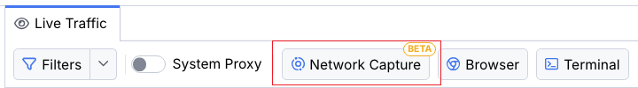

# Network Capture

>important The **Network Capture** feature is a BETA version and is subject to change in the future. Currently, the functionality is available only for the macOS version of Fiddler Everywhere.

This article describes using Fiddler's network capturing mode, where "network traffic" refers to all HTTP, HTTPS, WebSocket, and gRPC traffic directed to the active network adapter. The feature requires the installation of a network extension, which requires explicit administrative privileges.

In nature, the **Network Capture** is a more powerful way to capture network traffic on a lower level than an HTTPS(S) proxy works (which is how Fiddler works in the **System Capturing** mode or all other available capturing modes). 

The benefits of the **Network Capture** mode are as follows:

- Works on a lower level compared to HTTP(S) proxies.

- Captures all HTTP(S) traffic from the active network adapter. 

- No limitations related to frameworks, applications, operating systems, and other configuration specifics that you usually must handle when using an HTTP(S) proxy.

- Allows you to seamlessly control the range of IP addresses and processes to monitor.

## Prerequisites

You must meet the following prerequisites to use the **Network Capture** mode.

- Installed the latest version of Fiddler Everywhere.

- Administrative privileges to install the network extension on macOS.

## Enabling the Network Capture Mode

Currently, the **Network Capture** mode is "hidden" behind a feature toggle, and you need to enable it to access the feature explicitly. The steps listed below will be substituted with an easily accessible user interface once the feature is out of BETA state.


1. Close the Fiddler Everywhere application.

1. Navigate to the following macOS folder

    ```bash
    ~/.fiddler/Settings
    ```

1. Open the **electron-settings.json** file and add the following object (within the root object)

    ```JSON
    "featureToggles": {
        "driverCapturing": true
    }
    ```
1. Ensure the JSON structure is valid, and then save and exit the file.

With the above change in place, you can now restart the Fiddler Everywhere application. As a result, the **Network Capture** mode is now accessible in the Fiddler's **Live Traffic** menu options.

