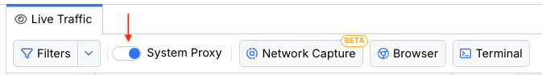

# System Capturing Mode

This article describes how to use Fiddler's **system capturing mode**, where "system traffic" refers to all HTTP, HTTPS, WebSocket, and gRPC traffic directed to go through the operating system proxy settings.

## Capturing System Traffic

Fiddler logs all HTTP and HTTPS traffic between your computer and the Internet and helps you analyze and debug the incoming and outgoing traffic from any application that supports a proxy&mdash;Google Chrome, Firefox, various desktop applications, CLI applications, and virtually any other application that respects the OS proxy settings. You can use the captured traffic to debug issues, mock HTTP requests and responses, identify performance bottlenecks, share them with collaborators, and more.

To capture system traffic with Fiddler Everywhere:

1. Start Fiddler Everywhere. 

1. Open the **Home** pane.

1. Open the **System Proxy** tutorial and follow the instructions.

OR (applicable when the Fiddler CA is already installed and trusted)

1. Start Fiddler Everywhere.

1. Open the **Traffic** pane.

1. Toggle the **System Proxy** switch to enable system capturing.

> Tip With the switch **System Proxy** toggled on, open a browser and type an arbitrary web address. As a result, Fiddler Everywhere intercepts the request, and the Live Traffic grid populates.

## Enable and Disable System Capturing

You can manually turn on and off the system proxy capturing mode.

1. Start Fiddler Everywhere.

1. Open the **Traffic** pane.

1. Toggle the **System Proxy** switch ON or OFF to enable and disable the system capturing mode.

Fiddler Everywhere warns you through an informative dialog when the system capturing mode is manually enabled.

>important Fiddler Everywhere persists in the state of the **System Proxy** switch and starts with system capturing turned on or off based on the last switch state.

