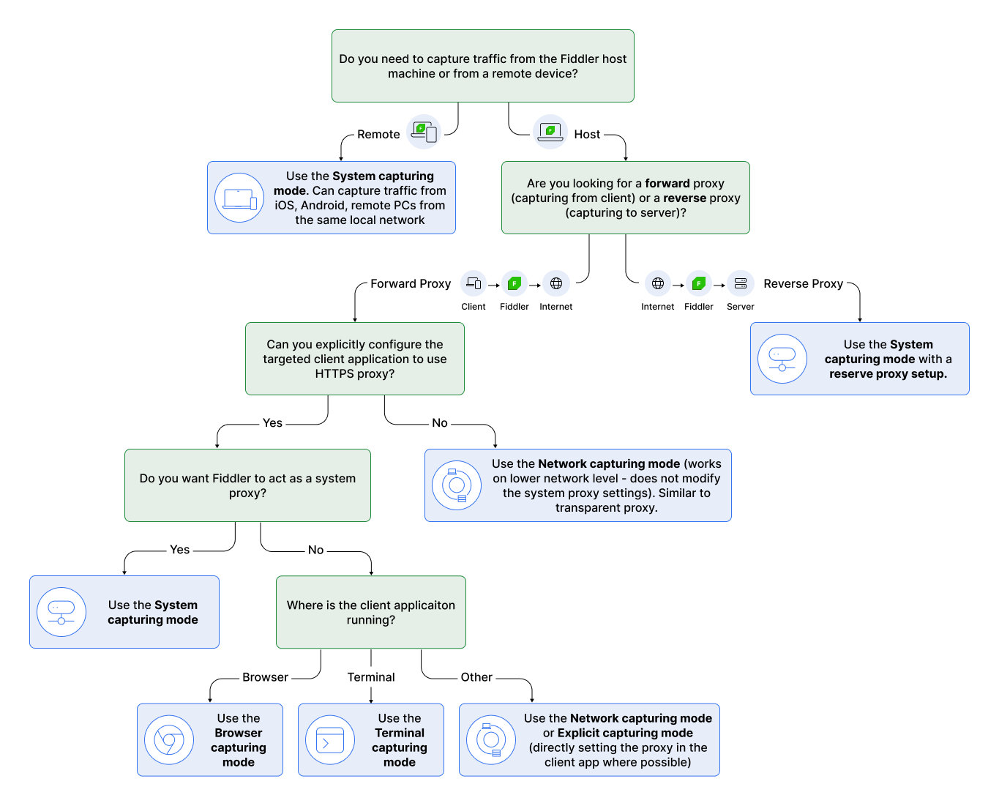
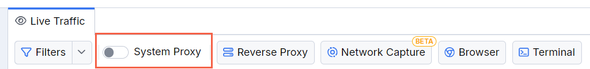
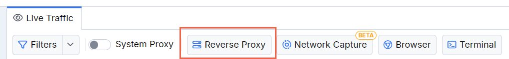
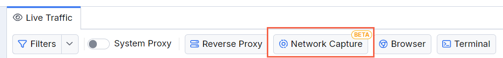
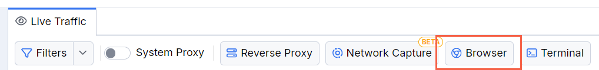
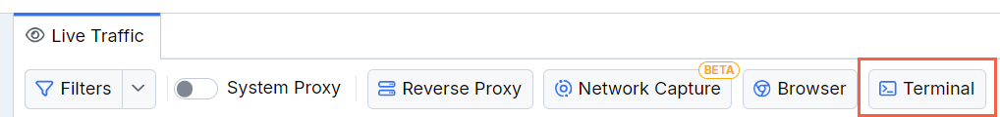

# Capturing Modes Overview

Fiddler Everywhere is a comprehensive web debugging proxy that captures HTTP(S), WebSocket, Server-Sent Events (SSE), and gRPC traffic. As a local forward TLS proxy, it can intercept traffic from locally installed applications and remote devices on your network.

## Available Capturing Modes

Fiddler Everywhere offers multiple capturing modes to suit different debugging scenarios:

- **[System Capturing](#system-capturing)**: Captures all system-wide traffic by modifying your OS proxy settings
- **[Network Capturing](#network-capturing)**: Captures traffic at the network adapter level without proxy configuration
- **[Independent Browser Capturing](#independent-browser-capturing)**: Uses a sandboxed browser instance for isolated traffic capture
- **[Terminal Capturing](#terminal-capturing)**: Captures traffic from a dedicated terminal session
- **[Explicit Capturing](#explicit-capturing)**: Captures traffic from applications manually configured to use Fiddler's proxy
- **[Remote Traffic Capturing](#remote-traffic-capturing)**: Captures traffic from devices on your local network

## Choosing the Right Capturing Mode

Select the appropriate capturing mode based on your specific debugging needs:

- **System Capturing**: Best for general debugging of all applications on your machine
- **Network Capturing**: Ideal when proxy settings cause issues or when you need low-level traffic analysis
- **Independent Browser**: Perfect for web application testing without affecting other system traffic
- **Terminal**: Great for debugging CLI tools, Node.js applications, and command-line utilities
- **Explicit/Remote**: Essential for testing mobile apps, IoT devices, or distributed systems
- **Reverse Proxy**: Best for capturing tarffic sent to a server



## Feature Comparison Table

The following table shows the capabilities and differences between Fiddler's capturing modes:

| Feature          | System Capturing | Network Capturing | Independent Browser Capturing  | Terminal Capturing | Explicit Capturing 
|:-----------------|:-----------------|:------------------|:--------------------------------|:-------------------|:-----------------
| **Traffic Sources** |
| Capture browser traffic   | ✅ All browsers  | ✅ All browsers  | ✅ Chromium browsers only | ❌ | ✅ All browsers 
| Capture application traffic | ✅ Most apps | ✅ All apps | 🟨 Browsers only | 🟨 Terminals only | ✅ Configured apps
| Capture remote traffic | ✅  | ❌  | ❌ | ❌ | ✅ 
| Capture Android traffic | ✅ |  ❌ | ❌ | ❌ | ✅
| Capture iOS traffic | ✅ | ❌ | ❌ | ❌ | ✅
| **Technical Details** |
| HTTPS source | System proxy | Network adapter | Dedicated browser | Dedicated terminal | Manual configuration
| Reverse Proxy support | ✅ | ✅ | ✅ | ✅ | ✅
| Traffic modification | ✅ | ✅ | ✅  | ✅ | ✅
| Breakpoints | ✅ | ✅ | ✅  | ✅ | ✅
| **Protocol Support** |
| Protocols  | HTTP, HTTPS, Streaming HTTP, WebSocket, SSE, gRPC, Socket.IO | HTTP, HTTPS, Streaming HTTP, WebSocket, SSE, gRPC, Socket.IO | HTTP, HTTPS, Streaming HTTP, WebSocket, SSE, Socket.IO | HTTP, HTTPS, Streaming HTTP, WebSocket, SSE, gRPC, Socket.IO | HTTP, HTTPS, Streaming HTTP, WebSocket, SSE, gRPC, Socket.IO
| HTTP/2   | ✅ | ✅ | ✅  | ✅ | ✅
| TLS 1.3  | ✅ | ✅ | ✅  | ✅ | ✅
| IPv4  | ✅ | ✅ | ✅  | ✅ | ✅
| IPv6  | ✅ | ❌ | ✅  | ✅ | ✅
| **Platform Support** |
| Supported OS  | Windows, macOS, Linux | Windows, macOS | macOS  | Windows, macOS, Linux | Windows, macOS, Linux
| VPN compatibility  | ✅* | ✅* | ✅ | ✅ | 🟨 App dependent
| **Configuration Requirements** |
| Proxy modification | ✅ Modifies system proxy | ❌ Uses network extension | 🟨 Browser instance only | 🟨 Terminal instance only | ✅ Manual configuration 
| Setup complexity | 🟨 Moderate | 🟡 Advanced | ✅ Simple | ✅ Simple | 🟡 Advanced
| CA certificate required | ✅ Automated/manual | ✅ Automated/manual | ❌ Preconfigured  | ❌ Preconfigured  | ✅ Manual installation

**Legend:** ✅ Fully supported | 🟨 Limited support | 🟡 Requires additional setup | ❌ Not supported

* VPN support depends on the specific VPN software and may require [additional configuration](slug://configure-vpn-fiddler).

### License Tier Comparison

Fiddler Everywhere offers multiple license tiers with different feature sets. See the [purchase comparison table](https://www.telerik.com/purchase/fiddler) for detailed information about each tier and its supported features.

## System Capturing

System capturing is the most comprehensive mode, intercepting all HTTP, HTTPS, WebSocket, SSE, and gRPC traffic between your computer and the Internet. This mode works by modifying your operating system's proxy settings to route traffic through Fiddler.

**Use Cases:**
- General application debugging
- System-wide traffic analysis
- Testing desktop applications
- Capturing traffic from multiple applications simultaneously



**Setup Steps:**
1. Start Fiddler Everywhere
2. Enable system capturing using the OS-specific guides:
   - [Windows setup guide](slug://first_steps_windows#capture-system-traffic)
   - [macOS setup guide](slug://first_steps_macos#capture-system-traffic)
   - [Linux setup guide](slug://first_steps_linux#capture-system-traffic)

[Learn more about system capturing...](slug://capture-system-traffic)

## Reverse Proxy

The Fiddler Everywhere application supports capturing in reverse proxy mode through the built-in **Reverse Proxy** functionality or through a custom reverse proxy rules.



[Learn more about the reverse proxy mode here...](slug://fiddler-reverse-proxy)

## Network Capturing (Beta)

Network capturing operates at a lower level than traditional HTTP proxies, capturing TCP traffic directly from your network adapter. This mode is available as a beta feature for Windows and macOS.

**Key Advantages:**
- No proxy configuration required
- Captures traffic from applications that don't support proxies
- More granular control over monitored processes and IP ranges
- Overcomes proxy-related limitations (e.g., Safari WebSocket issues on macOS)

**Use Cases:**
- Applications that ignore proxy settings
- WebSocket debugging in Safari on macOS
- Low-level network analysis
- Environments where proxy configuration is restricted



[Learn more about network capturing...](slug://capture-network-traffic)

### Network Capturing Benefits

Network capturing solves several common proxy limitations:

- **Safari WebSocket Issue**: [Safari on macOS ignores proxy settings for WebSocket traffic](https://discussions.apple.com/thread/253885692?sortBy=best), making traditional proxy tools ineffective. Network capturing bypasses this limitation by operating at the TCP level.
- **Proxy-Resistant Applications**: Some applications don't respect system proxy settings or have their own network stacks.
- **Corporate Environments**: Where proxy configuration may be restricted or controlled by IT policies. 

## Independent Browser Capturing

Independent browser capturing provides a sandboxed browser environment for isolated traffic analysis. Currently supported for Chromium-based browsers on macOS.

**Benefits:**
- No system-wide proxy changes required
- Isolated testing environment
- No certificate installation needed
- Perfect for web application testing

**Use Cases:**
- Web application debugging
- Testing without affecting other system traffic
- Environments where certificate installation is restricted
- Quick browser-based testing sessions



[Learn more about independent browser capturing...](slug://capture-browser-traffic#capturing-from-terminal)

## Terminal Capturing

Terminal capturing provides a dedicated terminal session with Fiddler's proxy pre-configured, making it ideal for debugging command-line tools and server-side applications.

**Benefits:**
- Isolated terminal environment
- No system configuration required
- Perfect for CLI tools and Node.js applications
- Pre-configured proxy settings

**Use Cases:**
- Node.js application debugging
- Testing CLI tools and utilities
- curl command analysis
- API testing scripts



[Learn more about terminal capturing...](slug://capture-terminal-traffic#capturing-from-terminal)

## Explicit Capturing

Explicit capturing works with applications manually configured to use Fiddler's proxy address (`127.0.0.1:8866` by default). This method works even when system capturing is disabled.

**Configuration:**
- Proxy address: `127.0.0.1:8866`
- Requires manual proxy configuration in target applications
- Works with any application that supports HTTP proxy settings

**Example:**
```bash
# curl command using Fiddler's proxy
curl --url https://www.example.com/ -x 127.0.0.1:8866 --ssl-no-revoke -v
```

**Use Cases:**
- Specific application testing
- Remote device configuration
- Applications with custom proxy settings
- Testing scenarios requiring precise control

## Remote Traffic Capturing

Remote capturing enables traffic analysis from devices on your local network, including smartphones, tablets, IoT devices, and other computers.

**Setup Requirements:**
1. Configure the remote device to use Fiddler's proxy (`[Fiddler-IP]:8866`)
2. Install Fiddler's CA certificate on the remote device
3. Ensure devices are on the same network

**Supported Remote Devices:**
- Android smartphones and tablets
- iOS devices (iPhone, iPad)
- Gaming consoles
- IoT devices
- Other computers and laptops

**Detailed Guides:**
- [Android device setup](slug://capture-mobile-android-traffic)
- [iOS device setup](slug://capture-mobile-ios-traffic)
- [Generic remote device setup](slug://fiddler-capture-other-computers)

> **Tip:** When capturing only remote traffic, you don't need to install the Fiddler CA on the host machine—only on the remote devices you want to monitor.

## Protocol Support

### HTTP Version Support

Fiddler Everywhere supports both HTTP/1.x and HTTP/2 traffic capture and composition. The application includes [dedicated columns](slug://web-sessions-list#columns) showing HTTP versions:

- **Client HTTP version**: Protocol version between client and Fiddler
- **Remote HTTP version**: Protocol version between Fiddler and remote endpoint

**HTTP/2 Specifics:**
- HTTP/2 support is enabled by default but can be disabled in [**Settings > Connections**](slug://connections-submenu)
- Connections default to HTTP/2 when both client and server support it
- When disabled, Fiddler forces HTTP/1.1 communication
- Fiddler translates between HTTP versions as needed (e.g., HTTP/2 client to HTTP/1.1 server)

**Important Considerations:**
- Some browsers share HTTP/2 connections between tabs and keep connections open after tab closure
- If experiencing issues, try restarting the browser
- HTTP/2 pseudo-headers are displayed in their original transmission order

### Streaming HTTP

Streaming HTTP uses the standard HTTP protocol with chunked transfer encoding to send data in chunks over a single, long-lived connection. The direction of communication is unidirectional where the server sends chunked data and the client can only receive them but has to respond in a new connection.

**Fiddler Streaming HTTP Support:**
- Compatible with all capturing modes
- Reuses the standard [HTTP inspectors](slug://inspector-types#https-inspectors)
- Automatic decoding of encoded messages

### WebSocket Protocol

[WebSocket](https://en.wikipedia.org/wiki/WebSocket) provides full-duplex communication over TCP connections. While distinct from HTTP, it's designed to work over HTTP ports (80, 443) and supports HTTP proxies.

**Fiddler WebSocket Support:**
- Compatible with all capturing modes
- Dedicated [WebSocket inspectors](slug://inspector-types#websocket-grpc-sse-and-socketio-inspectors)
- Automatic decoding of encoded messages
- Inspection of handshake, metadata, and messages

### Server-Sent Events (SSE)

[Server-Sent Events](https://developer.mozilla.org/en-US/docs/Web/API/Server-sent_events) enable servers to push data to clients over HTTP, allowing real-time updates without client polling.

**Fiddler SSE Support:**
- Works with HTTP/1.1 and HTTP/2
- Available in all capturing modes
- Dedicated SSE inspectors for handshake and message analysis

### gRPC Protocol

[gRPC](https://grpc.io/) is Google's open-source RPC framework built on HTTP/2, commonly used for microservices and mobile-to-backend communication.

**Fiddler gRPC Support:**
- Compatible with all capturing modes
- Dedicated [gRPC inspectors](slug://inspector-types#websocket-grpc-sse-and-socketio-inspectors)
- Handshake and message inspection capabilities

> **Important:** gRPC requires HTTP/2 support to be enabled in **Settings > Connections > Enable HTTP/2 support**.

[Learn more about gRPC traffic capture...](slug://capture-grpc-traffic)

### Socket.IO Protocol

[Socket.IO](https://socket.io) provides bidirectional, low-latency, event-based communication between clients and servers, often used for real-time applications.

**Fiddler Socket.IO Support:**
- Works with all capturing modes
- Dedicated [Socket.IO inspectors](slug://inspector-types#socketio-inspectors)
- Handshake and message analysis capabilities