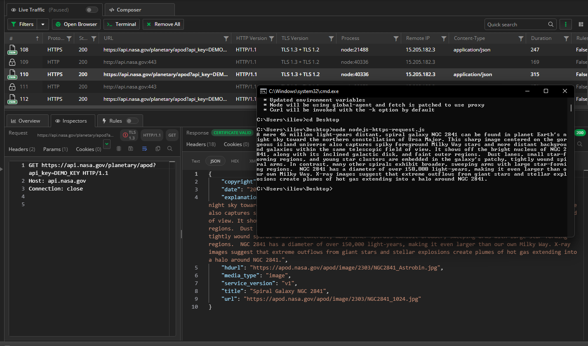

# Capturing Traffic from Preconfigured Terminal

Fiddler Everywhere can automatically start a preconfigured terminal instance through the **>_ Terminal** button in the **Live Traffic** toolbar.

## Preferred Terminal

You can set your preferred terminal application through **Settings > Terminal > Default Terminal**. The following options are available:

- **Command Prompt**&mdash;Available only on Windows.
- **Windows PowerShell**&mdash;Available only on Windows. Specfies the Windows PowerShell built on .NET Framework 4.5 and older versions.
- **PowerShell**&mdash;Available only on Windows. Specfies the PowerShell built on .NET Core or the new .NET.
- **Terminal application**&mdash;Available on macOS and Linux. This option will use the default shell environment, for example, **bash**, **zsh**, or **sh**.

The Fiddler's preconfigured terminal instance automatically proxies all requests made by **curl** or **Node.js** libraries (like **https**, **request**, **axios**, etc.) and all applications, which respect the **http_proxy** and **https_proxy** environment variables. Node.js and curl are configured to trust the Fiddler CA.

>tip Only the terminal instance opened by Fiddler will respect the proxy settings, so there is no need to reset the proxy to use other terminal instances. Note that if you close the Fiddler Everywhere application and leave the preconfigured terminal open, you will lose internet connectivity only for that terminal instance.

### Localhost Traffic through a Preconfigured Terminal

Some frameworks, like the .NET Framework, are hardcoded not to send requests for localhost through any proxies, and as a proxy, Fiddler will not receive such traffic.

Because Windows PowerShell uses the .NET Framework (not to be confused with PowerShell which uses .NET Core), the localhost traffic won't be sent through the proxy. You can workaround the issue by [using the Fiddler's aliases]() or adding a dot to the end of the localhost address (for example, **localhost.:8080**).

### NET Traffic through a Preconfigured Terminal

Capturing traffic from **curl** or **Node.js** libraries does not require explicitly installing and trusting the Fiddler root CA (certificate authority) on the Fiddler host. However, this is a mandatory requirement for a NET application that executes HTTPS requests.

[Learn how to install and trust the Fiddler root CA here...]()

## Capturing Traffic Explictly

You can also use explicit capturing as an alternative to the Fiddler's preconfigured terminal. That would require manually setting the Fiddler proxy address, port, and certificate within your preferred client application (such as a terminal).

## Additional Resources

[Learn more about the different capturing modes in Fiddler Everywhere here...]()