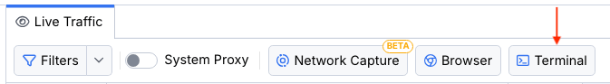

# Terminal Capturing Mode

The **terminal capturing mode** in Fiddler Everywhere allows you to set the Fiddler's proxy on a dedicated terminal instance. The terminal capturing mode lets you use the proxy in a sandboxed environment without changing the global OS proxy settings. Simultaneously, using a sandboxed proxy provides better control of the captured traffic.


## Capturing Terminal Traffic

To capture terminal traffic with Fiddler Everywhere:

1. Start Fiddler Everywhere.

1. Open the **Home** pane.

1. Open the **Terminal** tutorial, and then click on **Open Terminal**.

OR

1. Start Fiddler Everywhere.

1. Open the **Traffic** pane.

1. Click on the **>_ Terminal** button to load terminal instance.

    

1. Start your application within the terminal instance.

As a result, Fiddler Everywhere opens a dedicated terminal instance and starts capturing the ongoing HTTPS traffic immediately. It's important to note that Fiddler will capture the traffic generated from the terminal and any child process that originates (starts) from the same terminal instance. The terminal instance will lose connectivity if Fiddler Everywhere application is closed.


## Choosing Default Terminal

You can set your preferred terminal application through **Settings > Terminal > Default Terminal**. The following options are available:

- **Command Prompt**&mdash;Available only on Windows.
- **Windows PowerShell**&mdash;Available only on Windows. Specifies the Windows PowerShell built on .NET Framework 4.5 and older versions.
- **PowerShell**&mdash;Available only on Windows. Specifies the PowerShell built on .NET Core or the new .NET.
- **Terminal application**&mdash;Available on macOS and Linux. This option will use the default shell environment, for example, **bash**, **zsh**, or **sh**.

The Fiddler's terminal instance automatically proxies all HTTPS requests made by **curl** or **Node.js** libraries (like **https**, **request**, etc.) and all applications which respect the `http_proxy` and `https_proxy` environment variables.


## Terminal Traffic Specifics

While using the terminal capturing mode, you must consider the technical specifics listed below.

### Localhost Traffic through the Fiddler's Terminal

Some frameworks, like the .NET Framework, are hardcoded not to send requests for localhost through any proxies, and as a proxy, Fiddler will not receive such traffic.

Because Windows PowerShell uses the .NET Framework (not to be confused with PowerShell, which uses .NET Core), the localhost traffic won't be sent through the proxy. You can workaround the issue by [using the Fiddler's aliases]() or adding a dot to the end of the localhost address (for example, `localhost.:8080`).


### NET Traffic through a Terminal

Capturing traffic from **curl** or **Node.js** libraries does not require explicitly installing and trusting the Fiddler root CA (certificate authority) on the Fiddler host. However, this is a mandatory requirement for a NET application that executes HTTPS requests.

[Learn how to install and trust the Fiddler root CA here...]()


## Capturing from Non-Fiddler Terminals

>important The [terminal capturing mode](#capturing-terminal-traffic) is the recommended approach because it sets the proxy only per the current session, which makes it considerably more comfortable for testing and debugging. Use the below method only if you aim to solve specific application requirements (for example, an application that does not respect the terminal proxy implicitly).

### Setting the Fiddler Proxy Explicitly

As an alternative to [the Fiddler's terminal option](#capturing-terminal-traffic) described above, you can also explicitly configure your terminal and shell applications to respect the Fiddler proxy and trust the Fiddler root CA. One way to achieve that is to use the `export` command (for macOS and Linux) or the `set` command (for Windows) alongside the `http_proxy` and `https_proxy` variables. The `export` command will generate an environmental variable that will be included in a child process environment. It does not affect other already-existing settings.

The following example demonstrates how to define the proxy settings through environmental variables on **macOS** and **Linux**.

```bash
export http_proxy=http://127.0.0.1:8866
export https_proxy=http://127.0.0.1:8866
```

The following example demonstrates how to define the proxy settings through environmental variables on **Windows**.

```bash
set http_proxy=http://127.0.0.1:8866
set https_proxy=http://127.0.0.1:8866
```

Once the Fiddler Everywhere proxy sets, you can immediately capture traffic through the terminal application.

The following example demonstrates how to request while using cURL through iTerm2 and intercept the traffic in Fiddler Everywhere.

```Bash
curl https://docs.telerik.com/fiddler-everywhere --
```


### Setting the Fiddler Root Certificate

Apart from setting the environment variables `http_proxy` and `https_proxy`, you can manually export and point your terminal application to explicitly use the Fiddler root certificate authority (for decrypting TLS traffic). You must use different global variables depending on the specific application/framework. For example, you can use variables like `SSL_CERT_FILE` and `REQUESTS_CA_BUNDLE` for [configuring the Fiddler's CA within a Python application]().


### Resetting the Fiddler Proxy

Once debugging with Fiddler Everywhere, reset the current environment proxy by removing the Fiddler Everywhere proxy variables. You can use the `unset` command on macOS and Linux to achieve that. On Windows, you need to set an empty string.

The following example demonstrates how to unset the proxy on **macOS** and **Linux**.

```bash
unset http_proxy
unset https_proxy
```

The following example demonstrates how to unset the proxy on **Windows**.

```bash
set http_proxy=
set https_proxy=
```
