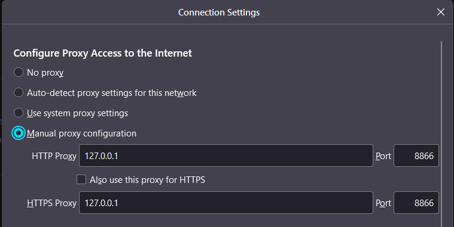

# Explicit Capturing

The **Fiddler Everywhere** application acts as a proxy from the moment it starts, and by default, its proxy address is **127.0.0.1:8866**. Any application explicitly directed to go through the Fiddler Everywhere proxy address will have its HTTP/HTTPS/WebSocket traffic immediately captured, even if the [system capturing](#system-capturing) is turned off.

Example for explicitly making a curl request that goes through the Fiddler Everywhere proxy:

```curl
curl --url https://www.example.com/ -x 127.0.0.1:8866 --ssl-no-revoke -v
```

Some applications have a dedicated user-interface that explicitly allows you to set a manual proxy. For example, below is the UI provided by the Firefox browser.



>tip One of the main benefits of explicitly setting specific client applications to use the Fiddler Everywhere proxy is that Fiddler won't need to act as a system proxy and, in terms, it will capture only specific traffic. That will reduce the pollution of your Live Traffic list and will ease your work with the Fiddler tool.