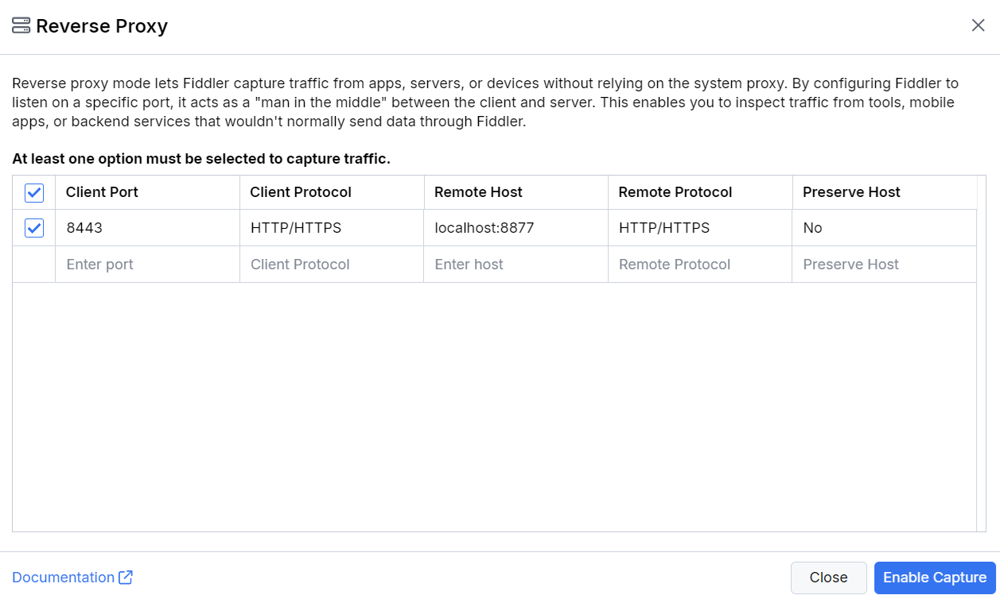
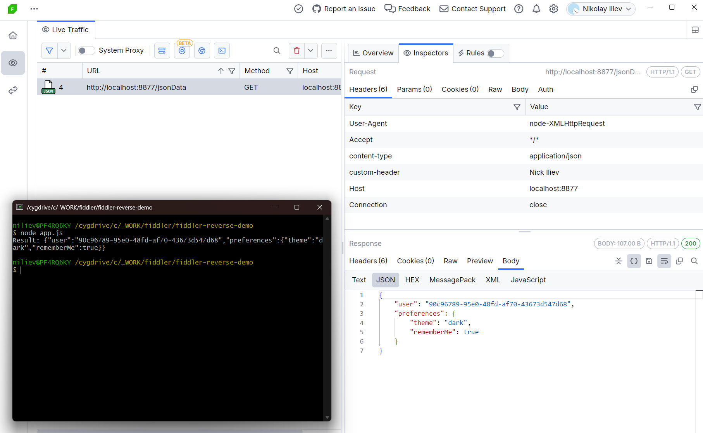
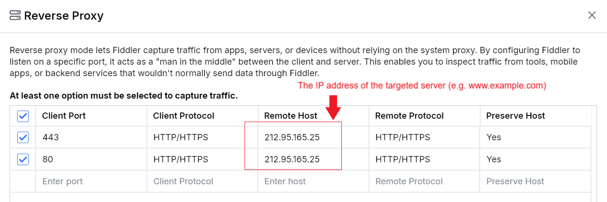
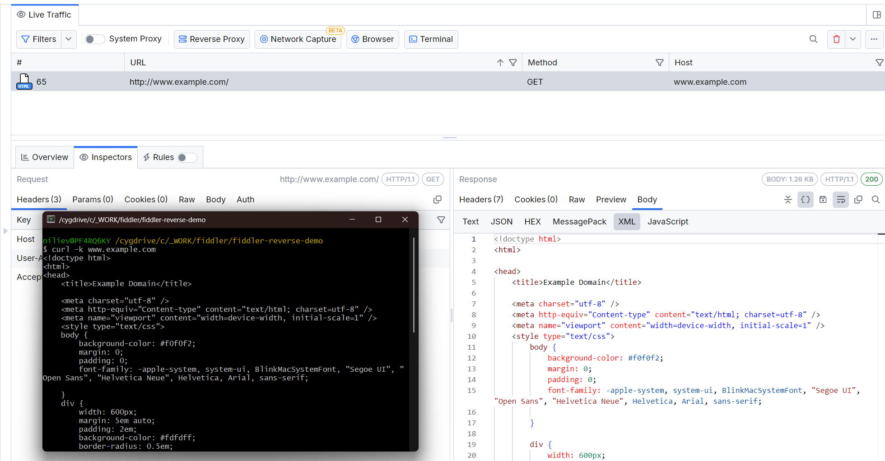

# Reverse Proxy Mode

Fiddler Everywhere can act as a reverse proxy, allowing you to inspect, debug, and modify HTTP(S) requests sent to your server. This is especially useful for developers, QA, and support engineers who need to analyze how their server handles client requests without the complexity of setting up a dedicated reverse proxy solution.

This article explains how to use Fiddler Everywhere as a reverse proxy through the built-in **Reverse Proxy** feature. You'll also find a demo setup and troubleshooting tips.

>note For most users, the built-in Reverse Proxy feature is the simplest and most robust approach.

## Reverse Proxy for Local Servers

The built-in **Reverse Proxy** feature lets you quickly set up a reverse proxy for localhost or remote servers. Follow these steps:

1. Start Fiddler Everywhere.
2. Click the **Reverse Proxy** button.
3. Enter the targeted port in the `Client Port` field (e.g., `8443`).
4. Select the client protocol (default: `HTTP/HTTPS`).
5. Enter the **remote host address** and **port** in the `Remote Host` field (e.g., `localhost:8877`).
    >important The custom port configured in the `Remote Host` field must differ from the port used by the Fiddler Everywhere proxy (configured through the **Settings > Connections > Fiddler listens on port** option).
6. Select the remote protocol (default: `HTTP/HTTPS`).
7. Choose whether to preserve the host header (default: `No`).
8. Save your changes.



**Update your server application to use the custom port:**

```javascript
/* 
    By default, the server works on port 8443 
    // const serverPort = 8443;
    // server.listen(serverPort); 
    However, in this case, we are using Fiddler to reverse proxy the requests to port 8877
*/
const reverseProxyPort = 8877;
server.listen(reverseProxyPort); 

console.log(`Server listening on port: ${reverseProxyPort}`);
```

>note When both the client and server run on the same host (like `localhost`), you must use a custom port for the server app. The above can be tested while using our [demo application](#demo-client-and-server-applications).



### Demo: Client and Server Applications

The above configuration is based on the following web application that makes HTTP requests to a local server on port `8443`.

**Client Application Example:**

```javascript
const XMLHttpRequest = require("xmlhttprequest").XMLHttpRequest;

const xmlHttp = new XMLHttpRequest();
try {
    /*  The server port is 8443 */
    xmlHttp.open("GET", 'http://localhost:8443/jsonData', false);

    xmlHttp.setRequestHeader('content-type', 'application/json');
    xmlHttp.setRequestHeader('custom-header', 'Nick Iliev');

    xmlHttp.send(null);
    result = xmlHttp.responseText;
    console.log(`Result: ${result}`);
} catch (err) {
    console.log(`Status: ${xmlHttp.status}, Error: ${err.message}`);
}
```

**Server Application Example:**

```javascript
const http = require('http');
const fs = require('fs');

http.createServer()

const server = http.createServer(null, (req, res) => {
});

server.on('error', (err) => console.error(err));
server.on('request', (req, res) => {
    const path = req.url;
    const method = req.method;

    if (path === "/jsonData" && method == 'GET') {
        res.writeHead(200, 'Success',  {
            'Content-Type': 'application/json',
            'Access-Control-Allow-Origin': '*',
            'Access-Control-Allow-Headers': '*'
        });

        const returnData = {
            user: '90c96789-95e0-48fd-af70-43673d547d68',
            preferences: {
                theme: 'dark',
                rememberMe: true
            }
        };

        res.end(JSON.stringify(returnData));
    } 
});

// this port must be explicitly changed when using Fiddler as a reverse proxy
const serverPort = 8443;
server.listen(serverPort);

console.log(`Server listening on port: ${serverPort}`);
```

The application can be started as follows:
```sh
npm i
node server.js
node app.js
```

The demo application above runs a server and a client application on port **8443**. By default, Fiddler will not capture traffic on port 8443 unless configured as a reverse proxy or through the network capturing mode.

## Reverse Proxy for Remote Web Servers

So far we demonstrated the configuration needed to create a reverse proxy for local servers which is convenient when Fiddler is hosted on the server machine or when testing development scenarios on `localhost`. However, another common scenario that developers often face is the need to test remote servers - here is where Fiddler Everywhere can once more be used alongside its reverse proxy mode.

In this scenario, we will test against [www.example.com](https://www.example.com) through the following configuration steps:

**Map the remote server to your local machine**

Configure the `hosts` file on your OS to map `www.example.com` to `127.0.0.1`.

**On Windows:**

```bash
# Add entry to hosts file (run as Administrator)
echo 127.0.0.1 www.example.com >> C:\Windows\System32\drivers\etc\hosts

# Verify the entry was added
type C:\Windows\System32\drivers\etc\hosts | findstr example.com

# Flush DNS cache to apply changes
ipconfig /flushdns
```

**On macOS:**

```bash
# Add entry to hosts file (requires sudo)
echo "127.0.0.1 www.example.com" | sudo tee -a /etc/hosts

# Verify the entry was added
grep example.com /etc/hosts

# Flush DNS cache to apply changes
sudo dscacheutil -flushcache
sudo killall -HUP mDNSResponder
```

>tip On macOS, you can also edit the hosts file directly using: `sudo nano /etc/hosts` or `sudo vim /etc/hosts`

**Configure the reverse proxy for the mapped remote server**

For demonstation purposes. we will configure the reverse proxy rule for the remote server (e.g., for `www.example.com`).

- Use a service to obtain the IP address of the targeted remote server. In our case, we will use IP address `212.95.165.25`, which currently stands for the server behind `www.example.com`

- Open the **Reverse Proxy** window in Fiddler Everywhere.

- Add two reverse proxy rules that set `443` and `80` within the `Client Port` field alongside the IP address of the targeted server within the `Remote Host` field.

    >important Most operating systems limit access to ports below 1024 by default. To capture traffic on ports 80 and 443, ensure that you have started Fiddler Everywhere as an administrator.

- For both rules, set the `Preserve Host` option to **YES** to ensure that Fiddler understands which website to reach when redirecting an IP. 

    

- Go to **Settings > HTTPS** and enable the **Ignore Server Certificate Errors (unsafe)** option.

    >tip Enabling the **Ignore Server Certificate Errors (unsafe)** option ensures that Fiddler won't encounter certificate errors when connecting to an IP hosting multiple web applications.

**Testing the reverse proxy configuration**

Once the above configuration is in place, you can trigger a request to `www.example.com` through a client app like a browser or curl and observe the request being captured in Fiddler.

```sh
curl -k www.example.com
```



## Reverse Proxy Options Explained

The built-in **Reverse Proxy** provides the following configurable options:

- **Client Port:** Port for client requests. Use a custom port for localhost scenarios to avoid conflicts.
- **Client Protocol:** Protocol used by the client application. Options include **HTTP**, **HTTPS**, or **HTTP/HTTPS** (default).
- **Remote Host:** Address and port of the target server (e.g., `localhost:8877` or `192.168.1.100:80`).
- **Remote Protocol:** Protocol used by the remote server. Options include **HTTP**, **HTTPS**, or **HTTP/HTTPS** (default).
- **Preserve Host:** Whether to keep the original `Host` header. Set to `Yes` only if your server requires the original host information.

## Reverse Proxy Alongside Other Capturing Modes

The reverse proxy can be used alongside other [capturing modes](slug://capture-traffic-get-started). The immediate effect of using the reverse proxy simultaneously with other capturing modes is that you will observe the same request being captured and listed twice in the Fiddler's live traffic grid — once when going through the reverse proxy mode and once when going through the alternative forward proxy mode.

## Troubleshooting & Best Practices

### Common Issues and Solutions

- **Traffic not captured:** Ensure Fiddler is running and the correct port and protocol are set in Fiddler's Reverse Proxy settings.
- **Connection refused errors:** Verify that your server is running on the configured port.
- **Certificate errors (HTTPS):** Trust the Fiddler root certificate or enable **"Ignore server certificate errors"** in **Settings > HTTPS**.

### Best Practices

- Always use a custom server or client port for **local** server reverse proxy scenarios.
- Start Fiddler Everywhere as administrator for **remote** server reverse proxy scenarios.
- Double-check port numbers in your client and server code.
- Test your configuration with simple tools like `curl` before using complex applications.
- Keep a backup of your hosts file before making changes.
- Use descriptive comments in your code when changing ports for reverse proxy scenarios.

## Additional Resources

- [GitHub Demo - Client App and Local Server](https://github.com/NickIliev/fiddler-reverse-demo)
- [Fiddler's Capturing Modes Explained](slug://capture-traffic-get-started)
