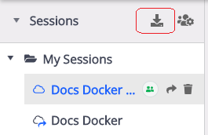

# Exporting and Importing HTTP Traffic with Fiddler Everywhere

Fiddler Everywhere allows the export and import of captured traffic in various known formats such as SAZ (Fiddler Archive), HTTPArchive, WCAT, MeddlerScript, cURLScript, and more.

### Exporting

The **Export** context menu option allows you to export the captured traffic in various formats.

- Select one or more sessions from the sessions grid.

- Right-click to invoke the context menu and choose **Export**. Then use one of the following options:

    - **Selected sessions**&mdash;Saves and shares all selected sessions.

    - **Unselected sessions**&mdash;Saves and shares all unselected sessions.

    - **All Sessions**&mdash;Saves and shares all captured traffic.

- Use the **Choose Format** to export the desired sessions in the preferred file format.

## Importing

Use the **Import Session** option (within the saved **Sessions** tree) to load sessions that are saved in various formats such as `*.saz` (Fiddler Archive), `*.har` (HTTPrchive), `*.tstest` (TestStudio LoadTest), `*.cap` (Packet Capture), `*.xml` (IE F12 NetXML).

