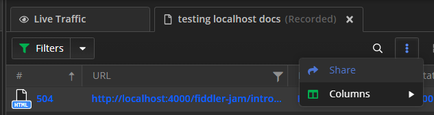
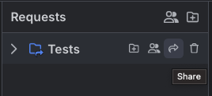
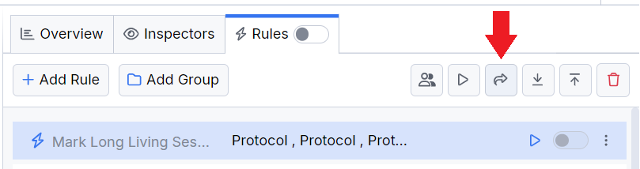

# Sharing Data with Fiddler Everywhere

This article covers the sharing capabilities of Fiddler Everywhere as follows:

- [Sharing session's snapshots](#sharing-sessions-snapshotss)&mdash;Options to save single or multiple captured HTTPS sessions as local/cloud snapshots in the **Sessions** list.

- Sharing API request collections&mdash;Options to share API requests collections as local/cloud collections in the **Requests** list.

- [Sharing rules](#sharing-rules)&mdash;Options to share single or multiple rules within the **Rules** tab.

## Sharing Session's Snapshots

To share captured traffic with other collaborators, first, you need to [save the session snapshot](). Note that sessions held locally will be transferred to the cloud if you use the share functionalities. Only users with knowledge of the password can open the session entry for encrypted sessions.

### Sharing Selected Sessions

To share a selected session from the ongoing capturing in the **Live Traffic** grid:

1. Select a session or multiple sessions from the **Live Traffic** grid.
 
1. Click the **Share** button from the **more** option. This action loads the **Save Session** prompt window. 

1. Give the snapshot a name, choose a destination folder, and then click **Save and Proceed**. This action loads the **Share Sessions** prompt window. 

1. Enter a valid email (mandatory) and notes (optional), and then click **Share**.

### Sharing Saved Session Snapshot

To share a saved session snapshot from the **Sessions** list:

1. Double-click a saved session entry from the **Sessions** list.

1. The session entry opens in a new tab. Click the **Share** button from the **more** option in the toolbar. This action loads the **Share Sessions** prompt window. 

    

1. Enter a valid email (mandatory) and notes (optional), and then click **Share**.

### Managing Users

The **Manage Users** option appears only if the session snapshot is stored in the cloud and shared. Click **Manage Users** to prompt a window that allows you to manage the list of users with access to the shared session.

### Deleting Shared Sessions

Fiddler Everywhere provides options for deleting previously shared sessions. To select the sessions you want to delete, go to the **Sessions** list and use the **Delete** button. All users added as collaborators will be notified through the [notification bar](#notifications-for-shared-content)  and with an email message that the shared session is now deleted. To restore deleted sessions, use the **Shared Sessions** option.

## Sharing Requests Collections

The **Composer** in Fiddler Everywhere is a powerful tool that allows you to execute custom API requests. You can also store these requests in a collection in the **Requests** list and share all saved collections.

To share a collection of saved API requests, follow these steps:

- Open the **Requests** pane.

- Select a requests collection from the **Requests** list.

- Click the **Share** icon. Then, enter the email addresses of the users in the **Share Collection** window.

    

### Sharing Requests Collections Specifics

Consider the following when sharing a collection of requests.

- You can share a collection only if you are the collection owner.

- You can share only collection folders on the root level of the **Requests** list. You cannot share individual sub-folders.  

    

## Sharing Rules

To share a created rule or group of rules, execute the following steps:

- Open the **Rules** tab.

- Select a rule or group of rules from the list.

- Click on the **Share** button.

    

## Sharing Context with Collaborators

Some network sessions may lack essential details not captured in the technical data. Fiddler Everywhere provides options for you and your collaborators to add context to the captured and shared sessions, comment in the same communication thread, and provide additional information by adding **comments** per session and **notes** per shared entities.

### Comments

Add a custom comment to one or more captured sessions to provide additional context.

1. Select a session from the **Live Traffic** grid or load saved sessions from the **Sessions** list.

1. Add a comment by using the **Comment** option from the context menu or press the **M** key while selecting the desired sessions. As a result, the newly added comment will appear in the **Comments** column.

    

### Notes

Add additional context in the form of a descriptive note while sharing one or more sessions.

1. Use the **Share** option.

1. In the first dialog window, provide a name for the shared sessions, set password protection, and choose the local destination folder.
    
1. In the second dialog window, provide the additional information in the **Add a note** field.

    

## Notifications for Shared Content

The Fiddler Everywhere client informs the collaborators about shared sessions in the following ways:
- Collaborators receive an email with an invitation to open the shared session. If the session creator has added a note, the email will display the note as well.
- All listed collaborators receive a notification within the Fiddler Everywhere client. To open the shared session in a separate tab, click the notification.

    