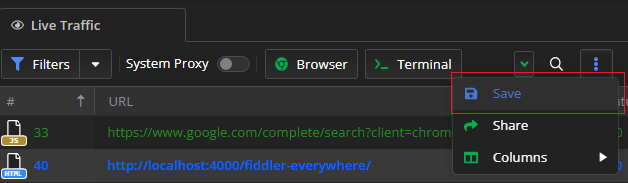
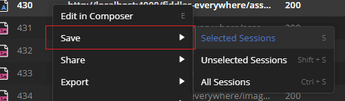
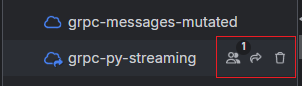
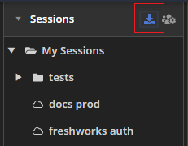

# Saving Data with Fiddler Everywhere

With Fiddler Everywhere, you can capture and generate data like HTTPS sessions, composed API requests, and rules. It's only natural that the application provides user interface options to save, organize and share the information so it can be quickly reused later. This article covers the saving capabilities of Fiddler Everywhere as follows:

- [Saving session's snapshots](#saving-sessions-snapshots)&mdash;Options to save single or multiple captured HTTPS sessions as local/cloud snapshots in the **Sessions** list.

- Saving API requests&mdash;Options to save single or multiple composed API requests as local/cloud collections in the **Requests** list.

- Saving rules&mdash;Options to save single or multiple rules within the **Rules** tab.

## Saving Session's Snapshots

The **Sessions** list in Fiddler Everywhere lets you store snapshots of previously captured traffic. The section is part of a collapsible panel that you can hide/show to optimize your working space. 

Save session snapshots to the **Sessions** list as follows:

- Use the **Save** option from the more option within the **Live Traffic** list toolbar.

    

OR

- Use the **Save** option from the **Live Traffic** list context menu

    

### Working with Saved Snapshots

You can select, inspect, modify, and share snapshots of previously saved sessions with collaborators. The snapshots can be saved locally or in the cloud. You can apply the following actions to a saved session snapshot:

- Single-click to select a session snapshot from the **Sessions** list.

- Double-click to open a saved session snapshot from the **Sessions** list in a new tab. Only users with the password can open the session entry for encrypted snapshots.

- Right-click to load the context menu of a selected session snapshot. The context menu provides multiple options for managing, exporting, and modifying the saved session entry. 

- Set a password to encrypt and protect your snapshot. The context menu provides options for setting, changing, and removing passwords for the saved session snapshot.

- Use the UI buttons next to a saved session snapshot to **manage users** (cloud session entries only), **share**, or **delete** saved session entries.

    
0
- Use the UI buttons at the very top to **import** session snapshots or to access previously **shared sessions** snapshots.

    