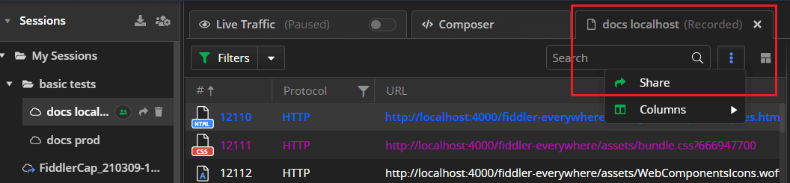

# Sharing Data with Fiddler Everywhere

## Sharing Sessions

To share captured traffic with other collaborators, first, save the session in the cloud. Note that sessions held locally will be transferred to the cloud if you use the share functionalities. For encrypted sessions, only users with knowledge of the password can open the session entry.

Fiddler Everywhere provides UI solutions for sharing and collaboration.

### Sharing Selected Sessions

To share a selected session:

1. Select a saved session entry from the **Sessions** list.
1. Click the **Share** button to the right of the entry name.
1. When the **Share Sessions** prompt window appears, enter a valid email (mandatory) and notes (optional). Click **Share**.

### Sharing Saved Session

To share a saved session:

1. Double-click a saved session entry from the **Sessions** list.
1. The session entry opens in a new tab. Click the **Share** button from the toolbar.
    
1. The **Share Sessions** prompt window appears. Enter a valid email (mandatory) and notes (optional). Click **Share**.

## Managing Users

The **Manage Users** option appears only if the session entry is stored in the cloud and shared. Click **Manage Users** to prompt a window to appear that allows you to manage the list of users that have access to the shared session.