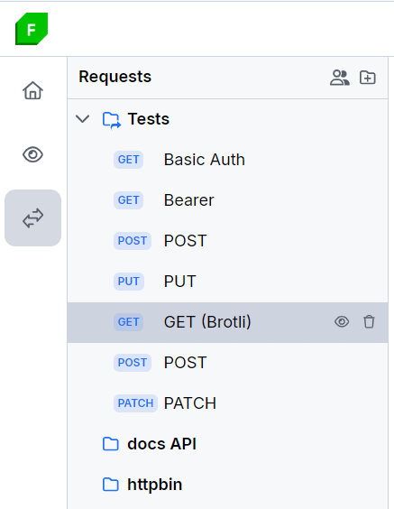
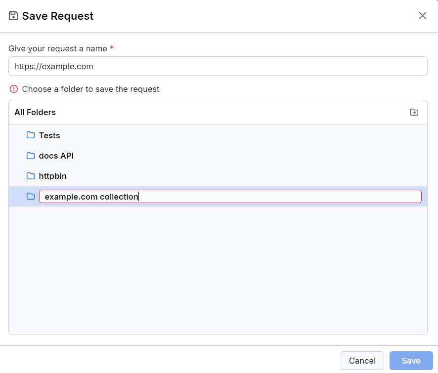

# Grouping API Requests in Collections

The Fiddler Everywhere client provides options for saving and organizing multiple requests composed by the API Composer through its **Requests** list. The section lets you arrange numerous requests or request folders in collections that can be promptly reloaded and executed. The **Requests** section is part of a collapsible panel that you can hide/show to optimize your working space.

To create a collection of composed API requests:

1. Create a new API request by clicking the **+** button in the collections. As a result, a new **Composer** tab will open.
1. After the request is composed, click **Save**. Alternatively, to prevent overwriting an existing entry, choose **Save as**.
1. Enter a request name and select the collection (folder) in which the request saves. Alternatively, you can create a new collection by clicking the folder icon to the right.
    
1. Click **Save** to close the dialog and add the request to the collection.

