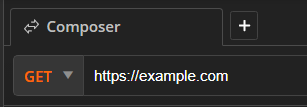
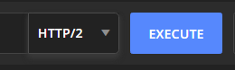
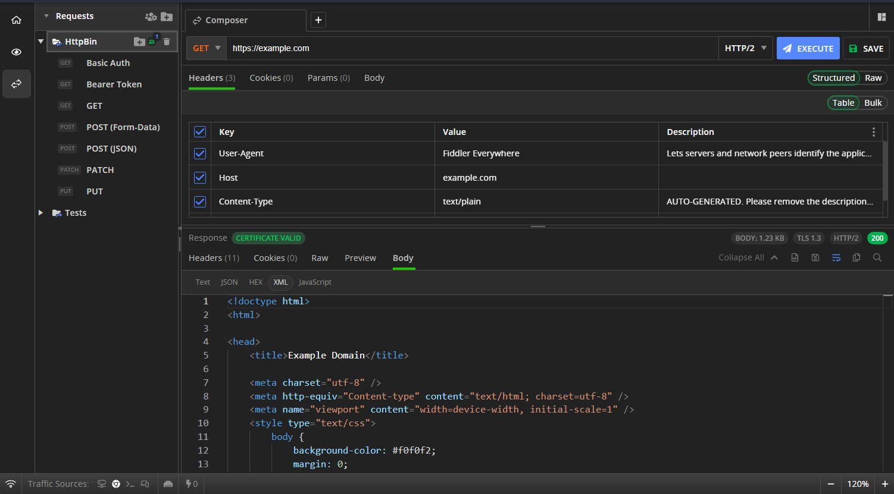
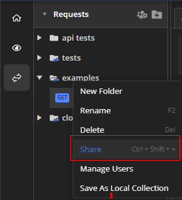

# API Requests Composer

The **Composer** in Fiddler Everywhere allows you to create requests to REST and SOAP API endpoints. Requests to local and online APIs enable you to check and debug various endpoints, inspect and analyze requests and responses, and quickly retrieve and receive data.

## Compose API Request

To compose an API request:

1. Start Fiddler Everywhere and open the **Composer** pane.

1. Select **HTTP method** and enter the endpoint URL.

    

1. Select the HTTP protocol version with the drop-down menu to the left of the **Execute** button.

    

1. (Optional) Enter additional headers, parameters, and body if required. For example, common scenarios are to enter an authorization header, a **Content-type** header, or custom body data. Note that the request execution includes only checked headers.

    >important By default, the Fiddler Everywhere client will add a `User-Agent` header with the `Fiddler Everywhere` value. This header lets servers and network peers identify the application, the operating system, the vendor, and/or the version of the requesting user agent.

1. Click **Execute** to send the composed API request. 

Once the API request executes, you can inspect its HTTP Response in the Composer's **Response inspector** tab. Like the inspectors in the **Live Traffic** pane, the **Response** inspector provides multiple views such as **Headers**, **Raw**, **JSON**, and so on.

## Edit Captured API Request

1. Start Fiddler Everywhere and open the **Live Traffic** pane.

1. Capture a session (or open a session from the saved **Sessions** list) and use the **Edit in Composer** option from the context menu.

As a result the session loads as a HTTP Request in the Fiddler's Composer where you can make atomic modifications to its structure.

## Save API Request

You can save the API request through the following steps.

- Open the **Composer** pane.

- [Compose your API request](#compose-api-request)

- Click the **Save** button. 

Saved requests are loaded as a collection in the **Requests** list and can be reused or shared with collaborators at any later moment.

## Share Requests Collection

With Fiddler Everywhere, you can quickly share a collection of saved API requests.

- Open the **Request** list.

- Select a collection of saved API requests.

- Use the context menu to share the collection with collaborators.

 **Response inspector** tab. Like the inspectors in the **Live Traffic** pane, the **Response** inspector provides multiple views such as **Headers**, **Raw**, **JSON**, and so on.

## Save API Request

You can save the API request through the following steps.

- Open the **Composer** pane.

- [Compose your API request](#compose-api-request)

- Click the **Save** button. 

Saved requests are loaded as a collection in the **Requests** list and can be reused or shared with collaborators at any later moment.

## Share Requests Collection

With Fiddler Everywhere, you can quickly share a collection of saved API requests.

- Open the **Request** list.

- Select a collection of saved API requests.

- Use the context menu to share the collection with collaborators.

