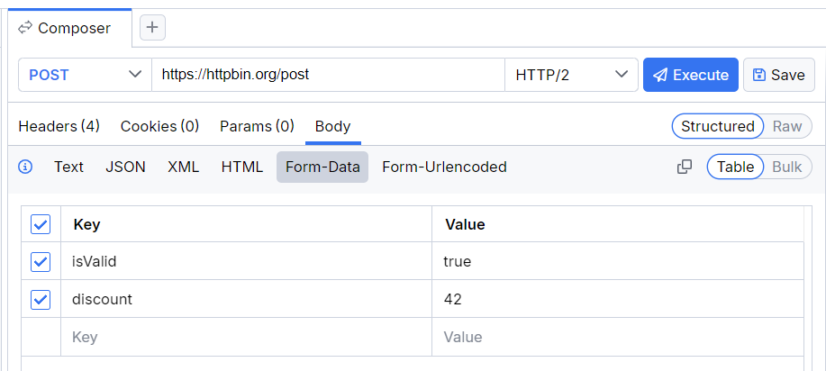
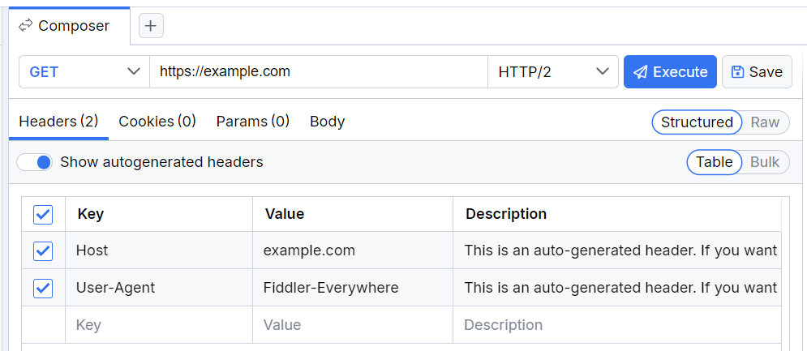

# Composing API Requests 

The **Composer** in Fiddler Everywhere allows you to create requests to REST and SOAP API endpoints. Requests to local and online APIs enable you to check and debug various endpoints, inspect and analyze requests and responses, and quickly retrieve and receive data. To load the **Composer**:

1. Start Fiddler Everywhere and open the **Home** Pane.

1. Follow the **Composer** flow from the **Compose API Request** section.

OR

1. Start Fiddler Everywhere and open the **Composer** pane.

As a result, Fiddler loads the **Composer** screen where you can compose and execute HTTP requests and organize them in collections through the **Requests** tree.

## Compose API Request

1. Use the **+** button to create a new **Composer** tab. Alternatively, you can directly use the main **Composer** tab.

1. Select **HTTP method** and enter the endpoint URL.

1. Select the HTTP protocol version with the drop-down menu to the left of the **Execute** button.

1. (Optional) Enter additional headers, parameters, and body if required. For example, common scenarios are to enter an authorization header, a **Content-type** header, or custom body data. Note that the request execution includes only checked headers.

    >important By default, the Fiddler's Composer auto-generates the required default headers, including the `Host` header and the `User-Agent` header with the value `Fiddler Everywhere`. This `Host` header lets servers and network peers identify the targeted host and port number of the targeted server. The `User-Agent` agent is a characteristic string that enables servers and network peers to identify the application or version of the requesting user agent. Note that while you can uncheck and execute a request without the default headers, an HTTP request without `Host` header will return a server error as it is considered a malformed request.

1. Click **Execute** to send the composed API request. 

Once the API request executes, you can inspect its HTTP Response in the Composer's **Response inspector** tab. Like the inspectors in the **Traffic** pane, the **Response** inspector provides multiple views such as **Headers**, **Raw**, **JSON**, and so on.

## Edit Captured API Request

1. Start Fiddler Everywhere and open the **Traffic** pane.

1. Capture a session (or open a session from the saved save **Sessions** tree) and use the **Edit in Composer** option from the context menu.

As a result, the session loads as an HTTP request in Fiddler's **Composer**, where you can make atomic modifications to its structure. The **Composer** has a flexible user interface that allows you to switch between **Structured** and **Raw** content (refer to the screenshots below) and between **Table** or **Bulk** style inspectors.

* Using the **Structured** mode
    

* Using the **Raw** mode
    

## Save API Request

You can save the API request through the following steps.

- Open the **Composer** pane.

- [Compose your API request](#compose-api-request)

- Click the **Save** button. 

Saved requests are loaded as a collection in the **Requests** list and can be reused or shared with collaborators at any later moment.

## Share Requests Collection

With Fiddler Everywhere, you can quickly share a collection of saved API requests.

- Open the **Request** list.

- Select a collection of saved API requests.

- Use the context menu to share the collection with collaborators.

## Save API Request

You can save the API request through the following steps.

- Open the **Composer** pane.

- [Compose your API request](#compose-api-request)

- Click the **Save** button. 

Saved requests are loaded as a collection in the **Requests** list and can be reused or shared with collaborators at any later moment.

