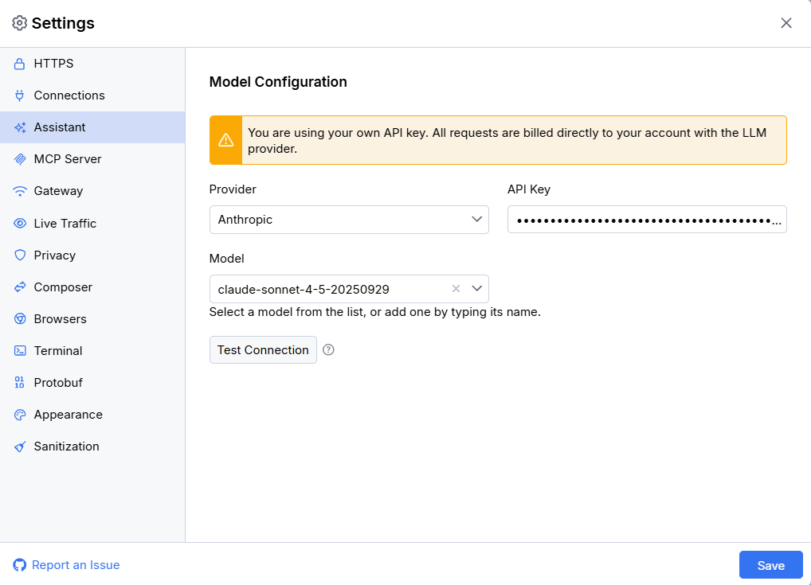
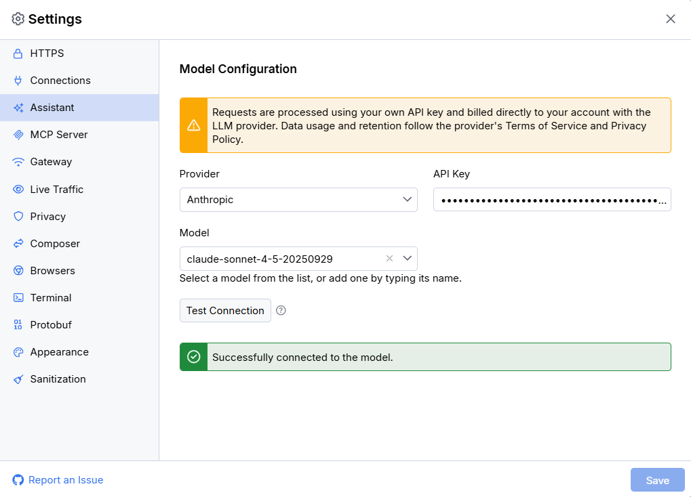
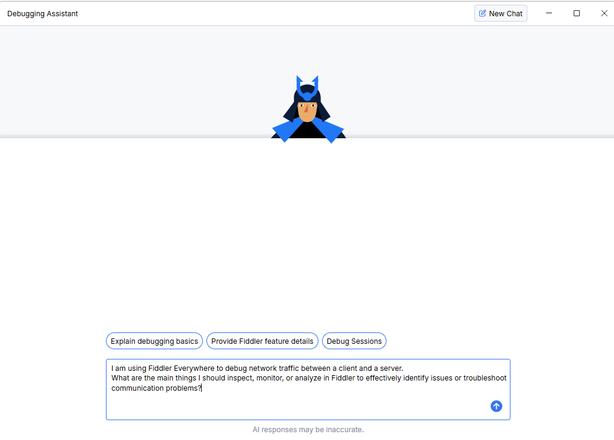

# Fiddler Debugging Assistant

The Fiddler Debugging Assistant enables you to leverage large language models (LLMs) to reach new levels of developer productivity. This built-in chat feature provides additional insights by combining your preferred AI model with Fiddler's powerful traffic analysis capabilities.

## Prerequisites

- The latest version of Fiddler Everywhere.
- A Fiddler Everywhere Pro or higher subscription tier.
- An API key with access to one of the supported language models. Fiddler Everywhere currently supports the following providers:
    * OpenAI
    * Anthropic
    * Azure OpenAI
    * Google Gemini

>important Once configured, the Fiddler Debugging Assistant consumes tokens for each generated inquiry. Token pricing varies depending on your LLM provider's plan, so review third-party pricing options carefully before using the assistant.

## Configuring the Debugging Assistant

The Debugging Assistant is accessible through the **Ask Assistant** button in the Fiddler toolbar. To use it, you must provide a valid API key for one of the supported AI providers.

Select your preferred LLM provider and set its API key through **Settings > Assistant**. 



Once all properties are set, use the **Test Connection** button to verify that the connection is properly established.



### Configuration Details
 
- When setting the `model`, you can choose from the dropdown list of available models or enter a custom model name if it's not listed.

- When setting the `Azure target URI`, note that this must be a complete URL containing the endpoint, deployment name, and API version. You can find this target URI in the deployment details page in Azure AI Foundry.

## Using the Debugging Assistant

To use the Debugging Assistant:

1. Open the Fiddler Everywhere application.
1. Click the **Ask Assistant** button.
1. Ask questions in natural language about Fiddler or the captured traffic data.



Use the **New Chat** button to start a fresh conversation and clear the current chat history from the context.

## Limitations

When working with the Debugging Assistant, consider the following limitations:

- The current version of the Debugging Assistant does not have access to the internet.
- The current version of the Debugging Assistant does not have access to captured traffic in live sessions or saved snapshots.

## Debugging Assistant Access Policies

Fiddler Everywhere provides managed application policies through its Enterprise tier. License administrators can use these policies to control access to the Fiddler Debugging Assistant for licensed users.

For more information about configuring enterprise policies, see the [Managed App Configuration](slug://fe-restrict-policies) article.

### Windows

IT teams managing Windows systems can apply app configuration keys using their preferred administrative tooling by setting values in the following registry path:

```txt
HKEY_CURRENT_USER\SOFTWARE\Policies\Progress\Fiddler Everywhere
```

| Key Name | Description | Value Type | Value Example |
|:---------|:------------|:-----------|:--------------|
| `DisableAssistant` | Enables or disables the Debugging Assistant | DWORD-32 (hexadecimal) | `1` |
| `DefaultAssistantSettings` | Sets the default settings (LLM provider, API key, and model) for the Debugging Assistant | REG_SZ (string) | See the JSON structure [here](#configuring-the-defaultassistantsettings-policy) |
| `DisableAssistantSettingsUpdate` | Enables or disables the option to update the Debugging Assistant settings | DWORD-32 (hexadecimal) | `1` |

### macOS

IT teams managing macOS systems can apply app configuration using their preferred device management solution (such as Jamf, Intune, or similar) by setting the following keys:

| Key Name | Description | Value Type | Value Example |
|:---------|:------------|:-----------|:--------------|
| `DisableAssistant` | Enables or disables the Debugging Assistant | integer | `1` |
| `DefaultAssistantSettings` | Sets the default settings (LLM provider, API key, and model) for the Debugging Assistant | String | See the JSON structure [here](#configuring-the-defaultassistantsettings-policy) |
| `DisableAssistantSettingsUpdate` | Enables or disables the option to update the Debugging Assistant settings | integer | `1` |

The `DefaultAssistantSettings` policy expects a JSON object that contains the following properties:

- `provider` - Sets the LLM provider. Supports the following values (case-sensitive):
```txt
openai
anthropic
azure_openai
google_gemini
```
- `providerApiKey` - Sets the API key for the selected provider. 
- `model` - Sets a specific model from the selected provider. Available when the `provider` key is set to `openai`,`anthropic`, or `google_gemini`.
- `azureUri` - Sets the Azure OpenAI resource URI . Available only when the `provider` key is set to `azure_openai`.

For more information on using managed application configurations, see the [Managed Application Policies](slug://fe-restrict-policies) article.

### Configuring the DefaultAssistantSettings Policy

The `DefaultAssistantSettings` policy expects a JSON object that contains the following properties:

- `provider` - Sets the LLM provider. Supports the following case-sensitive values:
```txt
openai
anthropic
azure_openai
google_gemini
```
- `providerApiKey` - Sets the API key for the selected provider.
- `model` - Sets a specific model from the selected provider. Available when the `provider` key is set to `openai`, `anthropic`, or `google_gemini`.
- `azureUri` - Sets the Azure OpenAI resource URI. Available only when the `provider` key is set to `azure_openai`.

**Example JSON for setting Anthropic using `provider`, `providerApiKey`, and `model`:**

```JSON
{"provider": "anthropic","providerApiKey": "my-api-key","model": "claude-sonnet-4-20250514"}
```

**Example JSON for setting Azure using `provider`, `providerApiKey`, and `azureUri`:**

```JSON
{"provider": "azure_openai","providerApiKey": "my-api-key","azureUri": "https://<your-azure-app-endpoint>/openai/deployments/gpt-4.1-mini/chat/completions?api-version=2025-01-01-preview"}
```