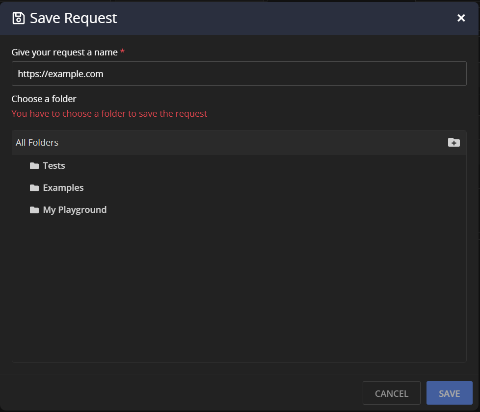
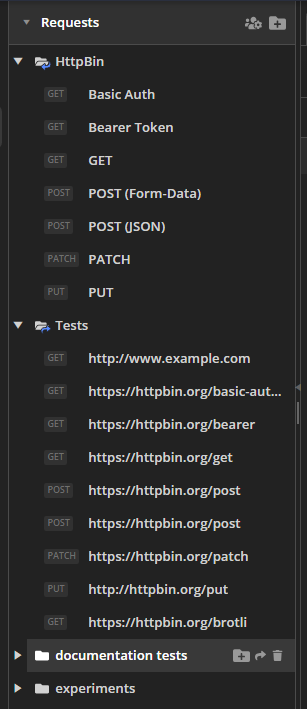

# Grouping API Requests in Collections

The Fiddler Everywhere client provides options for saving and organizing multiple requests, composed by the API Composer, through its [**Requests**]() list.

**Requests** enables you to arrange multiple requests or request folders in collections that can be promptly reloaded and executed.

To create a collection of composed API requests:

1. Create a new API request by clicking the **+** button in the collections. As a result, a new **Composer** tab will open. By default, its name is **Untitled**.

2. After the request is composed, click **Save**. Alternatively, to prevent overwriting an existing entry, choose **Save as**.

3. Enter a request name and select the collection (folder) in which the request will be saved. Alternatively, you can create a new collection by clicking the folder icon to the right.

    

3. Click **Save** to close the dialog and add the request to the collection.

    

For detailed description of the **Requests** tab, refer to the article on [saved requests lists]()

## Additional Resources

- [Creating Requests with the API Composer]()
- [Mocking Server Responses]()
- [Inspecting Captured Traffic]().
- [Modifying Traffic]()
- [Sharing Captured Traffic with Collaborators]().
