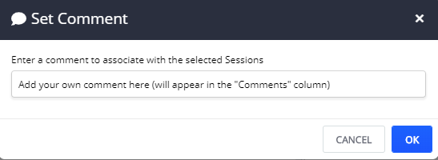
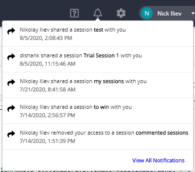

# Fiddler Everywhere Collaboration

The Fiddler Everywhere client provides easy and secure sharing of network debugging logs within your teams for quick analysis, communication, and resolution. 

In previous versions of Fiddler Everywhere, collaboration was limited to exporting .saz files and sharing them over a different channel. Now, all sharing and commenting happen directly within the Fiddler Everywhere UI, providing a much more comfortable and secure manner of collaborating with your team.

## Save and Share Sessions

Network sessions captured by the Fiddler Everywhere client can be saved and viewed later. These same sessions can also be shared with your teammates. Simply use the sharing features of Fiddler Everywhere and invite other team members to collaborate.

### Save Sessions

Save a session while following these steps:
 1. [Capture the traffic]().
 2. Use a preferred way to save a session. With Fiddler Everywhere, you can save captured traffic via:
    - [Live Traffic toolbar](#live-traffic-toolbar) provides **Save**  option.
    - [Live Traffic list](#live-traffic-list) provides **Save** option via the context menu.
    - [File menu]() allows you to import/export different known formats (like HTTPArchive, Packet Capture, Folder Tree, and others) and to load and save Fiddler archives (**SAZ** format) that are holding captured sessions.

### Share Sessions

Share a session with a collaborator while following these steps:
 1. [Capture the traffic]() (that you would like to share with your collaborators). Alternatively, select a saved session from the [**Sessions list**]().
 2. Use a preferred way to share a session. With Fiddler Everywhere, you can save and share captured traffic via:
    - [Live Traffic toolbar](#live-traffic-toolbar) provides **Share** option. Press the **Share** button to prompt two consecutive windows for entering save and share related information.
    - [Live Traffic list](#live-traffic-list) provides **Share** option via the context menu. Press the **Share** button to prompt two consecutive windows for entering save and share related information.
    - [Sessions list]() provides **Share** functionality via dedicated button. The list contains previously saved sessions or sessions shared with the user. Press the **Share** button to prompt a window for entering share related information.
    - [File menu]() allows you to import/export different known formats (like HTTPArchive, Packet Capture, Folder Tree, and others) and to load and save Fiddler archives (**SAZ** format) that are holding captured sessions.

>important The Fiddler Everywhere free version has a quota for sharing sessions with collaborators. Check [the advantages provided by Fiddler Everywhere Pro](#fiddler-everywhere-pro), which significantly extends the collaboration quotas.

### Delete Shared Sessions

With version 1.1.0 of Fiddler Everywhere, the user has options to delete previously shared sessions. The sessions can be deleted from the **Sessions list** via the **delete** icon. All users added as collaborators will be notified that the shared session is now deleted [via the notification bar and an email message](#notifications-for-shared-content).

## Add Context for Teammates

Some network sessions can be missing important context that is not captured in the technical details. Fiddler Everywhere allows you to add meaning to sessions by adding comments. Your peers as well can add information to the same comment thread for full communication and collaboration.

The Fiddler Everywhere client allows you to add additional context by adding **comments** (per session) and adding **notes** (per shared entities).

### Add Comments

Add a custom comment to one or more captured sessions to provide additional context.

1. Select a session from the [**Live Traffic list**](#live-traffic-list) or load saved sessions from the [**Sessions list**]().
2. Add a comment using the **Comment** option from the context menu or press **M** while having the desired sessions selected.

The newly added comment will appear in [the **Comments** column](#live-traffic-list).

### Add Notes

Add additional context in the form of a descriptive note while sharing a session or several sessions. 

1. Use the **Share** option from the [**Live Traffic toolbar**](#live-traffic-toolbar) or from the **share** button in the [**Sessions list**]().
2. In the first dialog window, provide a name for the shared sessions.
3. In the second dialog window, provide the additional information in the **Add a note** field. 

The note will be received as a context in the email received from the recipients (the collaborator's emails).

## Notifications for Shared Content

The Fiddler Everywhere client informs the collaborators for shared sessions in two channels:
- The collaborators will receive an email with an invitation to open the shared sessions. In case the creator has added note, the email will contain the note as well.
- All listed collaborators will receive a notification within the Fiddler Everywhere client. You can click on the notification to immediately open the share sessions in a separate tab.

    