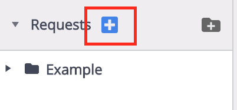
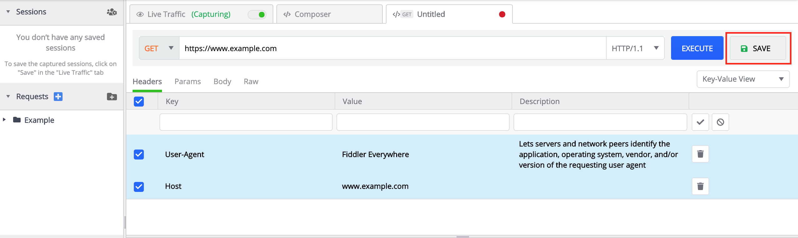

## Organize Requests into Collections

With the Fiddler Everywhere client, you can save and organize multiple composed requests via the **Requests** list. Collections of requests can be arranged in different folders from where they could be reloaded and executed promptly. The **Requests** list is located to the left (below the **Sessions** list) and can hold multiple collections.

Create your first collection of composed requests by following these steps:

1. Create your API request by clicking the "+" button in the collections

    

2. After the request is composed, press **Save**. 

    

3. Enter a request name and select the collection (folder) in which the request should be saved. Alternatively, you can create a new collection by pressing the folder icon to the right.

    

3. Press **Save** to close the dialog window and add the request to the collection.

    
