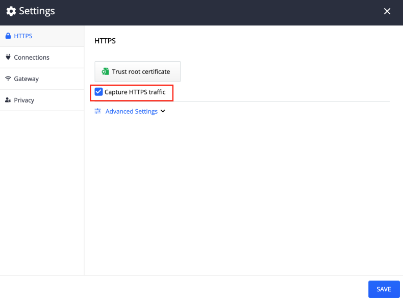

## Capturing Secure Traffic

By default, the Fiddler Everywhere client intercepts insecure traffic (**HTTP**) only and needs an account with administrative rights to capture secure traffic (**HTTPS**). The Fiddler Everywhere client acts as a man-in-the-middle (against the HTTPS traffic). To enable capturing and decrypting HTTPS traffic, you will need to explicitly install a root trust certificate via the __HTTPS__ submenu in __Settings__.
FF
## Configure on macOS

1. Start Fiddler Everywhere on the device that will capture the traffic.

2. Go to __Settings > HTTPS__

3. Click the __Trust Root Certificate__ button. 

    

4. A keychain user & password box appears. Enter your __machine administrative credentials__.

    

5. The __Capture HTTPS traffic__ checkbox is now active. Check the box to enable capturing HTTPS traffic.

    
    
6. Click the __Save__ button to save the changes.

## Configure on Windows

1. Start Fiddler Everywhere on the device that will capture the traffic.

2. Go to __Settings > HTTPS__

3. Click the __Trust Root Certificate__ button. 

    

4.  Trust certificate popup appears to confirm and add the certificate. 

    

5. The __Capture HTTPS traffic__ checkbox is now active. Check the box to enable capturing HTTPS traffic.

    
    
6. Click the __Save__ button to save the changes.

## Configure on Linux

Some Linux distributions are using different security features and different ways of adding a root certificate. For such cases, the Fiddler Everywhere provides means to export the root trust certificate so that it could be manually imported in your Linux OS. Use the __Export Root Certificate to Desktop and Trust Certificate__ option as follows:

1. Start Fiddler Everywhere on the device that will capture the traffic.

2. Go to __Settings > HTTPS__

3. Expand the __Advanced Settings__ submenu

4. Click the __Export Root Certificate to Desktop__ button.

    

5. Import and trust the exported certificate. To be able to install the FE certificate, you need to follow some additonal steps on Linux:

    - Create a directory and copy the certificate (exported in the previous steps). The last command will start the tool to upgrade the certificates. 
    
    - From the prompt select **Yes** to install new certificates
    
    - Choose the FiddlerRootCertficate.crt and press **OK**
    
    - The certificates are being updated
    

6. The __Capture HTTPS traffic__ checkbox is now active. Check the box to enable capturing HTTPS traffic.

    

7. Click the __Save__ button to save the changes.

    >important Some Linux distributions like Ubuntu will use localized paths (for example, the __Desktop__ folder is renamed with the related word used in the locale language). That might cause for __step 3__ to fail due to a missing folder named __Desktop__ with an error message of type _Could not find a part of the path ..._. Until an out-of-the-box solution is implemented, you could easily workaround this issue by creating a folder called __Desktop__ at your root directory (`mkdir ~/Desktop`) and then export the certificate to the newly-created directory. Once the certificate is installed, you could safely remove the directory.

## Next Steps

Once the client is configured, you can start using its features. Learn how to [capture traffic](), [inspect traffic](), edit traffic, mock a server response, create an API request, or how to share captured sessions with teammates.

For more information about Fiddler Everyehere settings, visit [**_Settings_**]() page.
