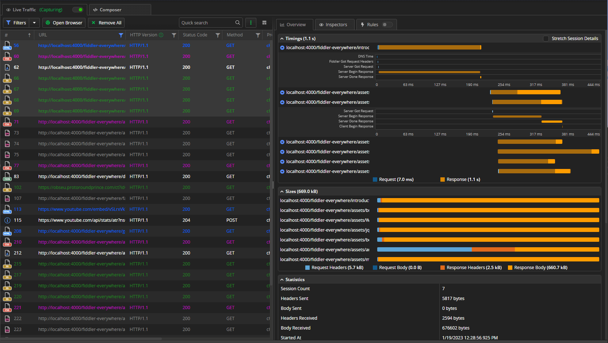

# Inspect Traffic

With traffic already captured, the process of analyzing has begun. The first place where you can extract information about the captured sessions is the [**Live Traffic**](). Each session (a session is the request/response entry) is listed in a row with multiple column fields in the __sessions list__. You can extract useful information like the returned status code, the host and the URL, type of used protocol (HTTP vs. HTTPS), body sizer in bytes, the used HTTP method (like GET or POST), and more.

Single-click a session or select multiple sessions to open structured information about the session timings, sizes, request, and response details in the [**Overview** tab](). 

Double-click a session to load [the request and response inspectors](). The [**Inspectors** tab]() is a powerful tool that will allow you to deep-dive in each session so you and your teammates can debug it or find performance bottlenecks. 

**Save** a selected session or multiple selected sessions [through the context menu](#save) (alternatively with a keyboard shortcut). Saved sessions are available in the [**Sessions list**]() from which they can be reloaded or shared with collaborators.

Inspecting sessions is often done with teammates or external collaborators. **Share** a selected session or multiple selected sessions directly from the [__Live Traffic__ list](#share) or through the [__Sessions__ list]().

## Additional Resources

- [Create an API request through the Composer]()
- [Modify traffic]()
- [Mock server response]()
- [Organize requests]()
- [Share captured traffic with collaborators]().
