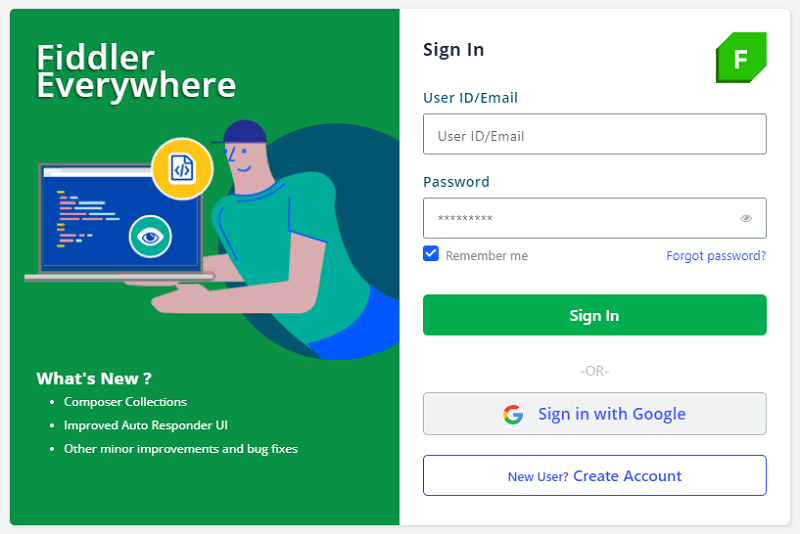
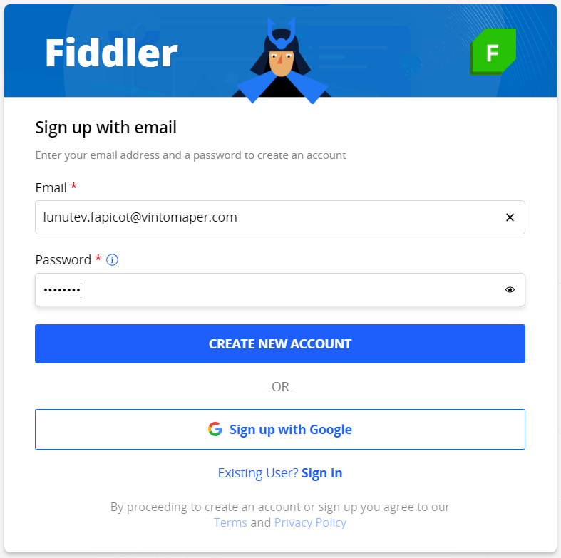

# Installation

Fiddler Everywhere is a cross-platform web debugging proxy available for Windows, macOS, and Linux. This article lists the system requirements and describe the steps to install Fiddler Everywhere on all supported operating systems.

## System Requirements

Supported operating systems:

- macOS High Sierra (10.13+) x64
- Windows 7 x64, Windows 8 x64, or Windows 10 x64 (all Windows versions require the installation of [.NET Core](https://docs.microsoft.com/en-us/dotnet/core/install/windows#additional-deps))
- Ubuntu 18+ x64

Other requirements:

- 300MB of free disk space
- Account with administrative rights. Needed for capturing and decoding HTTPS traffic.
- Active internet connection with access to the following URLs:

```
    https://*.getfiddler.com/
    https://*.amazonaws.com/
```

>tip Fiddler Everywhere version 1.1.0 and above supports predefined OS proxy settings (for direct internet access). If your system is accessing the internet through a predefined proxy, make sure you have the latest version of Fiddler Everywhere.

## Install Fiddler Everywhere

>important After the installation, Fiddler Everywhere allows you to track only non-secure HTTP traffic. To enable capturing and decoding of HTTPS traffic, you need to install a trusted certificate, as shown in the [article on configuration]().

### macOS

1. Navigate to the [Fiddler Everywhere](https://www.telerik.com/download/fiddler-everywhere) download page.

2. Select **Download for OS X** to download the installer.

3. Run the **Fiddler Everywhere** dmg file to start the installation process.

### Windows

1. Navigate to the [Fiddler Everywhere](https://www.telerik.com/download/fiddler-everywhere) download page.

2. Select **Download for Windows** to download the installer.

3. Run the **Fiddler Everywhere** exe file to start the installation process.

### Linux

1. Navigate to the [Fiddler Everywhere](https://www.telerik.com/download/fiddler-everywhere) download page.

2. Select **Download for Linux** to download the installer.

3. Install the downloaded package.

    On most **Linux** distributions, you need to set the installation file as executable before you can start the installation. You can do this with the command line or with the GUI:

    - **Command-line instructions**

        - Open a terminal
        - Navigate to the folder where the installation file resides.
        - Type `sudo chmod +x filename.appimage`. You can omit the `sudo` command if the currently logged user is the one that downloaded the executable.
        - Enter your username and password (if prompted) and press **Enter**.

    - **GUI Instructions**

        Alternatively, many Linux distributions provide options to set the file's executable rights through the used GUI.

        **Gnome**

        

        **Cinnamon**

        

        **KDE**

        

## Create an Account

Signing in is mandatory for both Trial and Pro versions of the Fiddler Everywhere client. You can sign up by [creating a Fiddler account](#create-fiddler-account) or by [using an existing Google account](#use-google-account). Fiddler Everywhere supports Google Authentication and own account system.

### Create Fiddler Account

1. Launch the Fiddler Everywhere client. If you don't have an existing Fiddler account, select the **New User? Create Account** button.

    

2. On the **Create Account** screen, enter the requested information and accept the terms of the agreement. The email that you provide in this step will be used by your teammates for sharing sessions, collections, and notifications.

    

3. Open the confirmation email sent by Fiddler, and follow the instructions to complete the registration.

### Use Google Account

Alternatively, you can directly sign in with an existing Google account.

1. Launch the Fiddler Everywhere client. 

2. Select **Sign in with Google**.

## Update

Steps to update Fiddler Everywhere to the latest version:

1. Start __Fiddler Everywhere__.

2. From the main menu, choose **_Help_ > _Check for Update_**. If a newer version is available, a notification will ask for your agreement to download and install it.

3. Fiddler Everywhere will restart and automatically update to the latest version.

>important Once the Fiddler Everywhere client is installed, updated and started with user account, you can review its [default configuration]().
