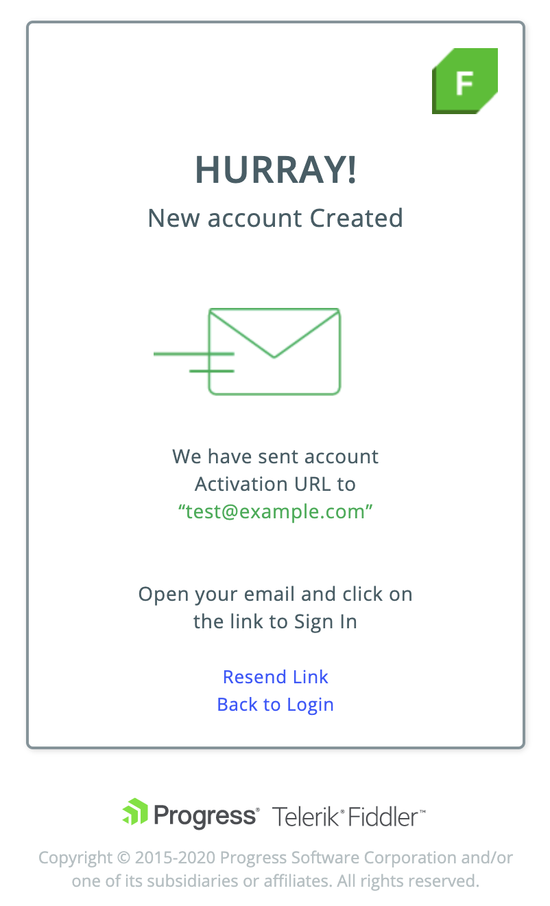

## Installation 
 
Steps to install Fiddler Everywhere client on your system (Mac OS, Windows, or Linux): 

1. The Fiddler Everywhere installer is available for download on the [Progress website](https://www.telerik.com/download/fiddler-everywhere).

2. Click **Download for <Your-OS-here>** to start downloading the installer for the respective operating system. The default operating system option is determined based on the currently used system.

3. Run the **Fiddler Everywhere** executable file to start the installation process. For Linux, you might need to explicitly [set the file as executible](#linux-installation).

4. Create and login with your Fiddler credentials or use Google authentication login.

    

5. Fiddler Everywhere is ready to be used.

>tip By default, the standard installation will allow you to track only non-secure HTTP traffic. To enable tracking and decoding of HTTPS, you will need to install a trusted certificate, as shown in the [HTTPS]() article.

### Linux Installation

On most **Linux** distributions before the installation can be started, the user needs to set the installation file as executable. This can be achieved via the command line or via the GUI.

- **Command line instructions**

    - Open a terminal
    - Navigate to the folder where the installation file resides.
    - Type `sudo chmod +x filename.appimage`. You can omit the `sudo` command if the currently logged user is the one that downloaded the executable.
    - Enter your username and password (if prompted) and press **Enter**.
    - Once the installation file is set as executable, you can [continue the installation process](#installation).

- **GUI Instructions**

    Alternatively, many Linux distributions are providing options to set the file executable rights via the used GUI.

    **Gnome**

    

    **Cinnamon**

    

    **KDE**

    

## Create an Account

Signing in is mandatory for both Free and Pro versions of the Fiddler Everywhere client. You can sign up by [creating an unique Fiddler account](#create-fiddler-account) or by [using existing Google account](#use-google-account). The Fiddler Everywhere account enables you to save and share sessions with collaborators and additionally provides access to the Pro features (if Pro version is purchased).

### Create Fiddler Account

1. Launch the Fiddler Everywhere client. The initial screen shows the **Sign In & Create Account** options. Click on **Create Account**.

2. The **Create Account** screen loads. Enter the requested information and accept the terms of the agreement. Note that the valid email provided here is the one that is later used for sharing and receiving sessions and notifications.

3. Fiddler sends a confirmation email to the provided address.

4. Open the confirmation email and follow the instructions to complete the registration.

### Use Google Account

Alternatively, you can directly sign in with an existing Google account.

1. Launch the Fiddler Everywhere client. 

2. Click on **Sign in with Google** button.

## Update

Steps to update Fiddler Everywhere to the latest version:

1. Start __Fiddler Everywhere__.

2. From the main menu, choose _Help_ > _Check for Update_. If a newer version is available, a notification will ask for your agreement to download and install it.

3. Fiddler Everywhere will restart and automatically update to the latest version.

## Next Steps

Once the Fiddler Everywhere client is installed, updated and started with user account, you can review its [default configuration]().