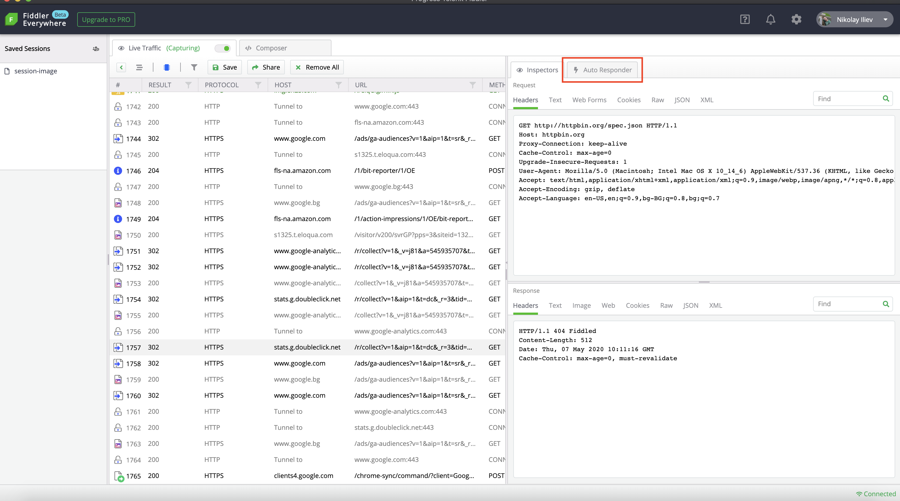
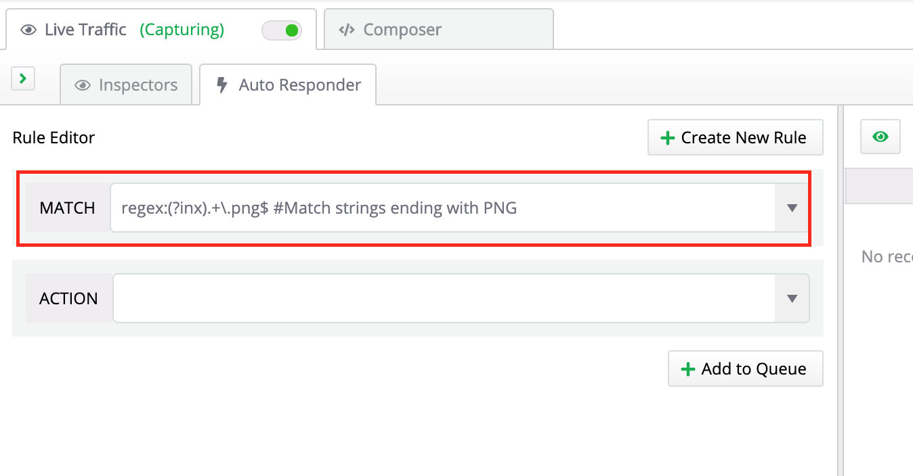
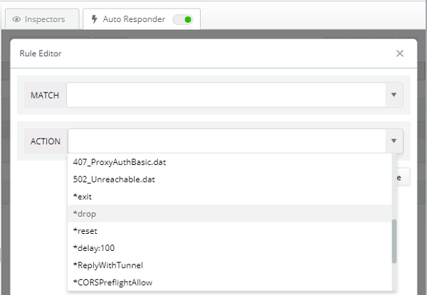
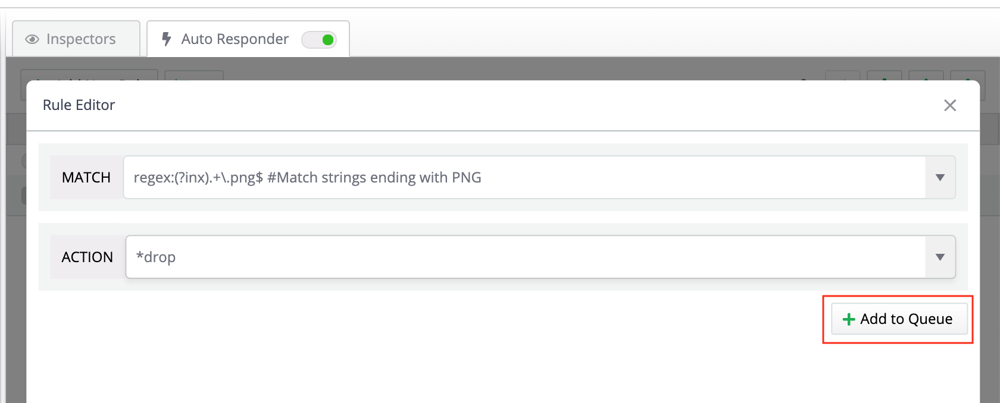
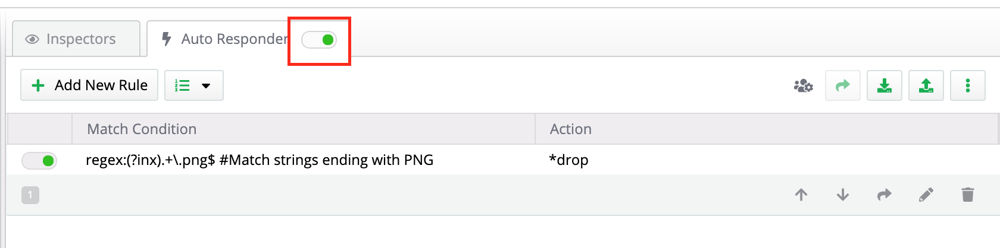

## Mocking Server Response with AutoResponder

One of the most powerful features of the Fiddler Everywhere client is the **AutoResponder** - a tool for mocking server responses and simulating various real-life scenarios. With AutoResponder, you can create **rules**, which will automatically trigger to a specific request (that covers the criteria set in the rule). Mocking a server response is as easy as setting as enabling AutoResponder, setting a rule, and executing the request (that will trigger the rule).

## Creating AutoResponder Rule

To create and test your first AutoResponder rule follow these steps:

1. Open the Fiddler Everywhere client and switch the [ **Live traffic** to **Capturing** mode.]()

2. Select the **AutoResponder** tab and create your rule. 

    

3. In the **MATCH** field, enter your match criteria. For this example, in the lines below, you will find a simple rule that matches ALL requests ending with PNG (the rules are created while using **regular expressions**).

    ```r
    regex:(?inx).+\.png$ #Match strings ending with PNG
    ```

    

    >tip The following basic example is creating a MATCH rule that will modify all requests that are ending with PNG. In most cases, you would like to mock a response from a request against a specific host. For that case, you could use the [EXACT match](#exact-match). See more examples for [creating different MATCH conditions](#match-rules).

4. In the **ACTION** field, enter the desired action. For this example, in the lines below, you will find a simple action that will drop everything corresponding to the MATCH criteria.

    ```*
    *drop
    ```

    

    See more examples for [creating actions](#action-strings)


5. Add the rule to the AutoResponder rules list

    

6. Enable the AutoResponder 

    

    >important Once the AutoResponder is turned on (via **Enable AutoResponses**), the activated rules apply for all incoming/outgoing traffic. If a session does not match any of the specified rules, the Fiddler Everywhere client will generate an `HTTP/404 Not Found` response. In case, you want unmatched requests to be sent generally to the servers, then [activate the **Unmatched Requests Passthrough** option](#unmatched-requests-passthrough) from the toolbar.

6. Open the application (e.g., a browser) and execute the request. As a result, if the request contains PNG images, they will be dropped. You have just tested a website against a scenario where the user has disabled all photos.

