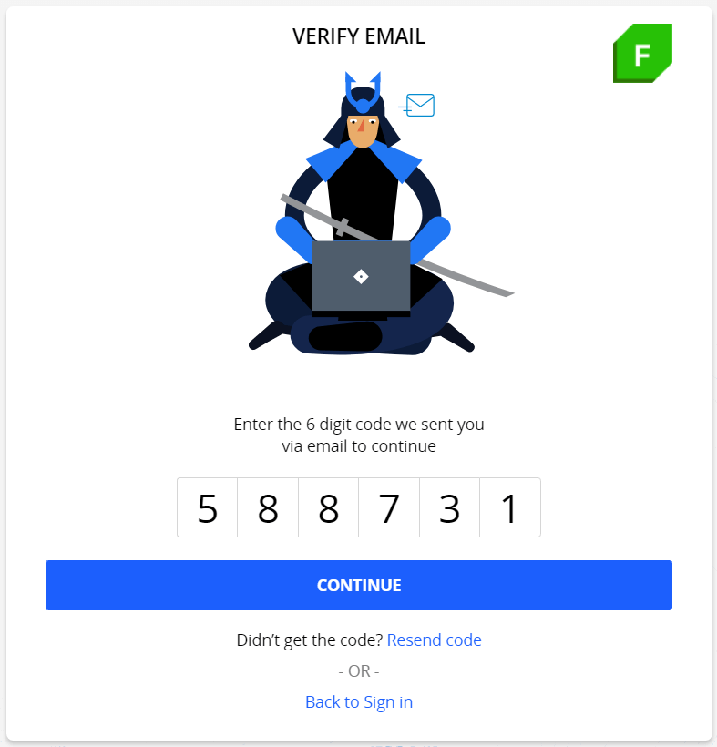
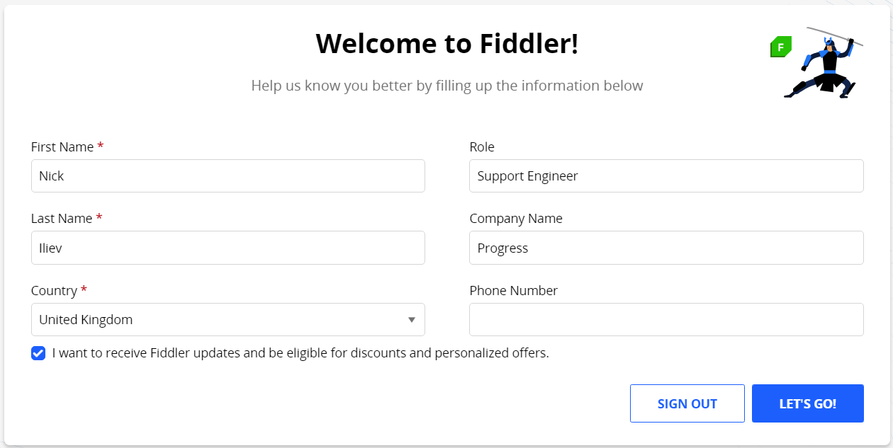
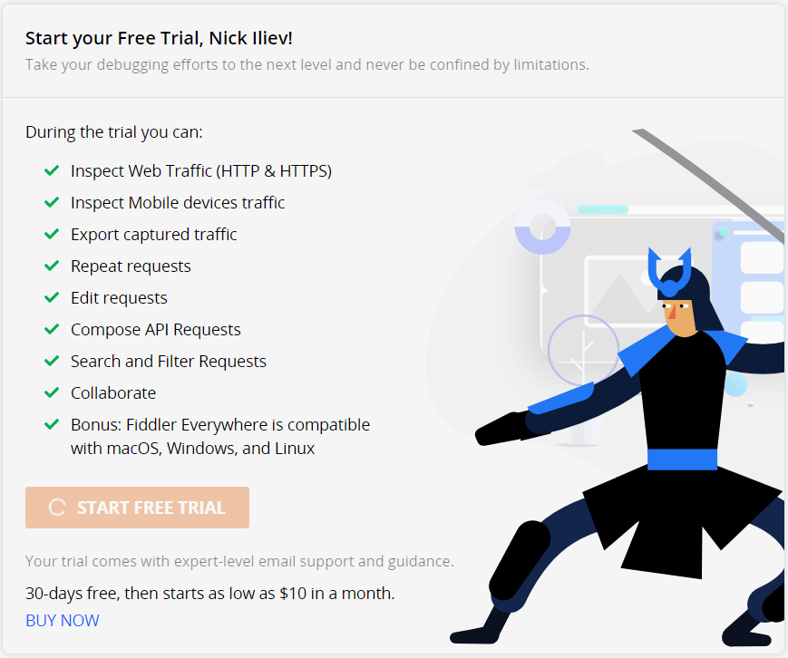

# First Steps with Fiddler Everywhere on macOS

This article lists the system requirements and describe the steps to install Fiddler Everywhere on macOS.

At the end of this article you will be able to install and configure Fiddler Everywhere on macOS, capture, inspect, and modify HTTP and HTTPS traffic, share the sessions with collaborators, create API requests with the API Composer, and mock server requests.

## Prerequisites

- Install macOS High Sierra (10.13+) x64.
- Provide 300MB of free disk space.
- Create an account with administrative rights which you'll need for capturing and decoding HTTPS traffic.
- Provide an active internet connection with access to the following URLs:

    ```
        https://*.getfiddler.com/
        https://*.amazonaws.com/
    ```

>tip Fiddler Everywhere v.1.1.0 and above supports predefined OS proxy settings for direct internet access. If your system is accesses the Internet through a predefined proxy, make sure you have the latest version of Fiddler Everywhere.

## Installation

>important After the installation, Fiddler Everywhere allows you to track only non-secure HTTP traffic. To enable capturing and decoding of HTTPS traffic, you need to install a trusted certificate, as shown in the [article on configuration]().

1. Navigate to the [Fiddler Everywhere](https://www.telerik.com/download/fiddler-everywhere) download page.
1. Select **Download for OS X** to download the installer.
1. Run the **Fiddler Everywhere** `dmg` file to start the installation process.
1. [Complete the HTTPS setup](#configure-on-macos) and start capturing.

## Creating an Account

Signing in is mandatory for both commercial and trial Fiddler Everywhere users. To sign up to Fiddler Everywhere, you can either [create a Fiddler account](#create-fiddler-account) or [use an existing Google account](#use-google-account).

### Creating a Fiddler Account

1. Launch the Fiddler Everywhere client. Select the **New User? Create Account** button.
1. On the **Create Account** screen, enter the requested information and accept the terms of the agreement. The email you provide here will be later on used by your collaborators for sharing sessions, collections, and notifications.

    

1. Open the confirmation email and verify your Fiddler registration by entering the unique code.

    

1. Fill in the required information and proceed through the **Let's Go** button.

    

1. On the next screen, choose whether you want to become a trial user or purchase a subscription plan by selecting either the **Start Free Trial** or the **BUY NOW** link.

    

### Using a Google Account

Alternatively, you can directly sign in with an existing Google account.

1. Launch the Fiddler Everywhere client.
1. Select **Sign in with Google** and authenticate on the Google Authentication page.
1. After you successfully sign up, choose whether you want to become a trial user or purchase a subscription plan by selecting either the **Start Free Trial** or the **BUY NOW** link.

## Update

Steps to update Fiddler Everywhere to the latest version:

1. Start __Fiddler Everywhere__.
1. From the main menu, choose **_Help_ > _Check for Update_**. If a newer version is available, a notification will ask for your agreement to download and install it.
1. Fiddler Everywhere will restart and automatically update to the latest version.

>important Once the Fiddler Everywhere client is installed, updated and started with user account, you can review its [default configuration]().
