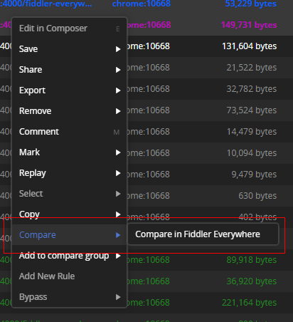
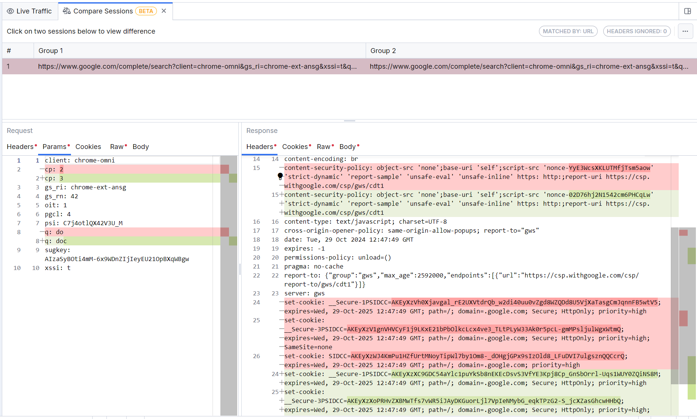
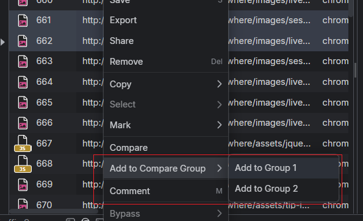
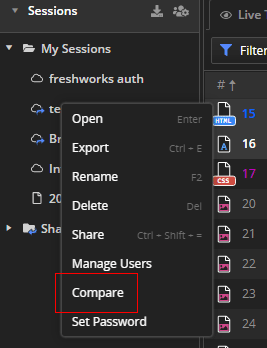
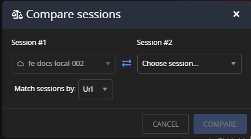
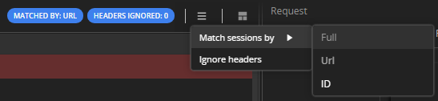
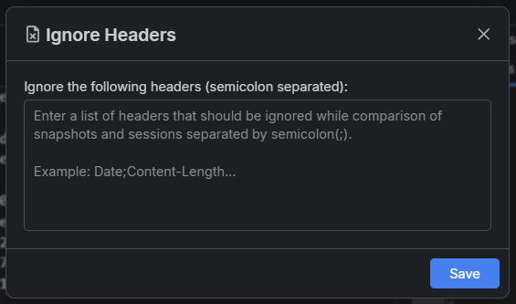
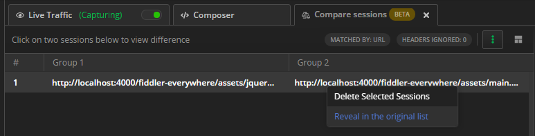

# Comparing Traffic

>tip The **Compare Sessions (BETA)** feature is under active development and subject to additional changes and improvements in future releases.

## Comparing Live Traffic Sessions

Fiddler Everywhere provides a comparing option for detailed differentiation of two or more captured sessions from the sessions grid.

1. Capture HTTP(S) traffic while using your preferred [capturing mode]().

1. Select two sessions that you want to compare.

1. Use the **Compare** option from the context menu. Note that the **Compare** option is active only when **two** sessions are selected.

    

1. Inspect both sessions in a new [**Compare Sessions (BETA**) tab](#compare-sessions-beta-section).

    

Fiddler Everywhere loads both sessions side-by-side, with the session with a lower ID to the left (named **Group 1**) and a higher ID to the right (named **Group 2**). The differences are highlighted in the session inspectors by a red background highlight for the removed content from the primary session and a green background highlight for newly added content in the secondary session. Additional sessions can be added to both groups, simultaneously comparing multiple sessions.

### Adding Sessions to the Compare Groups

You can add and compare more sessions by adding them to the comparison groups.

1. Capture HTTP(S) traffic while using your preferred [capturing mode]().

1. Select one or more sessions that you want to compare.

1. Select the **Add to compare group** option from the context menu and select the compare group to add the session.

    

## Comparing Saved Sessions

With Fiddler Everywhere, you can compare previously saved sessions from the save **Sessions** tree.

1. Select a saved entry from the save **Sessions** tree you want to compare.

1. Select the **Compare** option from the context menu.

    

1. Specify the primary and the secondary sessions you want to compare. Optionally, choose a [matching option](#comparing-options).

    

1. Inspect both sessions in a new [**Compare Sessions (BETA**) tab](#compare-sessions-beta-section).

## Compare Sessions (BETA) Section

The **Compare Sessions (BETA)** section consists of a tab that loads a grid containing the sessions (or groups of sessions) and inspectors comparing the selected sessions' HTTP requests and responses. The section also has a toolbar that provides the [comparing options](#comparing-options) and the ability to rearrange the tab user interface.

### Comparing Options

The **Compare Sessions (BETA)** tab provides the following options to customize your comparing criteria.

- **Match sessions by**&mdash;Highlights unmatched sessions with default criteria set to match by **URL**. The possible match options are as follows:
    - **URL** match to highlight sessions with different URLs.
    - **Order** match session by their order in their ID column. The ID is the Fiddler Everywhere unique identification for each captured session.

    

- **Ignore Headers**&mdash;You can use the popup to create an ignore list of specific requests and response headers from the matching.
    
    

### Context Menu

You can manage all sessions added in the **Compare Sessions (BETA)** tab through the context menu.

- **Delete Selected Sessions**&mdash;Removes the selected sessions from the compare group.

- **Reveal in the Original List**&mdash;Focuses the selected session in its original location (for example, the **Live Traffic** grid or the opened **Sessions** tree tab).

