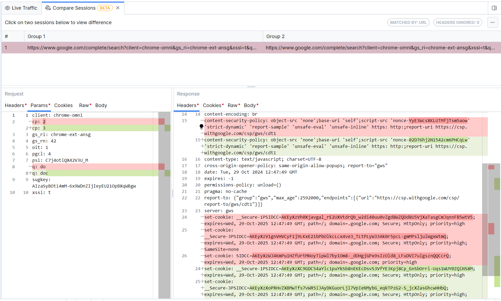
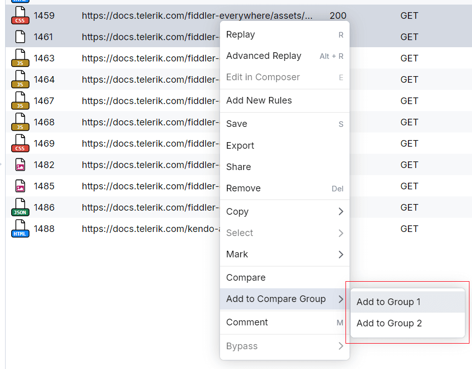
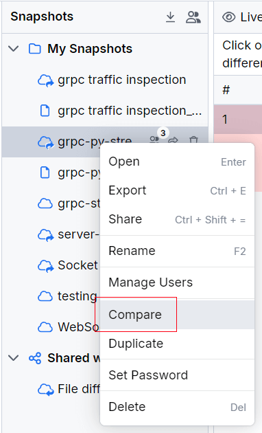
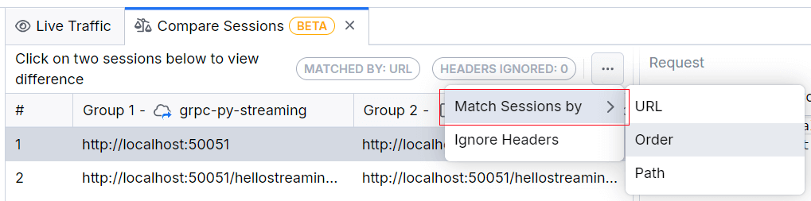
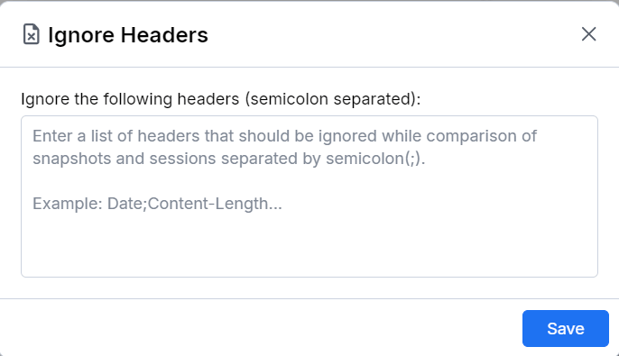
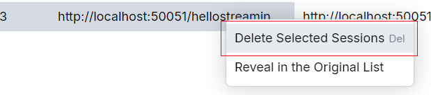

# Comparing Traffic

Fiddler Everywhere enables you to compare two or more captured HTTP sessions side by side to identify differences in headers, bodies, and timings.

## Comparing Live Traffic Sessions

Fiddler Everywhere provides a comparing option for detailed differentiation of two or more captured sessions from the sessions grid.

1. Capture HTTP(S) traffic while using your preferred [capturing mode](slug://capture-traffic-get-started).
1. Select two sessions that you want to compare.
1. Use the **Compare** option from the context menu. Note that the **Compare** option is active only when **two** sessions are selected.
1. Inspect both sessions in a new [**Compare Sessions** tab](#compare-sessions-section).

Fiddler Everywhere loads both sessions side-by-side, with the session with a lower ID to the left (named **Group 1**) and a higher ID to the right (named **Group 2**). The differences are highlighted in the session inspectors by a red background highlight for the removed content from the primary session and a green background highlight for newly added content in the secondary session. Additional sessions can be added to both groups, simultaneously comparing multiple sessions.

### Adding Sessions to the Compare Groups

You can add and compare more sessions by adding them to the comparison groups.

1. Capture HTTP(S) traffic while using your preferred [capturing mode](slug://capture-traffic-get-started).
1. Select one or more sessions that you want to compare.
1. Select the **Add to compare group** option from the context menu and select the compare group to add the session.

## Comparing Saved Session Snapshots

With Fiddler Everywhere, you can compare previously saved sessions from the save **Snapshots** tree.

1. Select a saved entry from the save **Snapshots** tree you want to compare.
1. Select the **Compare** option from the context menu.
    
1. Specify the primary and the secondary sessions you want to compare. Optionally, choose a [matching option](#comparing-options).
    
1. Inspect both sessions in a new [**Compare Sessions** tab](#compare-sessions-section).

## Compare Sessions Section

The **Compare Sessions** section consists of a tab that loads a grid containing the sessions (or groups of sessions) and inspectors comparing the selected sessions' HTTP requests and responses. The section also has a toolbar that provides the [comparing options](#comparing-options) and the ability to rearrange the tab user interface.

### Comparing Options

The **Compare Sessions** tab provides the following options to customize your comparing criteria.

- **Match sessions by**&mdash;Highlights unmatched sessions with default criteria set to match by **URL**. The possible match options are as follows:
    - **URL** match sessions with different URLs.
    - **Order** match session by their order in their ID column. The ID is the Fiddler Everywhere unique identification for each captured session.
    - **Path** match sessions with the same paths (but different hosts). This match ignores queries and fragments.
    
- **Ignore Headers**&mdash;You can use the popup to create an ignore list of specific requests and response headers from the matching.
    

### Context Menu

You can manage all sessions added in the **Compare Sessions** tab through the context menu.

- **Delete Selected Sessions**&mdash;Removes the selected sessions from the compare group.
- **Reveal in the Original List**&mdash;Focuses the selected session in its original location (for example, the **Live Traffic** grid or the opened **Snapshots** tree tab).
    

## See Also

- [Inspecting Traffic](slug://inspecting-traffic-get-started)
- [Inspector Types](slug://inspector-types)
- [Organizing Traffic](slug://fe-organize-sessions)
