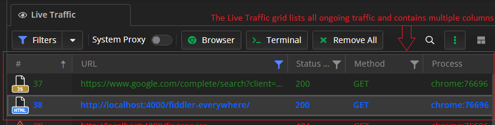
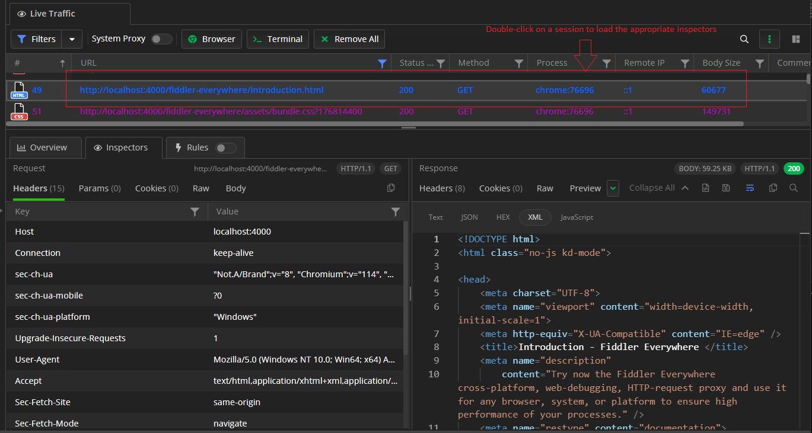
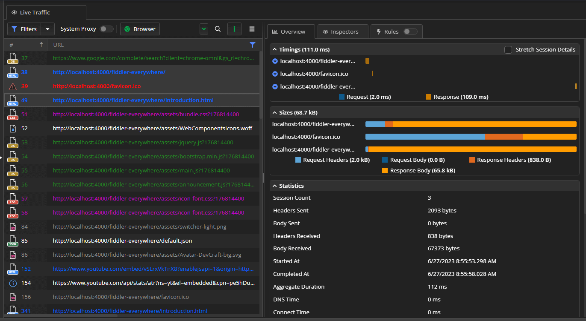

When the traffic is already captured, you can start inspecting its HTTP requests and responses and to analyze the received data. The captured sessions can be saved and reused a later point. You can achieve all that while using the **Live Traffic** pane and its subsections the **Live Traffic** tab and the **Sessions** list.

## Inspecting HTTPS Traffic

The core function of Fiddler Everywhere is to capture HTTPS requests and responses and to visualize its content through a cognitive UI. The ongoing HTTP sessions are listed in the **Live Traffic grid** which contains multiple columns.

>tip A session in the context of Fiddler, means the combination of the **HTTP Request** sent from the client to the server and the **HTTP Response** sent from the server to the client. As Fiddler acts as an intermediate TLS proxy that stands in the middle between client and server, that can also result in different behavior compared to a connection without a proxy. [Learn more about how Fiddler Everywhere works as a intermediate TLS proxy here ...](#fiddler-as-an-https-proxy)

To inspect the HTTP Request and Response headers and bodies, follow these steps:

1. Capture HTTP(S) traffic while using your preferred [capturing mode]().

1. Double-click on a captured session.

The session content is immediately loaded in the Fiddler's **Inspectors**. The application automatically decides which inspector is best suited to display the request and response of the double-clicked session. Alternatively, you can use single-click on a session to preserve the last shown inspector.

[Deep-dive into the Fiddler's inspectors tab here ...]()

## Overview Traffic Statistics

To extract information about the captured sessions, go to the **Live Traffic** tab, where each request/response entry (session) is listed in a row with multiple columns fields in the **Sessions** list. There you can extract valuable data such as the returned status code, the host and the URL, the type of the used protocol (HTTP or HTTPS), the body sizer in bytes, and the HTTP method (GET or POST), and more. The output traffic can be [filtered](), [exported](#exporting), [commented on](#commenting), and [shared]() for further and detailed inspection.

To open the structured information about the session in the [**Overview** tab](), follow these steps:

1. Capture HTTP(S) traffic while using your preferred [capturing mode]().

1. Select a session, and switch to the **Overview** tab.

[Deep-dive into the Fiddler's Overview tab here ...]()

## Sessions List

To save a selected session or multiple selected sessions, use the [context menu](#save) or use a keyboard shortcut. Saved sessions are available in the [**Sessions list**]() from which they can be reloaded or shared with collaborators.

The inspection of sessions often happens with teammates or external collaborators. Share a selected session or multiple selected sessions directly from the [__Live Traffic__ list](#share) or by using the [__Sessions__ list]().

[Deep-dive into the Fiddler's Sessions list here ...]()