# Inspectors Insights

The Fiddler Everywhere **Inspectors** section provides dedicated tabs for inspecting different types of captured traffic. The [**HTTP Inspector**](#http-inspector) renders the HTTP **Request** and **Response** sections, which display the information for the selected HTTP(S) sessions from the sessions grid. The [**Agent Inspector**](#agent-inspector) is a dedicated inspector for LLM/agent sessions that surfaces cost, latency, messages, tool calls, and model configuration details. In the case where the captured traffic uses [the WebSocket API](https://developer.mozilla.org/en-US/docs/Web/API/WebSockets_API) or [the gRPC framework](https://gRPC.io/), a dedicated [**WebSocket and gRPC inspectors**](#websocket-grpc-sse-and-socketio-inspectors) tab renders, which display the connection handshake details, messages, and each message details. For secure connections in the Live Traffic section, Fiddler Everywhere can show detailed [server certificate information](#server-certificate-details).

The inspectors are based on the [Monaco editor](https://microsoft.github.io/monaco-editor/) and provide multiple perks, among which:

- Great performance for loading large chunks of data.
- Line IDs to quickly find and mark a specific portion of the request or response.
- Powerful search functionality that supports strings and regular expressions.
- Automatic context styling that highlights the content based on its type&mdash;for example, image renderers, HTML and XML formatters, JSON formatter, JavaScript, and more.
- A **Preview** inspector type that recognizes and visualizes multiple formats.
- A **Raw** inspector that shows the received HTTP requests/responses as is. It also allows you to encode bodies received in unreadable decoded form.
- A **Copy all content to clipboard** option (in the toolbar at the top-right corner) that allows you to extract information efficiently.

To load the data of a session in the **Inspectors** section, double-click an HTTP(S), WebSocket, or gRPC session from the __Live Traffic__ grid.

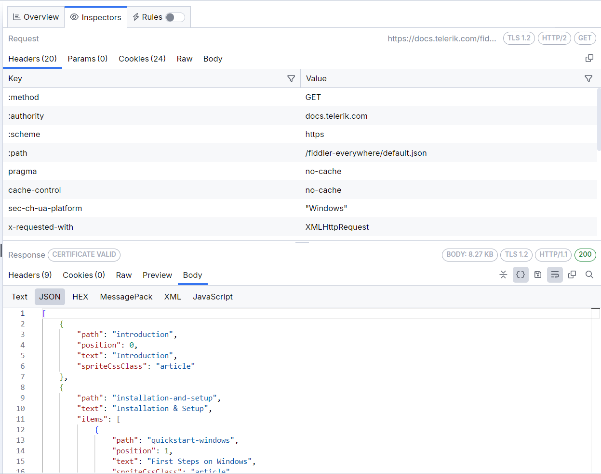

To switch the loaded name of the inspector, single-click the desired inspector name&mdash;for example, __Image__ or __Raw__.

## HTTP Inspector

The **HTTP Inspector** provides the following types of inspecting tools that enable you to examine different parts of the requests and responses:

* [Headers inspector](#headers-inspector)
* [Params inspector](#params-inspector)
* [Trailers inspector](#trailers-inspector)
* [Cookies inspector](#cookies-inspector)
* [Raw inspector](#raw-inspector)
* [Preview inspector](#preview-inspector)
* [Body inspector](#body-inspectors)
* [Auth inspector](#auth-inspector)

### Headers Inspector

The **Headers** inspector allows you to view the HTTP headers of the request and the response.

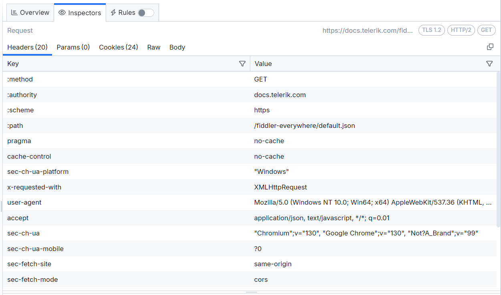

>tip Fiddler Everywhere supports HTTP/2 and shows the HTTP/2 pseudo-headers in their original order as they are sent/received.

### Params Inspector

The **Params inspector**, available only in the **Request** section, displays the content from any input endpoint parameters.

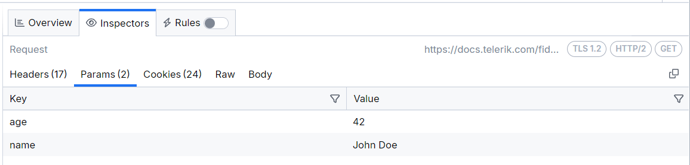

### Trailers Inspector

The **Params inspector** is a gRPC-specific inspector that helps inspect gRPC server trailer headers. [Learn more about gRPC capturing here...](slug://capture-grpc-traffic).

### Cookies Inspector

The **Cookies inspector** displays the contents of any outbound `Cookie` and `Cookie2` request headers and any inbound `Set-Cookie`, `Set-Cookie2`, and `P3P` response headers.

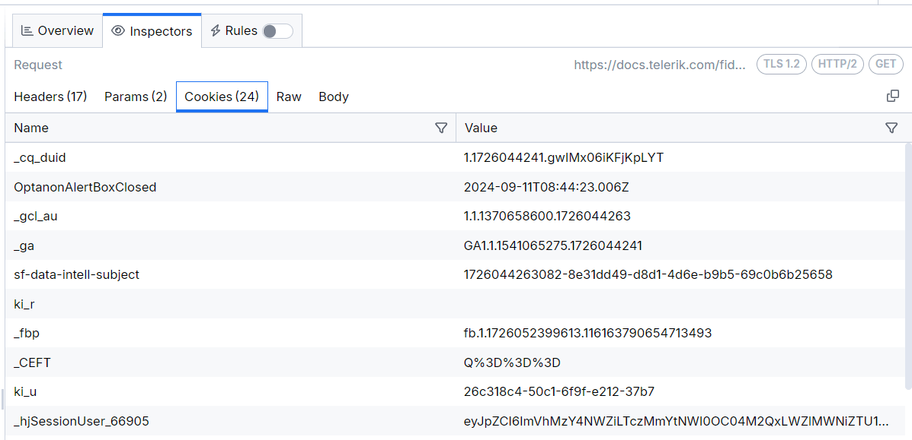

### Raw Inspector

The **Raw Inspector** allows you to view the complete request and response, including headers and bodies, as text. Most of the inspector represents a large text area that displays the body text interpreted using the detected character set with the headers, the byte-order-marker, or an embedded `META` tag declaration.

By default, the request or response displays as received, which means that encoded or compressed content will be in a non-human readable format and displayed as is. The **Raw Inspector** comes with a special **decode** button (located in the [toolbar](#toolbar)), decoding encoded content.

The following figure displays the encoded raw content with the **decode** button in an inactive state.

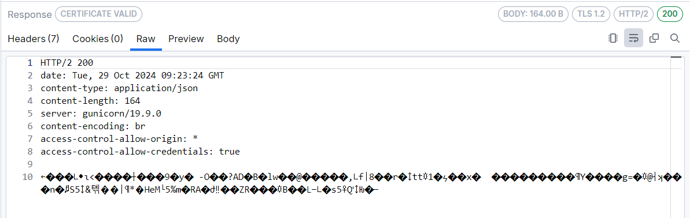

The following figure displays decoded raw content with the **decode** button in an active state.

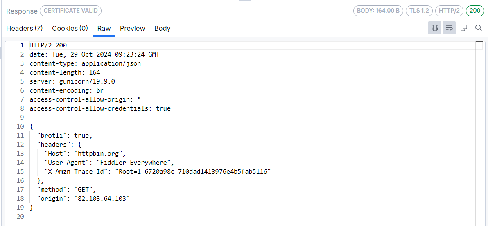

#### Request Raw Inspector Details

Every HTTP(S) request begins with plain text headers that describe what the client requests as a resource or operation. The first line of the request (the **Request line**) contains the following values:

* The HTTP method&mdash;For example, __GET__.
* The URL path which is being requested&mdash;For example, `/index.html`.
* The HTTP version&mdash;For example, `HTTP/1.1`.

The **Request line** can consist of one or more headers listed in rows that contain name-value pairs of metadata about the request and the client, such as the `User-Agent` and `Accept-Language`.

The **Request body** (if such exists) appears at the bottom and is separated by an empty line from the last header.

#### Response Raw Inspector Details

Like the HTTP request, every response begins with plain text headers describing the request's result. The first line of the response (the **Status line**) contains the following values:

* The HTTP version&mdash;For example, `HTTP/1.1`.
* The response status code&mdash;For example, `200`.
* The response status text&mdash;For example, `OK`.

The **Status line** can consist of one or more headers listed in rows that contain name-value pairs of metadata about the response and the server, such as the length of the response file, the content type, and how the response can be cached.

The **Response body** (if such exists) appears at the bottom and is separated by an empty line from the last header.

### Preview Inspector

The **Preview Inspector**, available in the **Request** section only, allows you to view the response bodies as an image or an HTML page, depending on the response content. The inspector can display the most common web image formats, including JPEG, PNG, GIF, and less common formats like cursors, WebP, JPEG-XR, bitmaps, and TIFF.

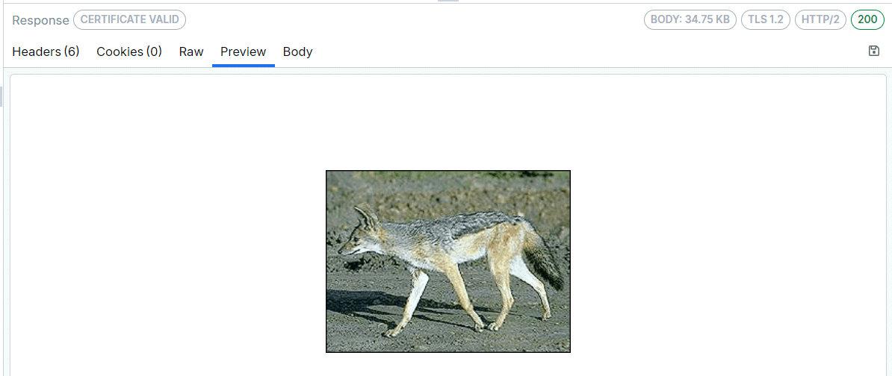

If the content is in HTML format, then the **Preview** inspector allows you to view responses in a web browser control, which provides a quick preview of how a given response may appear in a browser. The web browser control is configured to prevent additional downloads when rendering the response (to avoid flooding the Live Traffic grid), which means that most images and styles will not be displayed. Additionally, scripting and navigating are blocked and provide a read-only preview.

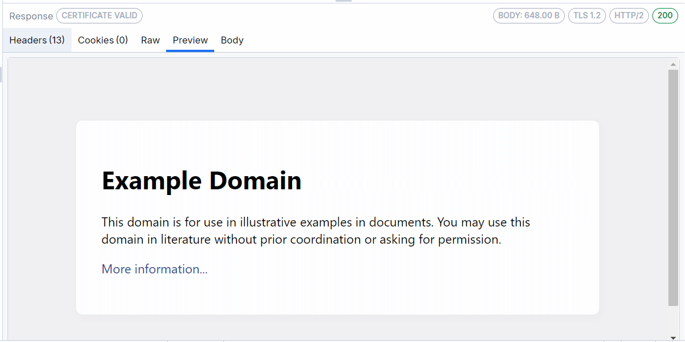

### Body Inspectors

The **Body** inspectors are suitable for different requests and responses. Depending on the received content type, Fiddler Everywhere automatically tries to load the most appropriate body inspector. Fiddler Everywhere provides the following body inspectors:

- [**Text**](#text-body-inspector)
- [**JSON**](#json-body-inspector)
- [**HEX**](#hex-body-inspector)
- [**MessagePack**](#messagepack-body-inspector)
- [**Protobuf**](#protobuf-body-inspector)
- [**XML**](#xml-body-inspector)
- [**Form-Data**](#form-data-body-inspector)
- [**JavaScript**](#javascript-body-inspector)

#### Text Body Inspector

The **Text** inspector lets you view the request and response bodies as text. It truncates the data it renders at the first null byte it finds, making it inappropriate for displaying binary content. Most body inspectors represent a large text area that reveals the body text interpreted using the detected character set with the headers, the byte-order-marker, or an embedded META tag declaration.

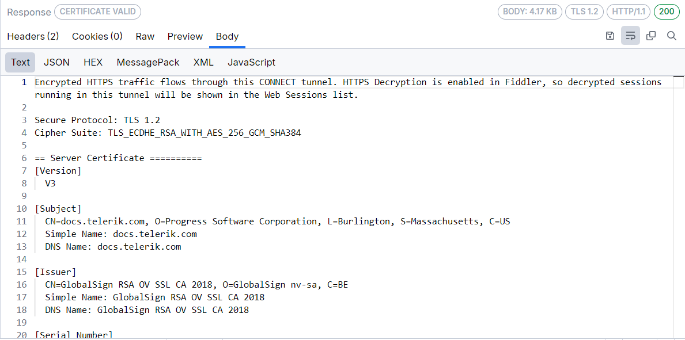

#### JSON Body Inspector

The **JSON** inspector interprets the selected request or response body as a JavaScript Object Notation (JSON) formatted string, showing a tree view of the JSON object nodes. The tree view will remain empty if the body cannot be interpreted as JSON. The JSON inspector can render the data even if the request or response is compressed or has HTTP chunked encoding.

>important If the JSON data is malformed, for example, the name component of a name/value pair is unquoted, the JSON inspector will show a warning in the footer.

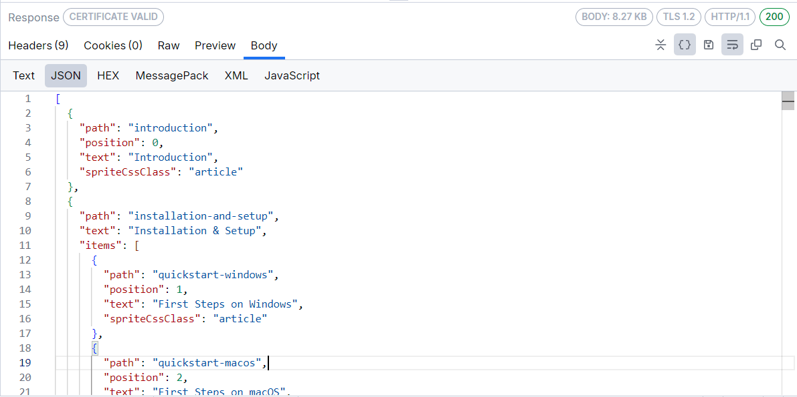

#### HEX Body Inspector

The **HEX** inspector loads a hex representation of the HTTP request/response bodies. The hex data can help identify hidden information in the requests/responses and find special characters (for example, CRLF, Tab, and others). The HEX inspector's primary goal is to help people analyze bodies with binary data while providing performance optimization for working with larger files.

The **HEX** inspector consists of an offset column, a hex view column, and a text view column.

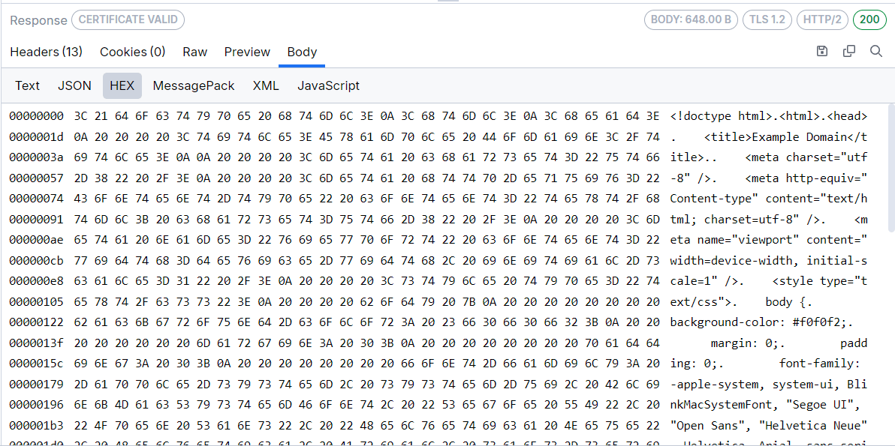

#### MessagePack Body Inspector

The **MessagePack** inspector interprets the selected request or response body as a [MessagePack](https://msgpack.org/index.html), showing a tree view of the MessagePack object nodes. The **MessagePack** inspector tab is auto-selected, and the message contents are decoded for all cases where the `Content-Type` header contains the keywords `messagepack` or `msgpack`, for example, `Content-Type: application/x-msgpack`.

#### Protobuf Body Inspector

The **Protobuf** inspector decodes request and response bodies that use Protocol Buffers (Protobuf). The **Protobuf** tab was previously available only for gRPC sessions, but it is now also available for HTTPS sessions in **Live Traffic** when the selected message contains Protobuf data.

To decode Protobuf messages, add one or more `.proto` files through **Settings** > **Protobuf** > **Decode via .proto file**. If no matching schema is available, the inspector cannot decode the message and prompts you to add a `.proto` file.

#### Socket.IO Body Inspector

The **Socket.IO** inspector interprets the selected request or response body as a [Socket.IO] message data, showing a tree view of the Socket.IO object nodes.

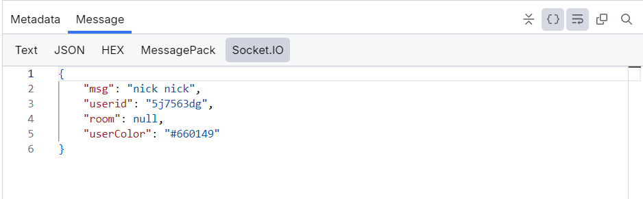

#### XML Body Inspector

The **XML** inspector interprets the selected request or response body as an Extensible Markup Language (XML) document, showing a tree view of the XML document nodes. The tree view will remain empty if the body cannot be interpreted as XML (that includes valid HTML). Each XML element is represented as a node in the tree. The attributes of the element are displayed in square brackets after its name. The inspector provides an **Expand All / Collapse All** toggle button to expand or collapse all XML tree nodes.

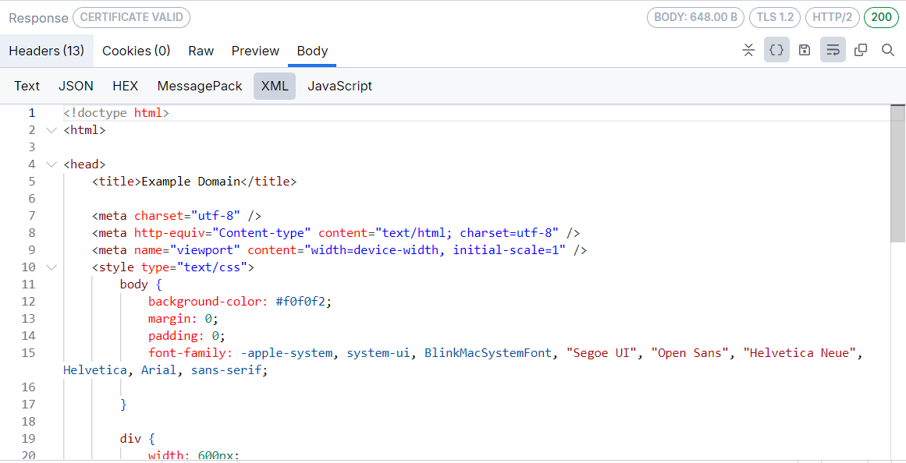

#### Form Data Body Inspector

The **Form Data** inspector, available in the **Request** section only, parses the request query string and body for any HTML form data. If a form is found, the parsed name/value pairs are displayed in the grid view. The inspector works best with `application/x-www-form-urlencoded` data used by most simple web forms.

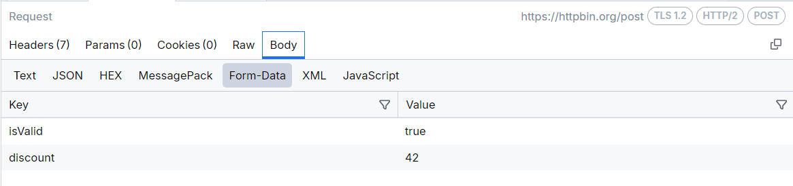

#### JavaScript Body Inspector

The **JavaScript** inspector interprets and formats the selected request or response body as a JavaScript/TypeScript code. The inspector will recognize and properly format the following MIME types:

```text
application/ecmascript
application/javascript
application/x-ecmascript
application/x-javascript
text/ecmascript
text/javascript
text/javascript1.0
text/javascript1.1
text/javascript1.2
text/javascript1.3
text/javascript1.4
text/javascript1.5
text/x-ecmascript
text/x-javascript
```

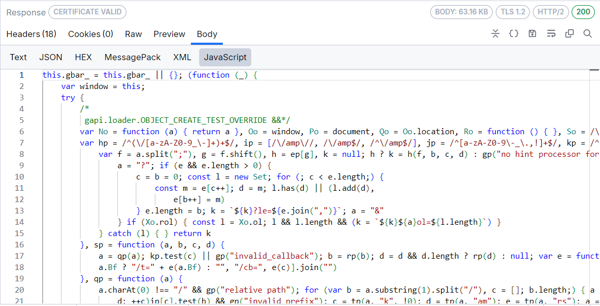

### Auth Inspector

The **Auth** inspector obtains authorization information from the `Authorize` and `Proxy-Authorize` headers and from SAML requests and responses within their query parameters and Request bodies, then tries to decode this information if possible. Fiddler recognizes the Basic auth scheme and JWT Bearer tokens as authorization headers.

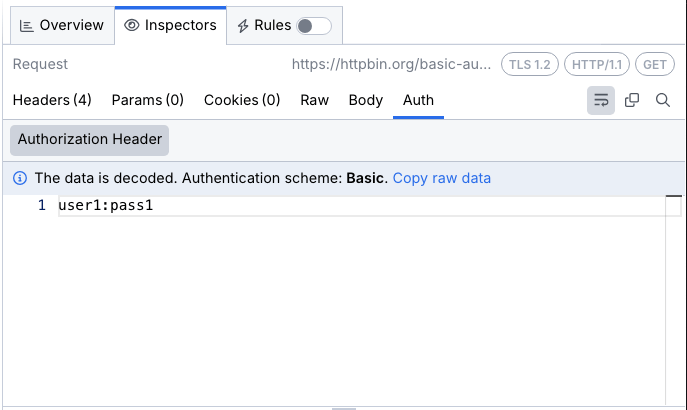

## Agent Inspector

The **Agent Inspector** is a dedicated inspector for LLM/agent sessions. It appears alongside the **HTTP Inspector** tab and is available when inspecting sessions in the **Live Traffic** grid, the **Agent Calls** tab, and saved snapshots. When an agent session (such as an API call to an LLM provider) is selected from the **Agent Calls** tab, the **Agent Inspector** is shown as the default inspector. When the same session is selected from the **Live Traffic** grid, the **Agent Inspector** appears as an additional tab next to **HTTP Inspector**.

The **Agent Inspector** provides the following sub-tabs:

* [Cost](#cost-sub-tab)
* [Latency](#latency-sub-tab)
* [Messages](#messages-sub-tab)
* [Tools](#tools-sub-tab)
* [Model](#model-sub-tab)

### Cost Sub-Tab

The **Cost** sub-tab provides a token usage and cost breakdown for the selected session. The tab contains two collapsible sections:

- **Tokens Count**&mdash;Displays the number of input tokens, output tokens, and total tokens consumed by the request, along with each value's percentage share of the total.
- **Cost**&mdash;Displays the monetary cost for input tokens, output tokens, and the total cost of the call, along with each value's percentage share of the total.

When a session is served from the [Fiddler Everywhere Agent Cache](slug://agent-cache), the **Cost** sub-tab also shows a cache-hit banner indicating how many tokens and how much money the cached response saved (for example, _"Cache hit. This call saved ~$0.0003 (331 tokens)."_). In this case, a note below the banner states that the metrics shown are from the cached session.

### Latency Sub-Tab

The **Latency** sub-tab shows the response time for the selected session. When a session is served from the [Fiddler Everywhere Agent Cache](slug://agent-cache), the tab shows a cache-hit banner indicating how many seconds of latency were avoided by serving the cached response (for example, _"Cache hit. This call avoided ~2.88 s latency."_).

### Messages Sub-Tab

The **Messages** sub-tab renders the full conversation exchange of the selected session in a readable, chat-style view. Messages are presented by role:

- **User**&mdash;Displays the user prompt and any additional context or data passed to the model.
- **Agent**&mdash;Displays the model's response to the user prompt.
- **Tool Call**&mdash;Displays a tool call made by the agent during the session.
- **Tool Response**&mdash;Displays the response returned by the tool.

A filter icon in the top-right corner of the sub-tab allows you to filter the displayed messages.

### Tools Sub-Tab

The **Tools** sub-tab displays all tools available to the model and any tool calls made during the session. The number of detected tool calls is indicated directly in the sub-tab label (for example, **Tools (0)** when no tool calls are detected). The sub-tab provides two views:

- **Usage**&mdash;Shows each available tool and the number of times it was called during the session. When no tool calls are present, the view displays the message _"No tool calls detected in this session."_
- **JSON**&mdash;Displays the full definitions of all available tools in JSON format, including their names, descriptions, and parameters.

### Model Sub-Tab

The **Model** sub-tab displays the model configuration details for the selected session. It provides the following collapsible sections:

- **Model Configuration**&mdash;Shows model parameters for the session. The available parameters vary depending on what was included in the LLM request. Common parameters include **Provider** (the service provider, for example `OpenAI`), **Model** (the model version, for example `gpt-4.1-mini-2025-04-14`), **Stream** (whether streaming was enabled), and **Thinking Tokens Used** (whether extended thinking tokens were consumed). Additional parameters such as **Max Tokens** may appear when specified in the request.
- **System Prompt**&mdash;Displays the system prompt passed to the model for the session (for example, _"Summarize hotel options. Be helpful and confident."_).

## WebSocket, gRPC, SSE, and SocketIO Inspectors

Fiddler Everywhere provides common user interface to create inspectors for visualizing WebSocket, gRPC, Server-Sent Events, and Socket.IO traffic. The inspectors provide the following types of inspecting tools that enable you to examine different parts of a connection:

- [Handshake tab](#handshake-tab)
- [Messages tab](#messages-tab)

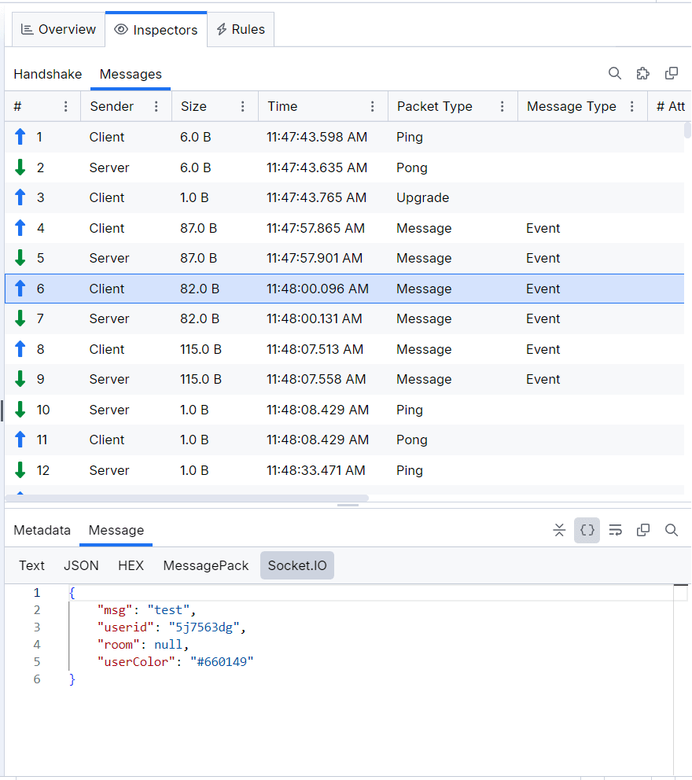

Encoded messages from a **gRPC** session are automatically decoded (if possible) and presented in human-readable form in the inspector. Fiddler will try to automatically decode captured **gRPC** sessions through a known decoding mechanism, server reflection (if such is present on the server side), or through a Protobuf file. Users can add one or more Protobuf files through the **Settings** > **Protobuf** > **Decode via .proto file** option.

The same Protobuf decoding capabilities are also available for HTTPS sessions through the **Body** > **Protobuf** tab in **Live Traffic**.

[Learn more about capturing gRPC traffic with Fiddler Everywhere here...](slug://capture-grpc-traffic)

### Handshake Tab

Similarly to an HTTP(S) request and response, the **Handshake tab** for the WebSocket and gRPC APIs provide the following types of inspecting tools that enable you to examine different parts of the WebSocket requests and responses:

- [Headers inspector](#headers-inspector)
- [Params inspector](#params-inspector)
- [Cookies inspector](#cookies-inspector)
- [Raw inspector](#raw-inspector)
- [Preview inspector](#preview-inspector)
- [Body inspector](#body-inspectors)

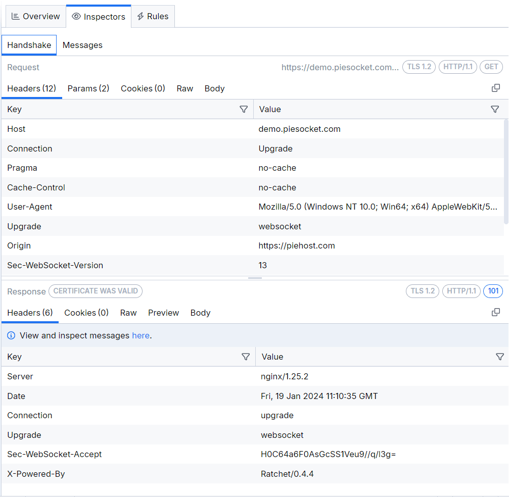

### Messages Tab

The **Messages tab** renders a list of the WebSocket or gRPC messages sent from the client or received from the server. The list is constantly populated with new upcoming messages until the two-way communication is disconnected. Each received WebSocket message can be inspected separately through the [**Metadata inspector**](#metadata-inspector) and through the [**Message Inspector**](#message-inspector).

The list of messages is rendered as a grid with multiple columns:

- **#**&mdash;Number indicating the consecutive number of the message.
- **Sender**&mdash;Indicates whether the **Client** or **Server** sent the message.
- **Type (WebSocket only)**&mdash;Indicates the type of the message. The supported values are as follows:
    * **Text**&mdash;message with text payload.
    * **Binary**&mdash;message with binary payload.
    * **Cont.**&mdash;represents a continuation message from a fragmented message. Use the **Unfragment all messages** button to unfragment messages of type **Cont.** and remove them from the **Messages** list.
    * [**Ping**](https://datatracker.ietf.org/doc/html/rfc6455#section-5.5.2).
    * [**Pong**](https://datatracker.ietf.org/doc/html/rfc6455#section-5.5.3).
- **Size**&mdash;The length of the message in bytes.
- **ID (SSE and Socket.IO)**&mdash;The ID for the specific SSE message (if such exists).
- **Sender (gRPC, Socket.IO)**&mdash;Indicates whether the sender is the client or the server application.
- **Event (SSE only)**&mdash;The server-sent event name which corresponds to **Type** column in Google Chrome’s DevTools.
- **Data (SSE, Socket.IO)**&mdash;Contains the value of the data property of the message.
- **Raw (SSE only)**&mdash;Contains the whole object sent from the server without any parsing.
- **Time (WebSocket, SSE, Socket.IO)**&mdash;Renders the date and the time when the message is received.
- **Message**&mdash;The string representation of the message sent/received.
- **Packet Type (Socket.IO only)**&mdash;Indicates the type of the received Socket.IO packet (for example, Ping, Pong, Upgrade, Message).
- **Message Type (Socket.IO only)**&mdash;Indicates the type of the received Socket.IO message (for example, Event).
- **Attachments (Socket.IO only)**&mdash;Lists the included attachments (if present).
- **Namespace (Socket.IO only)**&mdash;Lists the included namespace (if present).
- **Message Type (Socket.IO only)**&mdash;Indicates the type of the received Socket.IO message (for example, Event).
- **Ack.ID (Socket.IO only)**&mdash;Indicates the ID of the acknowledgment function (if present).

#### Messages Toolbar

The top-right corner of the **Messages tab** contains a toolbar with the following functionalities:

- **Search (WebSocket only)** field to filter received WebSocket messages.
- **Unfragment all messages (WebSocket only)** button to combine all continuation type messages with their original message and remove them from the **Messages** list.
- **Copy all content to clipboard** button that immediately puts all captured messages into the operating system clipboard.

#### Metadata inspector

The **Metadata inspector** (available only for WebSocket traffic) contains timestamps and masking information about the selected WebSocket message.

- **DoneRead**&mdash;Indicates when the Client/Server finished processing the message.
- **BeginSend**&mdash;Indicates when the Client/Server sent the message.
- **DoneSend**&mdash;Indicates when the Client/Server finished sending the message.
- **Data masked by key**&mdash;The key that conceals the message.

#### Message Inspector

The **Message Inspector** contains the non-masked message content visualized in [Text](#text-body-inspector), [JSON](#json-body-inspector) (WebSocket only), or [HEX](#hex-body-inspector) body inspector. The inspector has a toolbar that allows you to word-wrap the message content and highlight content through a search term.

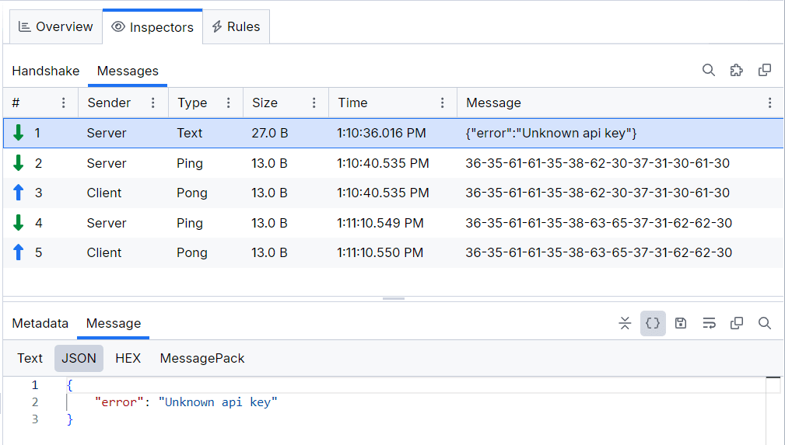

## Context Menu

All inspectors provide further interaction options through a context menu. The context menu options vary depending on the inspectors' type (refer to the list below).

- **Copy**&mdash;Basic copy operation for selected content. Available in most inspectors.
- **Copy Value**&mdash;An option to copy only the value (from a key-value pair). Available in **Headers** inspector.
- **Copy Key/Value**&mdash;An option to copy the key-value pair. Available in **Headers** inspector.
- **Copy Response Cookie Value**&mdash;An option to copy the value of a selected cookie. Available in **Cookies** inspector.
- **Decode Value**&mdash;An option that allows you to decode selected value. The decode option supports built-in decoding of Base64, EscapedSequences, Encoded URL, Hex, and Encoded HTML. Available in **Headers**, **Form Data** and **Cookies** inspectors.
- **Decode Selection**&mdash;An option that allows you to decode selected content (encoded). The decode option supports built-in decoding of Base64, EscapedSequences, Encoded URL, Hex, and Encoded HTML. Available in **Raw** inspector and all **Body** inspectors (**Text, JSON, XML, JavaScript**). The **Decode Selection** option opens a new detached window that you can use to inspect different snapshots and sessions.
- **Add as a column**&mdash;An option to create a custom column in the Live Traffic grid while using the selected HTTP Header. Available in **Headers** inspector.

## Toolbar

Each inspector has a toolbar that provides a different set of functionalities and information as follows:

- [**Server Certificate Details**](#server-certificate-details)
- **Badges** that output the request URL (Request inspector only), the TLS version, the HTTP version, the HTTP method (Request inspector only), Body size, and the status code (Response inspector only).
- **Expand All / Collapse All**&mdash;Toggle to expand or collapse all the output data. Available for all Body inspectors.
- **Decode / Encode**&mdash;Toggle between compressed/uncompressed or decoded/encoded content. Available only for the Raw inspector.
- **Reformat Text**&mdash;Formats the text with the built-in Monaco editor optimizations. Available only for JSON, XML, and JavaScript inspectors.
- **Save request body to file**&mdash;Exports the body in the format specified as content type. Raw data is exported as DAT files. Available for the Raw and Body Request inspectors.
- **Save response body to file**&mdash;Exports the body in the format specified as content type. Raw data is exported as DAT files. Available for the Raw and Body Response inspectors.
- **Save image to file**&mdash;Exports the previewed images in the specified format. Available only for the Preview inspector.
- **Toggle Word Wrap**&mdash;Toogle the option to transfer a word with insufficient space from the end of one line of text to the beginning of the next.
- **Copy all content to clipboard**&mdash;Copies the inspector's content into the system clipboard.

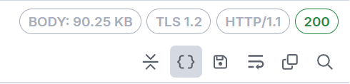

## Server Certificate Details

The Response Inspectors for ongoing capture (the sessions in the Live Traffic grid) in Fiddler Everywhere contain indicators and notifications that show if a server certificate is valid, expiring, or causes errors. 

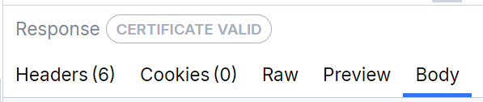

[Learn more on how to inspect and use the certificate details with Fiddler Everywhere here...](slug://fe-cert-details)

## See Also

- [Inspecting Traffic](slug://inspecting-traffic-get-started)
- [Overview Insights](slug://overview-tab)
- [Comparing Sessions](slug://fe-compare-sessions)
- [Agent Cache](slug://agent-cache)