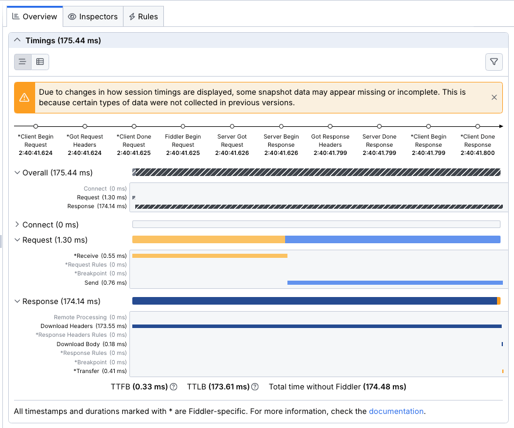
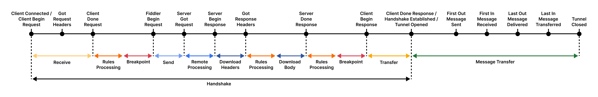
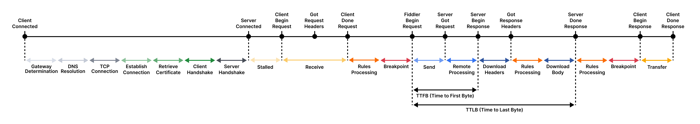
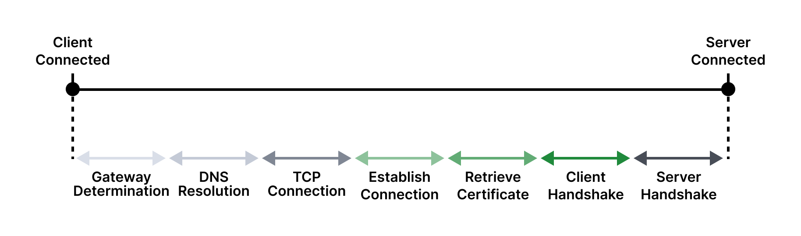
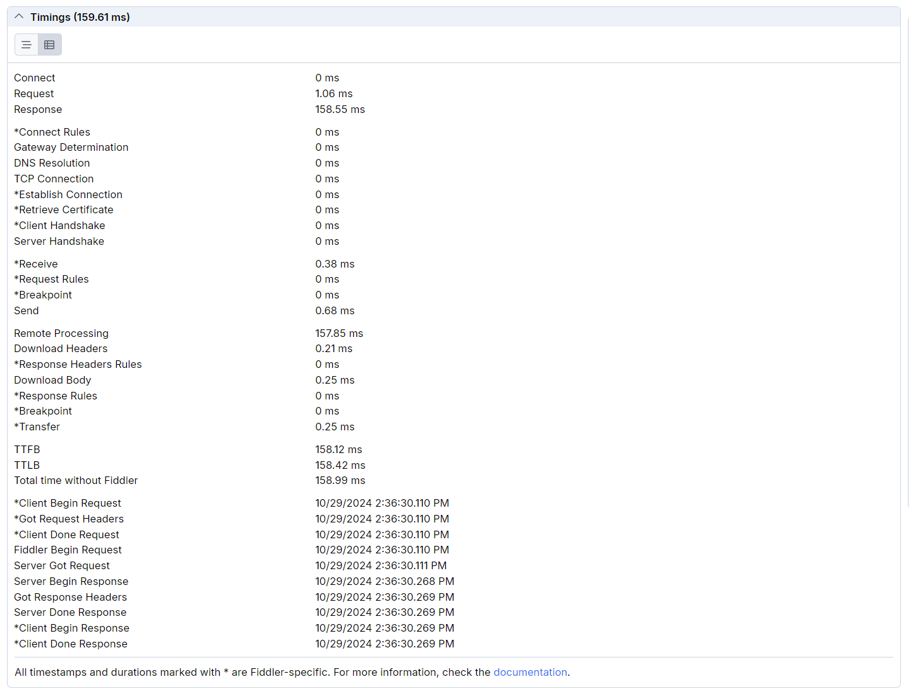
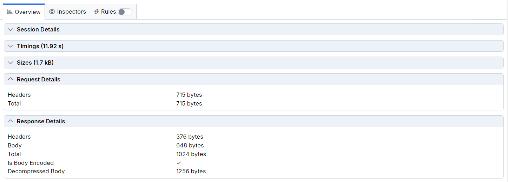

# Session Overview

The **Overview** tab in Fiddler Everywhere provides structured information and statistical data for the captured traffic. This section allows you to deep-dive, compare and analyze the timings, sizes and other contextual data for one or more HTTP sessions.

The **Overview** tab contains a set of widgets, which are dynamically changing depending on the number of selected sessions:

- [Session Details](#session-details)&mdash; This field contains information about a selected session's URL, protocol, and state.
- [Timings](#timings)&mdash; This section contains a detailed timeline and timing charts that visualize data for a single or multiple selected sessions.
- [Sizes](#sizes)&mdash; This section contains a representative chart and technical information related to the size of a single or multiple selected sessions.
- [Statistics](#statistics)&mdash;Contains a statistical data for the selected sessions.
- [Request Details](#request-details)&mdash; This section contains details about the HTTP Request for a selected session.
- [Response Details](#response-details)&mdash;This section contains details about the HTTP Response for a selected session.

## Session Details

The **Session Details** widget lists technical details, including:

* Session's URL
* Protocol
* Session state
* Session ID (within the Fiddler's traffic grid)

The widget is available only when a single session is selected.

## Timings

The **Timings** widget visually represents the timeline and the durations needed to execute the selected sessions. The widget dynamically changes based on whether the selection includes a single or multiple sessions. Hovering over a specific timing reveals additional details related to the targeted field. All sections are collapsible and can be explicitly hidden or shown through the **Settings** button at the top-right corner.

### Timings (Single Session)

When a single session is selected, the **Timings** widget displays two sections:

* **Timeline** section - Contains a timeline and detailed graph showing the timestamps of each session event (including events related to the Fiddler proxy).

 

The timeline represents the lifecycle of a session that goes through the Fiddler proxy. The following diagrams illustrate how each part of the timeline corresponds to a real-life HTTPS session.

The following diagram demonstrates the lifecycle of the bi-directional session

The following diagram demonstrates the lifecycle of the CONNECT + HTTP Request + HTTP Response.

The following diagram demonstrates the lifecycle of the CONNECT tunnel when the Fiddler proxy is in the middle.

* **Durations** section - Lists the timings related to the sessions' CONNECT, HTTP Request, and HTTP Response events (plus the overall of all three combined). This section also contains timings for Fiddler-specific events, such as using breakpoints and rules.

 

### Timings (Multiple Sessions)

When multiple sessions are selected, the **Timings** widget displays two sections:

* **Timeline** section that visualizes the execution order and the times for each session.

* **Duration** section that visualizes and compares the selected sessions based on duration.

The URL can be up to 30 symbols long. To visualize a tooltip with the entire session URL plus the fast copy option, click the eye icon at the end of the wrapped URL. 

### Events and Timestamps Explained

The timeline section in the **Timeline** widget can contain several timestamped events. The following are also available within the **Timestamps** section in **Timings**.

- **Client Begin Request**&mdash;A timestamp that indicates when the client app made the request. This is a Fiddler-specific timestamp.

- **Got Request Headers**&mdash;A timestamp that indicates when Fiddler received the request headers as sent from the client app.

- **Client Done Request**&mdash;A timestamp that indicates when the client finished the request. This is a Fiddler-specific timestamp.

- **Fiddler Begin Request**&mdash;A timestamp that indicates when Fiddler made the request.

- **Server Got Request**&mdash;A timestamp that indicates when the targeted server received the request.

- **Server Begin Response**&mdash;A timestamp that indicates when the targeted server triggered the response.

- **Got Response Headers**&mdash;A timestamp that indicates when Fiddler received the response headers as sent from the server.

- **Server Done Response**&mdash;A timestamp that indicates when the server finished sending the request.

- **Client Begin Response**&mdash;A timestamp that indicates when the client app received the response. This is a Fiddler-specific timestamp.

- **Client Done Response**&mdash;A timestamp that indicates when the client finished processing the response. This is a Fiddler-specific timestamp.

Additionally, all sessions that use **CONNECT** method have the following timestamps:

- **Client Connected**&mdash;A timestamp that indicates when the client app established a CONNECT session. This is a Fiddler-specific timestamp.

- **Server Connected**&mdash;A timestamp that indicates when the server established a CONNECT session.

- **Server Handshake**&mdash;A timestamp that indicates when the server confirmed or refused the TLS handshake.

### Timings

Some of the events visualized in the timeline are entirely related to Fiddler features like proxy determination, certificate retrieval, or executing custom rules for traffic modification. The following list represents all timings connected to a Fiddler-related application logic.

#### Overall Timings

- **Connect**&mdash;The time spent establishing a connection with the server.

- **Request**&mdash;The time spent receiving, processing and sending the request.

- **Response**&mdash;The time spent receiving, processing and sending the response.

#### Connect Timings

- **Connect Rules**&mdash;The time needed for the Fiddler application to execute a rule related to a CONNECT session.

- **Gateway Determination**&mdash;The time spent determining which gateway to use for handling the request.

- **DNS Resolution**&mdash;The time spent resolving the server's domain name to an IP address.

- **TCP Connection**&mdash;The time spent establishing a TCP/IP connection with the server.

- **Establish Connection**&mdash;The time needed to create the connection with the server (during a CONNECT session).

- **Retrieve Certificate**&mdash;The time Fiddler takes to obtain the certificate (during a CONNECT session).

- **Client Handshake**&mdash;The time Fiddler takes to complete the handshake with the client/server (during a CONNECT session).

- **Server Handshake**&mdash;The time Fiddler takes to complete the handshake with the client/server (during a CONNECT session).

#### Request Timings

- **Stalled**&mdash;The time between the actual client request and its execution in Fiddler.

- **Receive**&mdash;The time Fiddler takes to receive the request.

- **Request Rules**&mdash;The time Fiddler takes to execute a rule that modifies HTTP request.

- **Breakpoint**&mdash;The time Fiddler takes during an explicitly created breakpoint that pauses an HTTP request.

- **Send**&mdash;The time spent sending the request to the server.

#### Response Timings

- **Remote Processing**&mdash;The time from when the request was sent to when the first byte of the response was received.

- **Download Headers**&mdash;The time until the response headers are fully received.

- **Response Header Rules**&mdash;The time Fiddler takes to execute a rule that modifies HTTP response headers.

- **Download Body**&mdash;The time until the response body is fully downloaded.

- **Response Rules**&mdash;The time Fiddler takes to execute a rule that modifies HTTP response.

- **Breakpoint**&mdash;The time Fiddler takes during an explicitly created breakpoint that pauses an HTTP response.

- **Transfer**&mdash;The time Fiddler takes during an explicitly created breakpoint.

#### Additional Info Timings

- **TTFB**&mdash;The time to First Byte (TTFB) measures the moment a client app makes a request to a server to the time the client app receives the first byte of data from the server. 

- **TTLB**&mdash;The time to Last Byte (TTLB) measures the delay between the request sent by the client app and the receiving of the last byte of the related response.

- **Total time without Fiddler**&mdash;The total time that the HTTP session took without the Fiddler-specific events (like rules, breakpoints, CONNECT-related events, etc.).

#### Timestamps

This section provides a list of timestamps that indicate when a specific event occurred. [Learn more about the events in Fiddler Everywhere here...](#events-and-events-timestamps)

## Sizes

The **Sizes** widget visually represents the size of a single session or a selection of multiple sessions. Each Session is listed on a separate line and presented with a URL corresponding to the URL column in the sessions grid. The widget also includes a chart showing the header sizes and the body of the Request and Response, each included in a single chart.

The **Sizes** widget delivers the following options:

- **Request Headers**&mdash;The size of all request headers in bytes or kilobytes.

- **Request Body**&mdash;The size of all request bodies in bytes or kilobytes.

- **Response Headers**&mdash;The size of all response headers in bytes or kilobytes.

- **Response Body**&mdash;The size of all response bodies in bytes or kilobytes.

Under the list of session lines, you will find the **Request Headers** (dark blue), **Request Body** (light blue), **Response Headers** (red), and **Response Body** (orange) footers with the total size in kilobytes (**kB**) or bytes (**B**) for all listed sessions.

## Statistics

The **Statistics** widget contains a table with structured information for multiple selected sessions. The widget is only available when multiple sessions are selected (collapsed and inactive for a single session selection).

- **Session Count**&mdash;The number of selected sessions.

- **Headers Sent**&mdash;The size of the sent request headers in bytes.

- **Body Sent**&mdash;The size of the sent request bodies in bytes.

- **Headers Received**&mdash;The size of the received response headers in bytes.

- **Body Received**&mdash;The size of the received response bodies in bytes.

- **Started At**&mdash;The date and time when the earliest client request is established. Corresponds to the **Client Begin Request** timing.

- **Completed At**&mdash;The date and time when the latest client response finishes. Corresponds to the **Client Done Response** timing.

- **Aggregate Duration**&mdash;The total aggregate duration for all selected sessions in milliseconds.

- **Connect Time**&mdash;The aggregate TCP connect time for all selected sessions in milliseconds.

- **DNS Time**&mdash;The aggregate DNS time for all selected sessions in milliseconds.

- **Handshake Time**&mdash;The aggregate HTTPS handshake time for all selected sessions in milliseconds.

- **Requests per Host**&mdash;A list of the hosts and the number of requests to each.

- **Responses by Code**&mdash;A list of the received HTTP response status codes and the number of appearances.

- **Response Size by Type**&mdash;A list of the received response types and their aggregate size.

- **Timings**&mdash;Subsection that lists various timings and statistical data for all selected sessions.

    * **Min Duration**
    * **Max Duration**
    * **Average Duration**
    * **Median**
    * **Standard Deviation**
    * **90% percentile**
    * **95% percentile**
    * **99% percentile**
    * **Throughput**

## Request Details

The **Request Details** widget contains a table with the following information:

- **Method**&mdash;The HTTP request method.

- **Client IP**&mdash;Indicates the client IP that sent this Request. The IP will often show the loopback address (`0.0.0.0`), but it will be different if multiple computers on the network are pointed to a single Fiddler Everywhere instance.

- **Remote IP**&mdash;Indicates the server's IP address used for this Request.

- **TLS Version**&mdash;The version of the used cryptographic protocols (TLS or SSL).

- **Sizes** displays the following options:
    - **Body**&mdash;The size of the request body in bytes.
    - **Headers**&mdash;The size of the request headers in bytes.

## Response Details

The **Response Details** widget contains a table with the following information:

- **Status**&mdash;The HTTP response status code and status message.

- **TLS Version**&mdash;The version of the used cryptographic protocols (TLS or SSL).

- **Sizes**

    - **Body**&mdash;The size of the response body in bytes.

    - **Headers**&mdash;The size of the response headers in bytes.

    - **Is Body Encoded**&mdash;A boolean that indicates whether the response body is decoded or encoded.

    - **Decompressed Body**&mdash;The size of the decompressed body.

- **Times**&mdash;A list by execution order with timestamps or times (in milliseconds) for each triggered response event.

