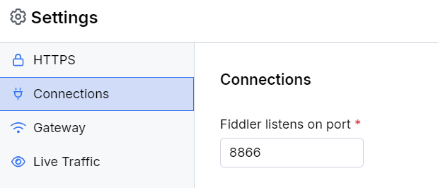
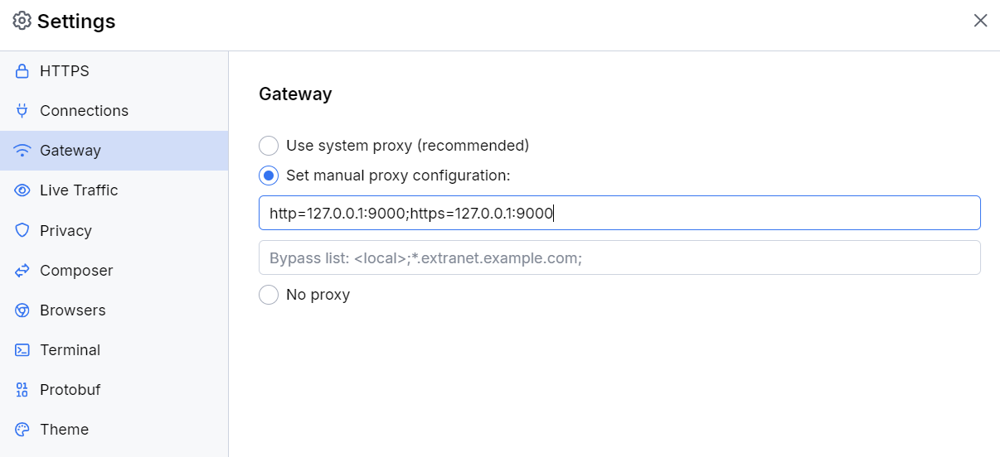

# Configuring Fiddler alongside Zscaler

Zscaler is a zero-trust security tool that provides a secure environment protected from internal and external threats. As such, the tool has some default mechanisms and applicable policies that prevent users or third-party applications (like Fiddler) from freely changing the operating system settings, including setting or unsetting an upstream system proxy. This article explains how both Fiddler Everywhere and Zscaler can be configured to work simultaneously.

The instructions below highlight the configuration steps while using the latest versions of [**Zscaler Client Connector**](#configure-zscaler-client-connector) and [**Fiddler Everywhere**](#configure-fiddler-everywhere).

## Configure Zscaler Client Connector

1. Create a custom PAC file and add the following rules:
    - Ensure that the traffic to `*.telerik.com` and `*.getfiddler.com` (the Fiddler Everywhere login endpoints) is sent while using `DIRECT` (and not through a proxy).

        ```sh
        if (localHostOrDomainIs(host, "telerik.com") || localHostOrDomainIs(host, "getfiddler.com")) {
            return DIRECT;
        }
        ```
    - Ensure that the Fiddler Everywhere proxy (by default, the Fiddler Everywhere proxy address is `127.0.0.1:8866`) should be the first option, and the Zscaler proxy should be the second option.
        ```sh
        return "PROXY 127.0.0.1:8866; PROXY ${ZAPP_LOCAL_PROXY}; DIRECT;";
        ```
1. Add the PAC file to a forwarding profile. Configure the forwarding profile with the following settings:
    - Select **Tunnel with Local Proxy** for all profiles (e.g., ON-trusted, OFF-trusted, VPN-trusted, etc.).
    - Select **Z-Tunnel 2.0**. 
        >important Note that **Z-Tunnel 1.0** is incompatible with the Fiddler Everywhere application.
    - Select the **PAC URL Location** field, and enter the custom PAC Url.
1. Add the forwarding profile to an app profile. You can create a new Zscaler Client Connector profile or update an existing one and then add the configured forwarding profile. The forwarding profile should contain the following options:
    - Set the **Rule Order** to **1**.
    - Enable the **app profile**.
    - Enable the **Disabled Loopback Restriction**.

## Configure Fiddler Everywhere

1. Start the **Fiddler Everywhere** application. 
1. Ensure that the **System Proxy** switch is toggled **OFF**.
    >important Fiddler Everywhere will work as [an explicit proxy](slug://capture-traffic-get-started#explicit-capturing) with the HTTPS traffic being directly forwarded (to Fiddler) by the Zscaler forwarding profile and the related Zscaler PAC script. Zscaler will usually revert any changes made in the OS system proxy settings, so ensure that the **System Proxy** switch always stays **OFF**.
1. Open **Settings > Connections** and ensure that the Fiddler port is the same as the one configured in the Zscaler PAC script. The default port used by the Fiddler Everywhere proxy is **port 8866**.
    
1. Open **Settings > Gateway** and select **Set Manual Proxy Configuration**. Enter the Zscaler Client Connector proxy address and port.
    ```sh
    http=127.0.0.1:9000;https=127.0.0.1:9000
    ```
    
1. Save the changes and close the Fiddler Everywhere application.

After you finish the configuration for Zscaler Client Connector and Fiddler Everywhere, ensure that you have been enrolled in Zscaler Client Connector with the updated policy. Once the Zscaler Client Connector is turned ON, you can open and use the Fiddler Everywhere application.
