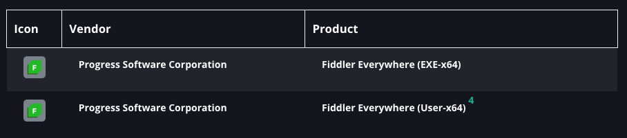

# Managing Fiddler Everywhere through "Patch My PC"

The policy-driven installation is available directly through the "Patch My PC" application. Fiddler Everywhere is listed as a supported product in [official database](https://patchmypc.com/supported-products) (search for Fiddler Everywhere)
 

When you use "Patch My PC", you have two options for installing Fiddler Everywhere: 

1. **Per-Machine Installation (EXE-x64)**: This option installs Fiddler Everywhere for all users on the machine, and updates can be explicitly distributed or through Fiddler Everywhere itself. 
1. **Per-User Installation (User-x64)**: This option installs Fiddler Everywhere for individual users. While you won’t be able to manage updates explicitly, users will still receive updates through the built-in update feature of the Fiddler Everywhere application.