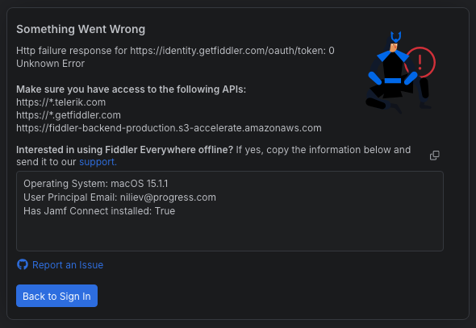

# Offline Mode

The offline mode in Fiddler Everywhere allows you to use the application’s core functionalities while working with limited or no internet access. The mode enables you to start the application without an explicit login and then configure the capturing you want to use - all without having active internet connection or while using restricted network. All options that can help you in your traffic debugging process are available offline, such as all Inspectors, Filters, Rules, Compare Sessions, and Composer.

## Prerequisites

- Requires licensed seat under the **Fiddler Everywhere Enterprise** subscription tier.
- Supported on Windows for both physical and virtual work machines.
- (Windows only) Requires Active Directory configuration with valid AD user (AD principal email).
- Supported on macOS with limited support for JAMF users only.

## Configuration Instructions

Execute the following steps to enable the offline mode:

1. Start Fiddler Everywhere on the device with limited internet access.

2. Upon login attempt, the Fiddler Everywhere application will display the "Something Went Wrong" screen. From that same screen, copy the information from the text field that contains details about the operating system and the user's principal email.



3. Send the above information to the support team alongside your [offline license request](#request-an-offline-license).

Once the request is received and approved, our team will reach out and send an individual offline license file that you must install on your device as follows:

- Download and install [the latest version of Fiddler Everywhere](https://www.telerik.com/download/fiddler-everywhere).

- Ensure that the Fiddler Everywhere application is closed.

- Open the archive **license.zip** (which you will receive from the support team) and extract the **license.lic** file. You will need only this file, not the archive itself.

    * Instructions for **Windows** - Create and navigate to the following folder on your Windows PC/Server.

    ```sh
        %PROGRAMDATA%/Fiddler/License
    ```

    * Instructions for **macOS** - Create and navigate to the following folder on your macOS device.

    ```sh
        ~/Library/Application Support/Fiddler Everywhere/License
    ```

- Inside the **License** folder, place the **license.lic** file. Ensure the file has the name **license.lic**.

Finally, restart Fiddler Everywhere to use the offline mode for the currently logged user. Note that the logged user must be identical to the one specified as the user's principal email in your support request.

## Request an Offline license

The offline mode is explicitly enabled through an individual offline license file. To request your license file, contact the Fiddler Everywhere technical support team through the [Telerik's Support Center](https://www.telerik.com/account/support-center
) or contact us directly at [fiddler-support@progress.com](fiddler-support@progress.com). Your request should include the information from the second step in the [configuration instructions](#configuration-instructions) and the licensed user that holds a seat for the **Fiddler Everywhere Enterprise** subscription tier.
