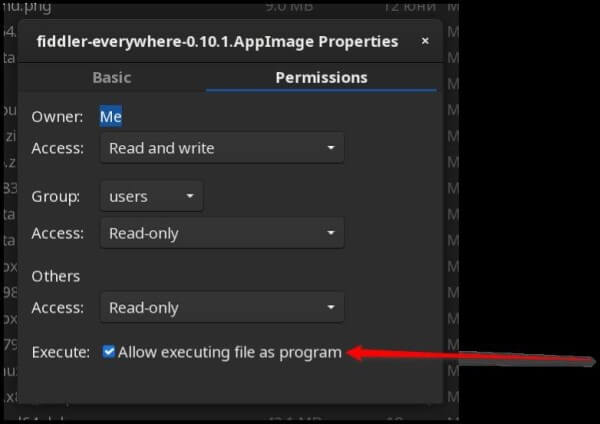
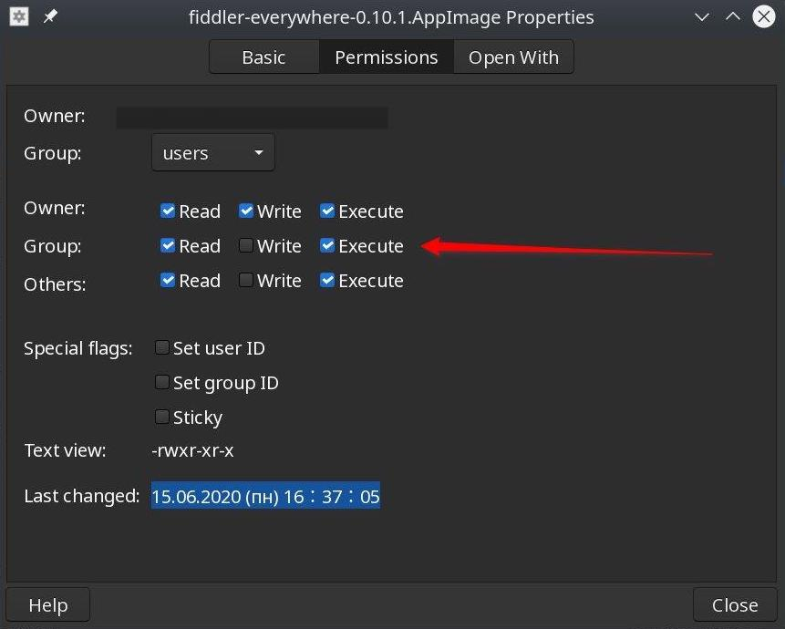
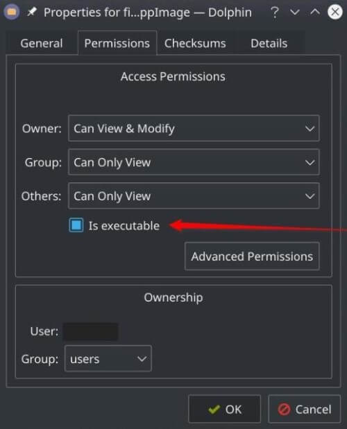

# First Steps with Fiddler Everywhere on Linux

This tutorial describes how to install and start using Fiddler Everywhere on Linux.

* First, you will go through the installation and configuration steps.
* Next, you'll create a Fiddler account so that you can move on to using the web-debugging tool.
* Finally, you will see how to capture, inspect, and modify traffic.

## Prerequisites

- Install Ubuntu 20+ x64.

- Provide 400MB of free disk space.

- Create an account with administrative rights, which you'll need for capturing and decoding HTTPS traffic.

- Provide an active Internet connection with access to the following URLs:

  ```curl
    https://*.telerik.com/
    https://*.getfiddler.com/
    https://fiddler-backend-production.s3-accelerate.amazonaws.com
    https://challenges.cloudflare.com
  ```

  >note The Telerik site (where the Fiddler authentication form resides) uses different CDNs to load various components, styles, and cookies related to its user interface. Having limited internet access can cause the site not to load correctly.

- Ensure that Fiddler Everywhere's proxy port is open and unrestricted by a firewall/security tool. By default, that's **port 8866**, but you can change it from **Settings > Connections > Fiddler listens on port**.

## Step 1: Install Fiddler Everywhere on Your Machine

Install the latest version of Fiddler Everywhere on your machine.

1. Download the latest version of [Fiddler Everywhere](https://www.telerik.com/download/fiddler-everywhere).

1. Install the downloaded package. On most Linux distributions, you must set the installation file as executable before starting the installation. To achieve this, either use the command line or the GUI of the desired distribution. 

    - Setting the installation plan as executable through the command line:

        1. Open a terminal.

        1. Navigate to the folder where the installation file resides.

        1. Type `sudo chmod +x filename.appimage`. You can omit the `sudo` command if the currently logged user is the one that downloaded the executable.

        1. If prompted, enter your username and password. Press the **Enter** key.

    - Setting the installation plan as executable through the GUI.

        For the Gnome distribution

          

        For the Cinnamon distribution

          

        For the KDI distribution

          

### Ubuntu 24.04 Specifics

Recent reports on Ubuntu version 24.04 showed a bug related to most Electron-based applications (like Fiddler Everywhere) where the file can not be set as executable (refer to [this GitHub thread](https://github.com/electron/electron/issues/42510)). In case you are unable to execute the Fiddler installation after the above steps, then try the following:

1. Open a terminal

1. Run the following command:
 
  ```bash
  sudo apt install libfuse2
  ```

The above installs the required dependencies to run .appimage files on Ubuntu 24.04. If the application does not start, try to start it from the terminal and check the output for errors. If you see an error "The SUID sandbox helper binary was found, but is not configured correctly" then you must add the `--no-sandbox` command line option when starting the application from the terminal. 

## Step 2: Create Your Fiddler Account

In this step, you'll register by creating your unified Telerik account.   

1. Launch the Fiddler Everywhere application. Follow the **Sign in or create an account** link.

1. Create an account using email and password or using the **Sign in with Google** option.

  >tip The [Fiddler Everywhere Enterprise subscription plan](https://www.telerik.com/purchase/fiddler) supports SSO login. Get in touch with our [support]() for detailed instructions on configuring your company-specific SSO.

1. Enter the requested information on the **Enter Your Email to Sign in or Create an Account** screen.

1. Check your inbox, open the confirmation email, and complete your account activation.

1. Return the Fiddler Everywhere application and choose whether to become a trial user or purchase a subscription plan by selecting either the **Start Free Trial** or the **BUY NOW** link.

After successful login into Fiddler Everywhere, you will see your personal and license information within the **Home** pane.

## Step 3: Interact with the Captured Traffic

You can now take advantage of the Fiddler Everywhere capabilities - capture, inspect, save & share, import *& export, mock and modify HTTPS traffic.

1. Capture HTTPS traffic through the preferred [capturing mode]().

  >tip To capture and decrypt secure HTTPS traffic, you need to explicitly [install and trust the Fiddler certificate authority (CA)](). Alternatively, you can explicitly [install the Fiddler CA certificate in a third-party certificate store](#install-the-fiddlers-certificate-authority-in-third-party-certificate-stores) (for example, [through intalling the CA in Firefox]()) and capture traffic only from that application.

1. [Inspect the captured data]().

1. [Save](), [share](). or [export]() the captured HTTPS traffic.

1. [Modify a session through the **Composer**](#edit-captured-api-request)

1. [Mock client and server behavior through the **Rules** tab]()

>tip The **Rules** tab is one of the most advanced features in Fiddler Everywhere. You can create and execute complex rules on your incoming traffic to mock client and server behavior without touching the client and server applications.

That's it! Now you're equipped to delve deeper into Fiddler Everywhere and make the most of its powerful functionalities.

## Next Steps

* [Learn more about the capturing options with Fiddler Everywhere]()
* [Learn more about installing the Fiddler CA certificate to decrypt secure HTTPS traffic]()
* [Sharing captured sessions with collaborators]()
* [Creating API requests]()
* [Grouping the API requests in collections]()
* [Mocking server responses]()
* [Configuring Fiddler Everywhere on Fedora, CentOS, or RedHat]()
* [Configuring Fiddler Everywhere on XFCE]()
* [Creating PEM certificate]()
* [Setting Up the Fiddler CA certificate for Electron-based Applications]()
* [Setting Up the Fiddler CA certificate in Firefox]()

