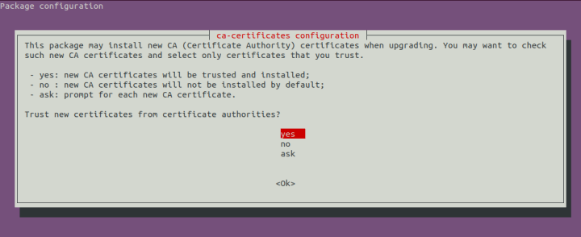
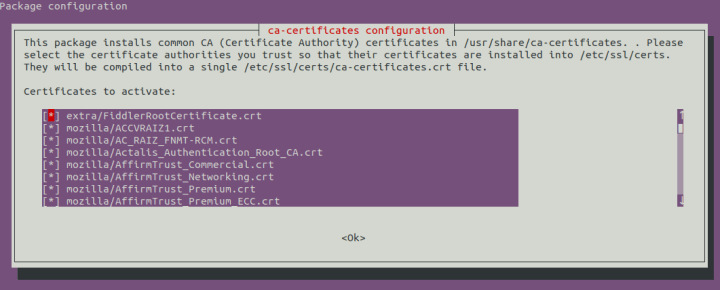
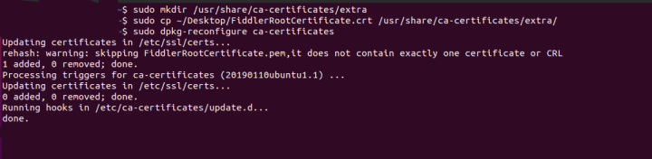

# Trust Root Certificate

This article provides additional information about the options for installing the Fiddler Everywhere root trust certificate in your operating system. The proper certificate enablement is a crucial step when using Fiddler to [capture secure system traffic](#system-capturing). Note that the certificate installation is not mandatory if you choose the [preconfigured browser capturing](#preconfigured-browser-capturing) option.


## Install & Trust the Root Certificate (Quickstart)

The quick start certificate installation options of Fiddler Everywhere for each platform are part of the getting started step-by-step tutorials:

* [Installing the Fiddler Everywhere root certificate on Windows](#capturing-system-traffic)
* [Installing the Fiddler Everywhere root certificate on macOS](#capturing-system-traffic)
* [Installing the Fiddler Everywhere root certificate on Linux](#capturing-system-traffic)


## Install & Trust the Root Certificate (Settings)

Fiddler Everywhere provides the option to manually go through the certificate installation and enable the HTTPS system traffic capture.

As Fiddler Everywhere is a cross-platform web-debugging proxy available for Windows, macOS, and Linux, you need to follow the respective approach for installing the tool.

### For Windows

1. Start Fiddler Everywhere and go to **Settings** > **HTTPS**.

1. Click the **Trust Root Certificate** button. Confirm your choice and add the certificate in the popup that appears.

1. Enable capturing the HTTPS traffic by selecting the **Capture HTTPS traffic** checkbox. Click **Save**.

1. Back on the foremost Fiddler Everywhere screen, enable the **Live Traffic** to toggle to start capturing HTTP and HTTPS system traffic.


### For macOS

1. Start Fiddler Everywhere and go to **Settings** > **HTTPS**. Click the **Trust Root Certificate** button.

1. In the window that appears, enter your machine administrative credentials.

    

1. Enable capturing the HTTPS traffic by selecting the **Capture HTTPS traffic** checkbox. Click **Save**.

1. Back on the foremost Fiddler Everywhere screen, enable the **Live Traffic** to toggle to start capturing HTTP and HTTPS system traffic.

### For Linux

1. Start Fiddler Everywhere and go to **Settings** > **HTTPS**. Expand the **Advanced Settings** sub-menu and use the **Export root certificate(DER/Binary format)** from the drop-down menu. The certificate is exported to **~/Desktop** as file with name **FiddlerRootCertificate.crt**.

1. To import and trust the exported certificate, perform the following steps.

    >important (For localized Linux distributions only) Some Linux distributions, such as Ubuntu, use localized paths&mdash;for example, the name of the **Desktop** folder translates into the locale language. To resolve this issue, create a folder named **Desktop** in your root through `mkdir ~/Desktop`. Then, export the certificate to the newly-created directory. Once the certificate is installed, you can safely remove that directory.

    1. Create a directory and copy the exported certificate by running the following commands.
        ```shell
        $ sudo mkdir /usr/share/ca-certificates/extra
        $ sudo cp ~/Desktop/FiddlerRootCertificate.crt /usr/share/ca-certificates/extra

        // Starts the tool and upgrades the certificates.
        $ sudo dpkg-reconfigure ca-certificates
        ```

        >tip In case your Linux distribution does not use the `dpkg` library, then refer to your OS documentation for alternative ways to handle the CA installation or use our dedicated [Fedora, CentOS, RedHat]() and [XFCE]() instructions.

    1. From the prompt, select **Yes** to install new certificates.

        

    1. Choose the `FiddlerRootCertificate.crt` file and click **OK**.

        

    1. The certificates are now updated.

        

1. Enable capturing the HTTPS traffic by selecting the **Capture HTTPS traffic** checkbox and clicking **Save**.

1. Back in the foremost Fiddler Everywhere screen, enable the **Live Traffic** toggle to start capturing HTTP and HTTPS system traffic.

Fiddler Everywhere enables you to control the certificate installation and HTTPS system capture. Use the [**HTTPS** menu]() for more advanced features and options related to the root trust certificate and the HTTPS system capture.

>tip Fiddler Everywhere provides the [preconfigured browser-capturing option](#preconfigured-browser-capturing), which enables you to skip the system capturing configuration. The predefined browser-capturing option comes in handy when you generate captured traffic only from a browser, lack administrative rights to install certificates and modify the system proxy, or when third-party VPNs and security tools collide with the Fiddler Everywhere proxy.


## Manually Export and Install the Trust Certificate

The automatic installation of the trust certificate can fail due to security restrictions, compatibility issues, limited read/write rights, corporate policies, etc. In that case, the Fiddler Everywhere application presents an error message that notifies the user that the certificate installation has failed. You can export the Fiddler certificate and install it to solve similar issues manually.

1. Start Fiddler Everywhere and go to **Settings** > **HTTPS** > **Advanced Settings**.

1. Choose the proper certificate format (**DER/Binary**, **PEM/ASCII**, and **PKCS 12**) and click the **Export Root Certificate** button. The export option will export the certificate to a root folder called **Desktop**, so ensure that such a folder exists in your file system.

1. Add the exported certificate to the desired certificate manager (for example, on [Linux](), [macOS](), custom application, etc.).

1. Enable capturing the HTTPS traffic by selecting the **Capture HTTPS traffic** checkbox. Click **Save**.

1. Back on the foremost Fiddler Everywhere screen, enable the **Live Traffic** to toggle to start capturing HTTP and HTTPS system traffic.

