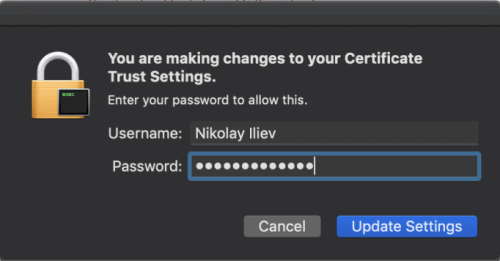

# Trust Fiddler's Certificate Authority

Proper installation and trust of the Fiddler Everywhere Certificate Authority (CA) is essential for capturing and decrypting HTTPS traffic at the system level. This article explains the recommended and manual approaches for installing the Fiddler CA on Windows, macOS, and Linux, and provides troubleshooting tips and best practices.

>tip CA installation is not required if you use [independent browser capturing](slug://capture-traffic-get-started#independent-browser-capturing) or [terminal capturing](slug://capture-traffic-get-started#terminal-capturing) modes.

## Recommended: Automated CA Installation

The easiest and most reliable way to install and trust the Fiddler CA certificate is through the in-app system capturing wizards:

1. Open the **Home** pane in Fiddler Everywhere.
2. Start the **System Proxy** tutorial and follow the prompts. You will be guided to install and trust the Fiddler CA certificate in your OS certificate manager.

Once installed, the CA remains valid until explicitly uninstalled. The CA appears as `Fiddler Root Certificate Authority` in your OS certificate manager.

## Manual CA Installation (Advanced)

Use the manual approach if the automated wizard fails or you need more control over the installation steps. Follow the instructions for your operating system:

### Windows

1. Go to **Settings** > **HTTPS** in Fiddler Everywhere.
2. Click **Trust Fiddler CA in the User Store**. Confirm and accept the certificate in the popup.
   >tip To install the CA in the Windows **machine store** (for all users), run Fiddler as Administrator and use **Trust Fiddler CA in the Machine Store**.
3. Go to **Settings** > **HTTPS** once more and enable **Capture HTTPS traffic**
4. Click **Save**.
5. On the main screen, toggle **System Proxy** ON to start capturing system HTTP/HTTPS traffic.

### macOS

1. Go to **Settings** > **HTTPS** in Fiddler Everywhere.
2. Click **Trust Fiddler CA in the User Store**.
   >tip To install the Fiddler CA certificate in the system keychain, you must use the export option and then proceed with manually installing it on macOS. The Fiddler Everywhere application automatically recognizes the installed CA from the login and system keychains.
3. Enter your macOS admin credentials when prompted.
   
4. Go to **Settings** > **HTTPS** once more and enable **Capture HTTPS traffic**
5. Click **Save**.
6. On the main screen, enable **Live Traffic** to start capturing system HTTP/HTTPS traffic.

### Linux

1. Go to **Settings** > **HTTPS** > **Export** in Fiddler Everywhere. Export the CA certificate in **DER/Binary format**. The file will be saved as **Fiddler_Root_Certificate_Authority.crt** on your Desktop.
2. Import and trust the exported certificate:
   >important Some Linux distributions use localized Desktop folder names. If needed, create a `~/Desktop` directory before exporting.

   ```sh
   sudo mkdir -p /usr/share/ca-certificates/extra
   sudo cp ~/Desktop/Fiddler_Root_Certificate_Authority.crt /usr/share/ca-certificates/extra
   sudo dpkg-reconfigure ca-certificates
   ```
   >tip If your distribution does not use `dpkg`, refer to your OS documentation or see our [Fedora, CentOS, RedHat](slug://fiddler-fedora-centos) and [XFCE](slug://fiddler-xfce) guides.
3. In the prompt, select **Yes** to install new certificates, then select the Fiddler certificate and confirm.
4. Enable **Capture HTTPS traffic** and click **Save**.
5. On the main screen, toggle **System Proxy** ON to capture system HTTP/HTTPS traffic.

## Exporting the Fiddler CA (for Manual or Third-Party Use)

If automatic installation fails (due to security restrictions, permissions, or corporate policy), you can export the Fiddler CA and install it manually:

1. Go to **Settings** > **HTTPS**.
2. Choose the desired format (**DER/Binary**, **PEM/ASCII**, or **PKCS 12**) and click **Export**.
3. Add the exported certificate to your certificate manager (see [Linux](slug://how-to-install-fiddler-root-certificate-in-firefox-on-linux), [macOS](slug://how-to-install-fiddler-root-certificate-on-mac-os), or your application documentation).
4. Enable **Capture HTTPS traffic** and click **Save**.
5. Enable **System Proxy** to start capturing system traffic.

### Installing in Third-Party Certificate Stores

Fiddler CA can be exported in multiple formats for use in other applications:
- [Firefox on Linux](slug://how-to-install-fiddler-root-certificate-in-firefox-on-linux)
- [Electron-based apps](slug://ubuntu-ca-electron)
- [Python](slug://fiddler-python-traffic#setting-fiddler-proxy-and-ca-through-environment-variable)
- [AWS](slug://how-to-capture-aws-traffic)

## Best Practices & Troubleshooting

- Always install the CA certificate only from the official Fiddler Everywhere application.
- Use the User Store for personal development; use the Machine Store only if multiple users need HTTPS capture.
- Remove the CA certificate when you no longer need HTTPS capturing for security.
- If HTTPS capture does not work, verify the CA is trusted and "Capture HTTPS traffic" is enabled.
- For certificate errors on specific sites, add the domain to the ignore list (for development only).
- On Linux, always follow the manual export and trust instructions for your distribution.
- Use [independent browser capturing](slug://capture-traffic-get-started#independent-browser-capturing-browser-capturing) if you lack admin rights or only need browser traffic.

