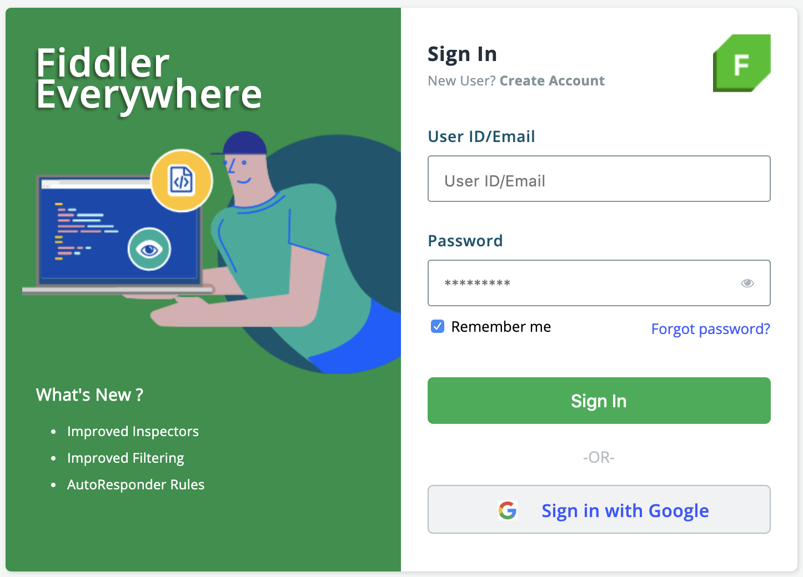

# Installation Procedure 
 
Steps to install Fiddler Everywhere client on your system: 

1. The Progress® Telerik® Fiddler Everywhere installer is available for download on the [Progress website](https://www.telerik.com/download/fiddler-everywhere).

2. Click **Download for <Your-OS-here>** to start downloading the installer for the respective operating system. The default operating system option is determined based on the currently used system.

3. Run the **Progress Telerik Fiddler.exe** file to start the installation process.

4. Create and login with your Fiddler credentials or use Google authentication login.

    

5. Fiddler Everywhere is ready for is to be used.

6. (Optional) Enable capturing and decoding secure traffic (HTTPS).

By default, the standard installation will allow you to track only non-secure HTTP traffic. To enable tracking and decoding of HTTPS, you will need to install a trusted certificate as shown [here]().