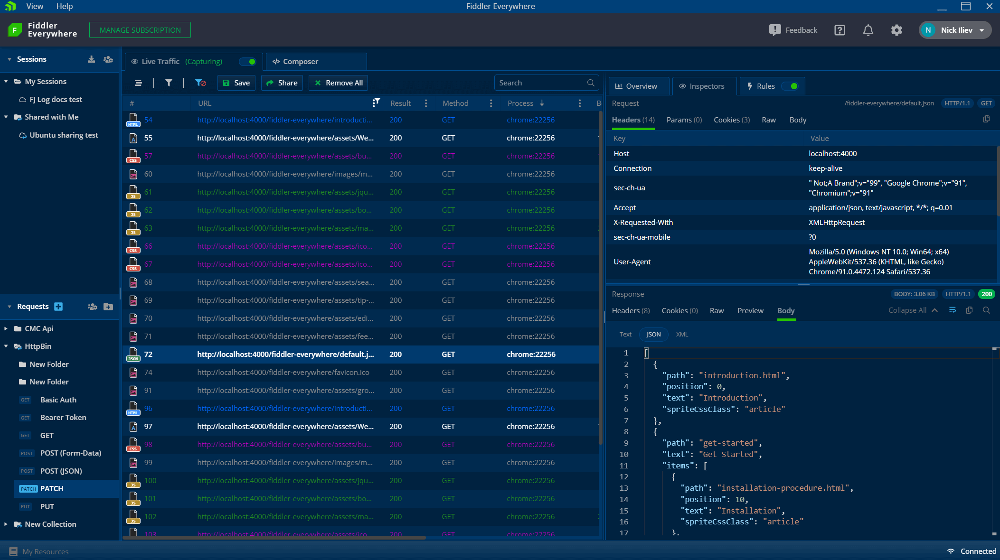

# Welcome to Fiddler Everywhere!

Progress® Telerik® Fiddler Everywhere is a web-debugging tool that monitors, inspects, edits, and logs all HTTP(S) traffic, and issue requests between your computer and the Internet, and fiddles with incoming and outgoing data. It is a high-performance, cross-platform proxy for any browser, system, or platform.

## Key Features

Fiddler Everywhere delivers a range of handy and user-friendly features whose number and further development are not limited by the list in this section&mdash;the Fiddler team constantly invests efforts to improve the performance and add more value to the existing web-debugging tool and build on top of its available features.

### System Traffic Capturing

Fiddler Everywhere inspects and logs all HTTP(S) traffic between your computer and the Internet, and enables you to capture traffic from virtually any application that supports a system proxy. [Read more about capturing HTTP(S) traffic with Fiddler Everywhere...](#system-capturing)

### Preconfigured Browser Capturing

Fiddler Everywhere provides preconfigured options for automatic browser HTTP(S) capturing without the need to modify the operating system proxy. [Read more about the preconfigured browser capturing...](#preconfigured-browser-capturing
)

### Traffic Analysis

Fiddler Everywhere provides an HTTP(S) traffic-analyzing functionality, which renders the captured information in a structured way and visualizes various statistical data for one or more captured sessions. You can also decrypt secure traffic and save, receive, and share captured traffic with collaborators. [Read more about inspecting and modifying traffic with Fiddler Everywhere...]()

### Request and Response Mocking

Fiddler supports the mocking and modification of requests and responses on any application. In this way, you can quickly and easily change HTTP(S) requests and responses without the need to update the code. [Read more about mocking requests and responses with Fiddler Everywhere...]()

### API Composing

Fiddler Everywhere comes with an API Composer, which allows you to test APIs by creating and sending requests as well as save and share composed APIs. You can use the API composing feature both when developing new APIs and when testing existing APIs. [Read more about creating and organizing API requests with Fiddler Everywhere...]()

### Secure Collaboration

Fiddler Everywhere provides a secure method for saving and sharing network debugging logs with your teams for analysis, communication, and resolution. [Read more about the collaboration options...]()

### Cross-Platform Support

Fiddler Everywhere provides platform-agnostic compatibility that enables you to install, configure, and run the web-debugging tool on Windows, macOS, and Linux system-operating machines. Read more in the dedicated step-by-step guides:

* [Get Started with Fiddler Everywhere on Windows]()
* [Get Started with Fiddler Everywhere on macOS]()
* [Get Started with Fiddler Everywhere on Linux]()

### Fiddler Everywhere on Mobile

Fiddler Everywhere enables you to also capture and inspect traffic on devices running on iOS and Android.

* [Capturing and Inspecting Traffic on iOS]()
* [Capturing and Inspecting Traffic on Android]()

### Styling Options  

Fiddler Everywhere delivers a modern, intuitive UI and a set of popular themes. [Read more about modifying the appearance of the Fiddler web-debugging tool...]()

## Trial Version and Commercial License

Fiddler Everywhere offers a 30-day trial with a full-featured version of the tool&mdash;no restrictions! What’s more, you are eligible for complete technical support during your trial period in case you have any questions. To sign up for a free 30-day trial, go [here](https://www.telerik.com/download/fiddler-everywhere). In addition, [the Fiddler Everywhere dashboard panel]() provides information and options for managing your subscription plans.

To use Fiddler Everywhere commercially, you need to purchase a license. The terms of use are fully described in the [Fiddler Everywhere License Agreement](https://www.telerik.com/purchase/license-agreement/fiddler-everywhere).

* For more information about the available subscription plans, go to the [Fiddler Everywhere purchase page](https://www.telerik.com/purchase/fiddler).
* For more information on the available commercial and free support channels, refer to the article on the [available Fiddler Everywhere support options]().

## Suggested Links

* [Before You Start: All Things Fiddler (Telerik Blog Post)](https://www.telerik.com/blogs/fiddler)
* [Getting Started with Fiddler Everywhere (Video Tutorials)](https://www.telerik.com/videos/fiddler/tag/fiddler-everywhere)
* [Getting Started with Fiddler Everywhere (Webinars on Demand)](https://www.telerik.com/webinars/fiddler-everywhere)
* [Quickstart on Windows (Step-by-Step Guide)]()
* [Quickstart on macOS (Step-by-Step Guide)]()
* [Quickstart on Linux (Step-by-Step Guide)]()
