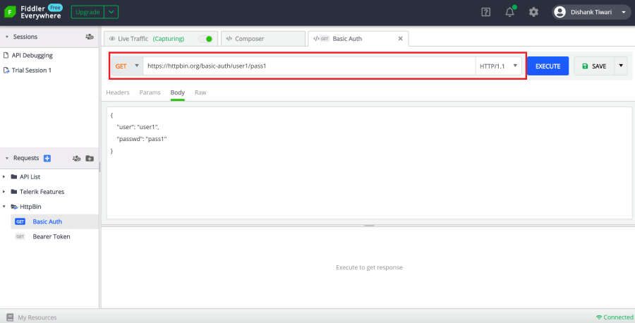
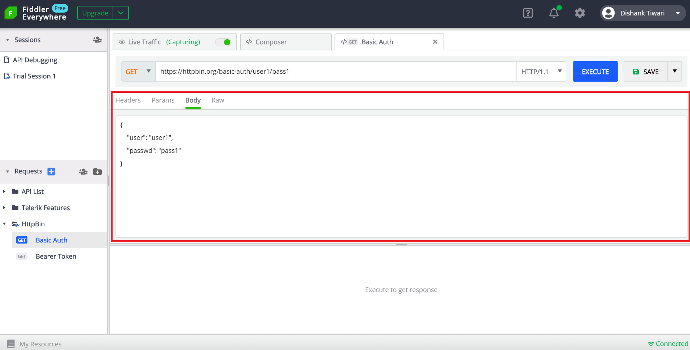
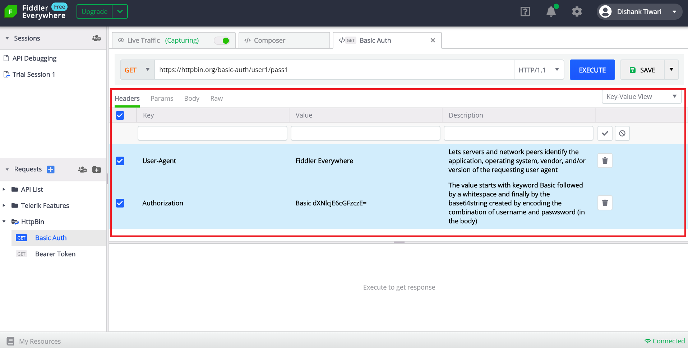
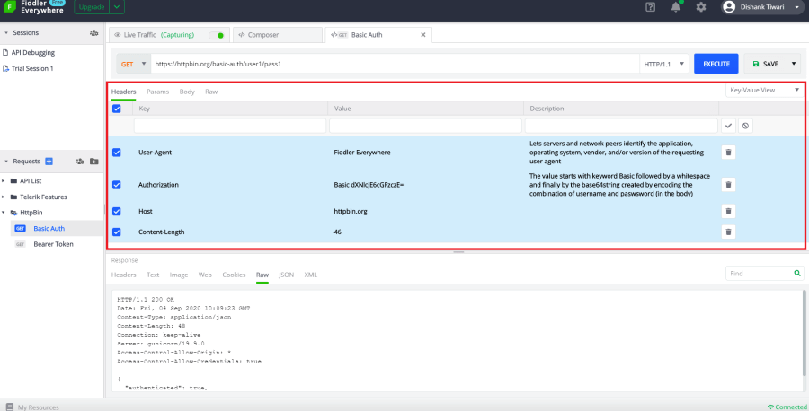
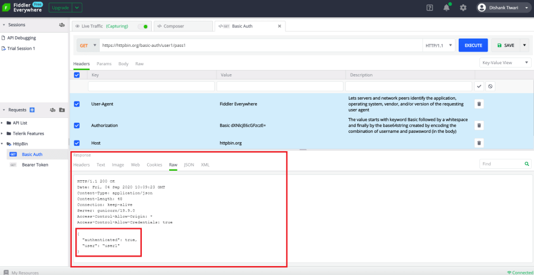

#### Environment

|   |   |
|---|---|
| Product   |
| Product Version | 1.0.1 and above  |

#### Description

In the context of an HTTP transaction, __Basic Access Authentication__ is a method for an HTTP user agent (for example, a web browser) to provide a user name and password when making a request. In __Basic HTTP Authentication__, a request contains a header field in the form of __`Authorization: Basic <base64 string>`__, where credentials are the __Base64__ encoding of `username` and `password` joined by a single colon(`:`).

In this article, we list the steps to [create a request for APIs that require __Authentication__](#create-a-basic-authentication-request) by using the Fiddler Everywhere [Composer]() and provide a [complete example](#basic-authentication-request-example) of the procedure.

## Create a Basic Authentication Request

The following steps provide an overview of the procedure used to create a basic authentication request:

1. Select the [Composer]() tab.
1. Set the HTTP/HTTPS method to __GET__ and add the URL in the URL field.
1. Create an object in the request __Body__ and the `user` and `passwd` variables and their values. In this object, `user` and `passwd` are the predefined variables for the __Basic Authentication__.
1. Add an `Authorization` key to the header:
    * Encode the value of the `<username>:<password>` string with a [__Base64 converter__](https://www.base64decode.org/) and note the encoded value.
    * In the __Headers__ tab, set the __Key__ to `Authorization` and add the encoded `<username>:<password>` under __Value__.
    * Add a __Description__ for the key. Click the __tick__ to add the `Authorization` key.

## Basic Authentication Request Example

1. In the [Composer]() tab, set the HTTP/HTTPS method to __GET__ and add [https://httpbin.org/basic-auth/user1/pass1](https://httpbin.org/basic-auth/user1/pass1) in the URL field.

   

   The [https://httpbin.org/basic-auth/user1/pass1](https://httpbin.org/basic-auth/user1/pass1) URL includes the following fields:

      * The [httpbin.org](https://httpbin.org/) HTTP request and response service. 
      * The authentication scheme [__basic-auth__](https://tools.ietf.org/html/rfc7617).
      * The values of the `user` and `passwd` variables: __user1__ and __pass1__.

1. Create a JSON object in the __Body__ tab:

   

   The predefined variables for __Basic Authentication__ are `user` and `passwd`. Set their values to __user1__ and __pass1__, respectively.

1. Add the Authorization key in the __Headers__ tab:
   * Encode the value of the `<username>:<password>` string with a __Base64 converter__. The resulting string from the encoding of __user1:pass1__ is `dXNlcjE6cGFzczE=`.
   * In __Headers__ tab, set the __Key__ to `Authorization`.
   * Set the __Value__ to `Basic dXNlcjE6cGFzczE=`.
   * Add a __Description__ for the key, and select the __tick__ to add the Authorization key.

   

After performing all the above steps, select __Execute__ (placed at the right side of the URL field) to send the request.

Clicking the __Execute__ button adds two more Keys to the __Headers__ tab named `Host` and `Content-Length`:

Following the above steps will create __Basic Authentication__ with Fiddler Everywhere. To check, go through the __Response Inspector__ section of the Composer. A successful request should return __status 200__ from the server along with the server-specific payload:

The above response is HTTPBin specific as we used it to create the __Basic Authentication__.
