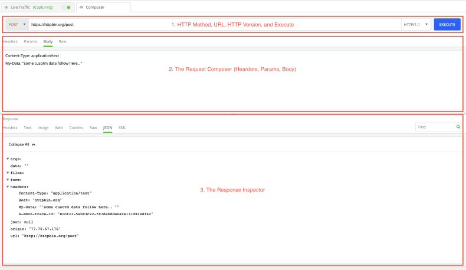

## Environment

<table>
	<tbody>
		<tr>
			<td>Product Version</td>
			<td>1.0.1</td>
		</tr>
		<tr>
			<td>Product</td>
			<td>Fiddler Everywhere</td>
		</tr>
	</tbody>
</table>

## Description

Fiddler Everywhere certificate is installed to inspect network traffic and debug it. The __Composer__ feature in Fiddler Everywhere enables you to manually build and send HTTP, HTTPS requests. Click [here]() to know more about Fiddler Everywhere Composer.

Refer to the image below:

The Composer is divided into three major sections. 

- The top section contains a drop-down for selecting __HTTP Methods__, an __URL field__, a drop-down to select the used __HTTP version__, and an __Execute__ button.

- The mid-section is  a __request composer__ that provides options to further modify your request via __Headers__, __Body__, __Params__, or __Raw__ views.

- The bottom section is a __response inspector__, which shows the response from the executed request.

All of the sections are used to construct a request and ovserve the response.

Now, let's see how can you create Composer request for APIs that require authentication:

>tip In the steps shown below, you can use [httpbin.org](https://httpbin.org/) for HTTP request and response service.

## Step 1

Set the HTTP/HTTPS method to __GET__ and add the URL in the URL field. The URL added has been generated from the [httpbin.org](https://httpbin.org/).

In the above image image, as you can see that the URL specified is [https://httpbin.org/basic-auth/user1/pass1](https://httpbin.org/basic-auth/user1/pass1). Here __basic-auth__ specifies that the authentication taking place is basic. The next two fields user1 and pass1 are the values of `user` and `passwd` variables respectively.

## Step 2

Create and object inside the Body tab. The predefined variables for the basic authentication are `user` and `passwd`. Set the values for both the variables.

In the above image you can see that the values of the `user` and `passwd` variables are set to __user1__ and __pass1__ respectively.

## Step 3

Once you create the object in the Body, go to the __Headers__ tab, where you can see a predefined key `User-Agent` added from Fiddler Everywhere. Now, lets add the Authorization key to the header. For that:

- Encode the values of the variables set in the JSON format. The encoded value of __user1:pass1__ is `dXNlcjFwYXNzMQ==`.

- In __Headers__ tab:
    - Set the __Key__ to `Authorization`.
    - Set the __Value__ to `Basic dXNlcjFwYXNzMQ==`.
    - Add a __Description__ for the key to be added. Click the __tick__.

A key named `Authorization` has been to the __Headers__ tab.

After executing all the above steps click __Execute__ (placed at the right side of the URL field).

Clicking the __Execute__ button will add two more Keys to the __Headers__ tab named `Host` and `Content-Length`.

Following the above steps will create the basic authentication with Fiddler Everywhere. To check go thorugh the __Response Inspector__ section of the Composer. If the Raw and the JSON tab of the __Response Inspector__ shows the value of `"authenticated": true,`, you have successfully completed the authentication process.

Refer to the image below:

