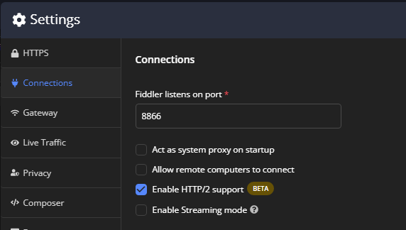
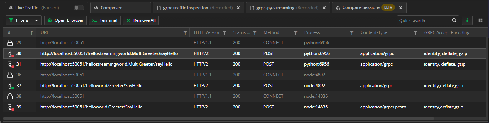
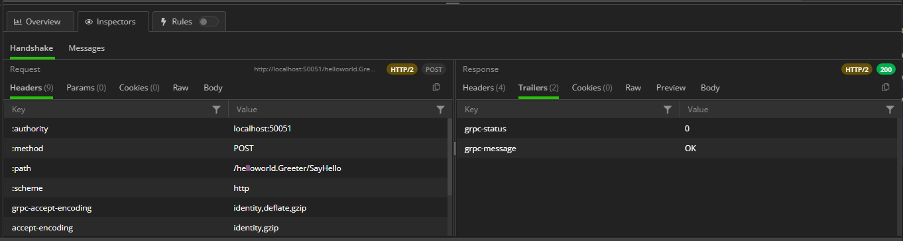
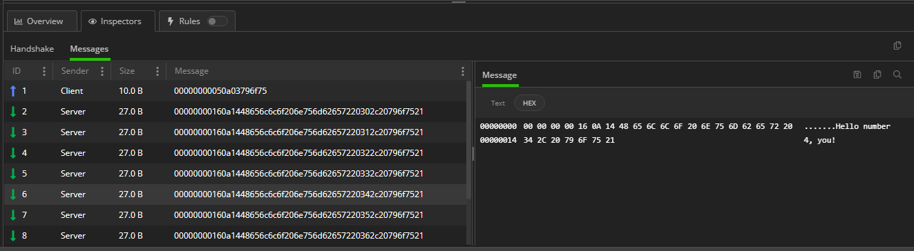

## The state of GRPC today

The initialism GRPC is around us more and more often each day. We are hearing that large companies like Google use GRPC (expected as the G in GRPC stands for Google), plus others like Netflix, Spotify, Salesforce, IBM, Cisco, Dropbox, and Slack - the list can go on and on. So what exactly is GRPC, and how does it helps developers today?

Technically the [GRPC](https://grpc.io) is a Remote Procedure Call (RPC) framework that can run in any environment. It can also be referred to as an architectural style similar to REST, SOAP, WebSockets, etc. While most applications in the wild still rely primarily on REST, it became apparent that the REST API is far from perfect, and relying only on it could be problematic as your business grows. The mass adoption of the microservices architecture style also showed the need for a different technology to solve various problems. This is where GRPC came in! The GRPC framework is efficient, has high performance (some say up to seven times faster than REST), is cross-platform, has a native code compiler, and is ideal for microservices and data streaming. GRPC is not here to replace REST but should be considered an alternative for solving specific problems.

Looking into the framework itself, the first thing that we can notice is that it uses the [Protobuf format](https://protobuf.dev/) (instead of JSON or XML). The pros of the format are that it is light and compressed (here is where the GRPC gains high performance). The cons are that Protocol Buffers messages are not human-readable. Fiddler Everywhere can help developers that own the .proto file - each Protobuf message is available with Fiddler and can be used for deep-dive investigation.

## GRPC Support in Fiddler Everywhere

As GRPC gained popularity, it became apparent that developers needed a debugging tool to help them capture and inspect GRPC traffic. The tool had to support HTTP/2 (as GRPC is based on HTTP/2 and is not compatible with HTTP/1.1) and also has to be ready to visualize the information from specific GRPC channels, including a handshake, messages, trailer headers, etc. Wait no more...

**Fiddler Everywhere!**

After the Fiddler's team recently introduced the support for HTTP/2 and TLS 1.3, it was natural to go ahead with the implementation for GRPC support. With Fiddler Everywhere version 4.2.0 and above, GRPC support is a reality, and you can start capturing and inspecting GRPC traffic out-of-the-box. Ok, not precisely out-of-the-box - because GRPC relays on HTTP/2, you must ensure that your Fiddler Everywhere application has HTTP/2 capturing enabled through **Settings > Connections > Enable HTTP/2 Support (BETA)**.

That's all you need from Fiddler Everywhere's side! 

The next step is to tell your GRPC client application to respect the Fiddler's proxy for its HTTP and HTTPS requests. The specific proxy configuration entirely depends on the used client's application technology (for example, different approaches if it is a browser, a Python app, a GO app, a Java app, and so on). [Learn more on how to set Fiddler Everywhere as a proxy for your technology here ...](https://docs.telerik.com/fiddler-everywhere/knowledge-base/capturing-grpc-traffic)

## GRPC Inspection

Upon capturing a GRPC session, Fiddler Everywhere shows opened and closed GRPC channels in the Live Traffic list. A green badge in the ID column (by default, the first column on the left) indicates an active GRPC channel, while a red bad indicates that the GRPC channel is closed. Fiddler Everywhere supports all gRPC life cycles and will successfully capture unary RPC, client streaming RPC, server streaming RPC, and bidirectional streaming RPC.

You can select a session with a single click to observe the **Handshake** tab and its details. The **Handshake** tab contains information about the used HTTP headers and the specific GRPC traliers. The server sends trailers to the client after processing the request. A typical scenario is for trailers to contain information common to service methods.

You can open the **Messages** tab by double-clicking on the selected session (or by manually selecting the tab) and inspect each streamed message in the GRPC channel. Each GRPC message uses [the Protobuf format](https://protobuf.dev/overview/), which is in unreadable form and received as binary. You can inspect the binary message from the **Message** inspector. Fiddler Everywhere also provides instruments (**Decode value** and **HEX** inspector) to partially visualize text content that could be part of the Protobuf message. It is important to note that this will always be mutated content, not the original Protobuf message. Only the creator & owner of the .proto scheme can fully decode a Protobuf message.

## Conclusion

GRPC is here to stay - in 2022, the technology gained popularity and increased its spread (from 8% to 11% percent of developers that said they like GRPC). It is now one of the most recognizable architectural styles alongside REST, WebSocket, SOAP, Webhooks, and GraphQL. It is more likely that a programmer will have to deal with it sooner or later, and Fiddler solves that puzzle.

Fiddler Everywhere itself evolves more after each release and is far from being just a forward proxy or a web debugging tool. The added GRPC support, alongside the support for other modern technologies like HTTP/2, TLS 1.3, the advanced Rules capabilities, HTTP Request composer, collaboration, and many more, makes Fiddler a swiss-knife for solving a different range of tasks. From QA engineers and developers, support personas, web administrators, police officers, and security experts, Fiddler is a tool that can bring much value. Did we mention that Fiddler is cross-platform? Yes, it works on macOS, Windows, and Linux and can capture traffic from virtually any client that uses the HTTP(S) protocol.

In case you have just heard about us - the team welcomes you! Go ahead and try Fiddler Everywhere and let us know what you think!