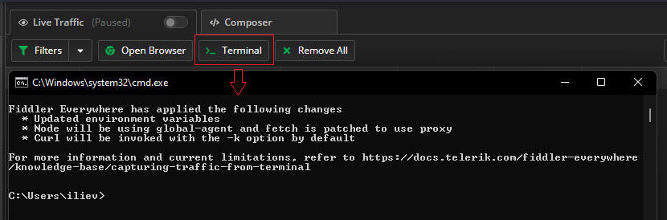
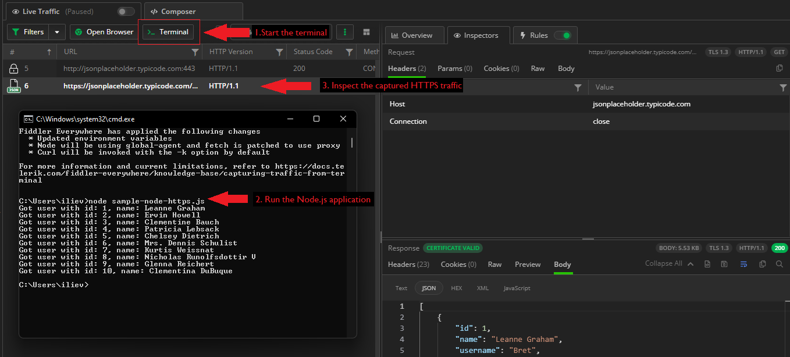
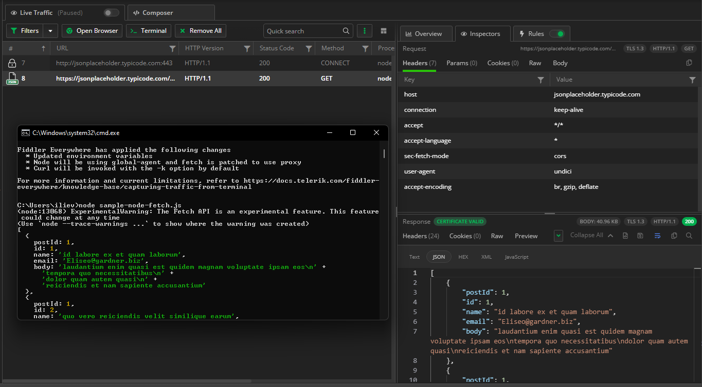
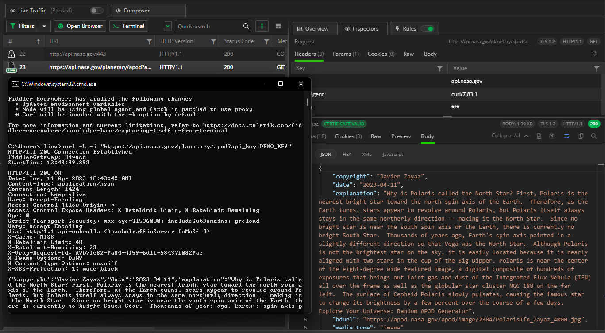

# Fiddler Everywhere as a Sandboxed Proxy

Fiddler Everywhere evolved from the concept of being just a web-debugging tool that acts as a system proxy. Nowadays, the term proxy tool is way too narrow to describe the many possibilities that Fiddler opens - a correct depiction is one of a Swiss-knife proxy tool for meddling with HTTP(S) traffic daily. The complexity of Fiddler's functionalities implies that there is a learning curve to using Fiddler to its full potential. However, the team behind Fiddler Everywhere works in the opposite direction. It aims to make the tool easier to use and more intuitive (apart from being a cross-platform tool, the UI is the other distinction with the old Fiddler Classic, which, let's face it, is hard to use with not so-modern user interface). 

While reviewing the user's feedback, it quickly became apparent that setting Fiddler as a system proxy is overkill for many users. Users wanted to work with sandboxed environments that would allow them to quickly test their HTTP(S) requests without changing the system network settings or configuring a proxy manually.  

Using sandboxed proxy tooling solves several issues:

- No need to modify the system settings of the Fiddler Everywhere host machine.
- No need to manually configure the client's proxy settings.
- No need to revert global environment variables once your work is done.
- Allows you to test scenarios in a preferred sandboxed instance quickly.

The above arguments were good enough for the core Fiddler Everywhere team, and they led to the appearance of exciting new features - [the preconfigured browser capturing](https://www.telerik.com/blogs/introducing-preconfigured-browser-capturing-fiddler-everywhere) and the topic of this article - [**the preconfigured terminal capturing**](#fiddlers-preconfigured-terminal).


## Fiddler's Preconfigured Terminal

Today almost all software engineers use a command-line interface to work with various applications quickly. And nearly all applications have online connectivity. For most of us, that means we use CLI to build, test and deploy applications executing HTTP(S) requests. It was only natural for Fiddler Everywhere to provide a preconfigured terminal instance that automatically redirects the HTTP(S) traffic through the Fiddler proxy.

To open a preconfigured terminal instance, use the **>_ Terminal** button from the Live Traffic toolbar.



The option opens the preferred terminal on your OS (you can set up the preferred terminal upon the initial startup). The following terminals are supported:

- **Command Prompt**&mdash;Available only on Windows.
- **Windows PowerShell**&mdash;Available only on Windows. Specifies the **Windows PowerShell** built on .NET Framework 4.5 and older versions.
- **PowerShell**&mdash;Available only on Windows. Specifies the **PowerShell** built on .NET Core or the new .NET.
- **Terminal application**&mdash;Available for macOS and Linux distributions. This option will use the default shell environment, for example, **bash**, **zsh**, or **sh**.

Once the terminal instance starts, its environment variables are updated to use Fiddler Everywhere as an HTTP and HTTPS proxy. Node.js will use [global-agent](https://www.npmjs.com/package/global-agent), the **Fetch** API will be patched to use Fiddler's proxy, and cURL requests will be executed with the **-k** flag (which disables attempts to verify self-signed certificates against a certificate authority). Note that Fiddler Everywhere won't change any global variables, so any other terminal instance won't go through the proxy (unless explicitly set). The preconfigured terminal instance will have network connectivity as long as Fiddler Everywhere works.

### Windows PowerShell Specifics

By default, most terminals won't differentiate localhost traffic, so in most cases, you will capture localhost traffic out of the box.

However, this is not true for Windows PowerShell because it is built upon .NET. The .NET Framework is hardcoded **not** to send localhost requests through any proxies, and as a forward proxy, Fiddler will not receive such traffic. As **Windows PowerShell** uses the .NET Framework (not to be confused with **PowerShell**, which uses .NET Core), the localhost traffic is not automatically sent through the proxy. To workaround the issue, use [the Fiddler's aliases](https://docs.telerik.com/fiddler-everywhere/knowledge-base/capturing-localhost-traffic) or add a dot to the end of the localhost address (for example, `localhost.:8080`).

### NET Specifics

To capture traffic from cURL or Node.js libraries, you don't need to explicitly install and trust the Fiddler root CA (certificate authority) on the Fiddler host. However, this is a mandatory requirement for a .NET application that executes HTTPS requests (as a .NET application will utilize the system keychain). If you haven't already installed and trusted the Fiddler root CA learn how to do it [here](https://docs.telerik.com/fiddler-everywhere/installation-and-update/trust-certificate-configuration).

## Quick Demos with Node.js, Fetch, and cURL

Once the default terminal starts, you can immediately start testing your applications. Below, you will find basic demonstrations depicting how Fiddler's Terminal captures traffic from a Node.js app that uses the `https` library, from an app that uses the **Fetch** API, and from a cURL request.

### Node.js HTTPS Demo

- Create your Node.js application. Our demo uses the `https` library to execute its HTTP(S) requests.

    ```JavaScript
    const https = require('https');

    https.get('https://jsonplaceholder.typicode.com/users', res => {
        let data = [];

        res.on('data', chunk => {
            data.push(chunk);
        });

        res.on('end', () => {
            const users = JSON.parse(Buffer.concat(data).toString());
            for (user of users) {
                console.log(`Got user with id: ${user.id}, name: ${user.name}`);
            }
        });
    }).on('error', err => {
        console.log('Error: ', err.message);
    });
    ```

- Start a preconfigured terminal instance using the **>_ Terminal** button.

- Run the Node.js application within the preconfigured terminal instance.

As a result, you can quickly inspect, debug, test, and mock different HTTP(S) scenarios with a few clicks.



### Fetch API Demo

- Create your application that utilizes the Fetch API.

 ```JavaScript
 fetch('https://jsonplaceholder.typicode.com/comments')
  .then((response) => response.json())
  .then((json) => console.log(json));
 ```

- Start a preconfigured terminal instance using the **>_ Terminal** button.

- Run the application within the preconfigured terminal instance.



### cURL Demo

- Compose your cURL request. Alternatively, you can use the Fiddler's built-in **Copy as cURL** option from the Live Traffic context menu.

    ```curl
    curl -k -i "https://api.nasa.gov/planetary/apod?api_key=DEMO_KEY"
    ```

- Start a preconfigured terminal instance using the **>_ Terminal** button.

- Execute the cURL request within the preconfigured terminal instance.



## What's Next

Built-in support for Fiddler proxy with Python applications is in active development and is just around the corner. Do you have other ideas on further improving the preconfigured terminal option? Don't hesitate to contact us [leave your feedback or directly let us know about the features you would like to see in Fiddler Everywhere](https://feedback.telerik.com/fiddler-everywhere).